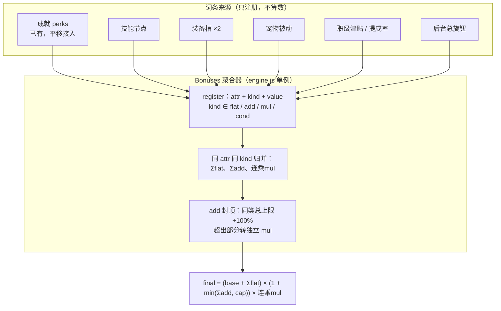
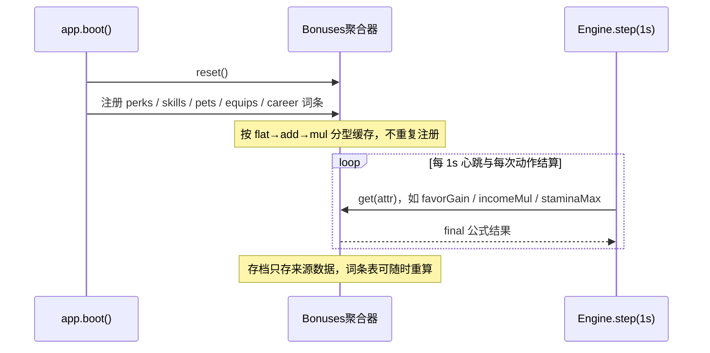

# 01 · 数值底座：bonuses 聚合器

> 口径源：`growth-evolution-mini.md` §0。这是全部后续模块的前置依赖。
> 唯一改造点：结算公式不再散落 `perkMul` 硬编码，所有来源只注册词条。

## 聚合管线

## 结算时序（boot 注册 → step 取值）

## 验收要点

- 任一词条增删不改公式本体，只动数据表；
- `tests/test-engine.js` 新增三型叠序单测（顺序固定且档案卡公示）；
- 存档 v3 迁移幂等。
