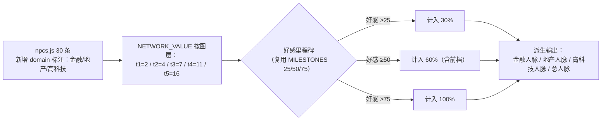
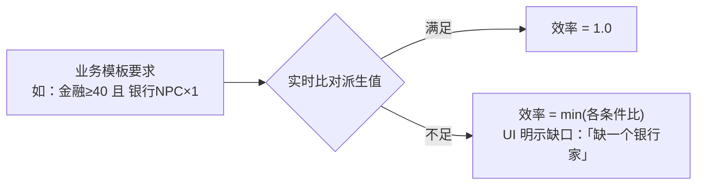
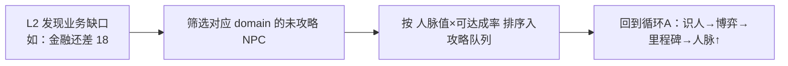

# 02 · 行业人脉系统

> 口径源：`career-numbers-mini.md` §3。人脉是**派生值**，不进存档，实时由名册算出——杜绝同步 bug。

## 派生计算

## 用法一：业务闸门

## 用法二：Agent 决策器挂钩

## 备注

- v1 不衰减：里程碑锁定后永久计入；衰减规则留待三维关系改造一并定。
- 成本：npcs.js 30 条标注 + 派生函数，约 1 天。
