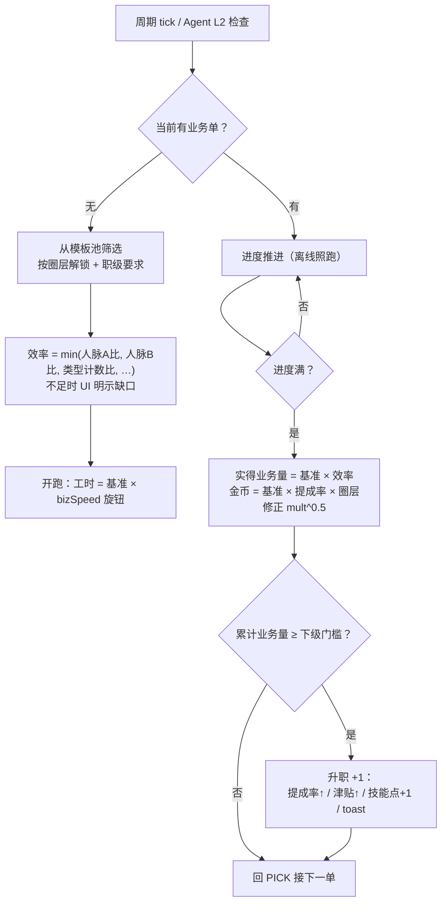
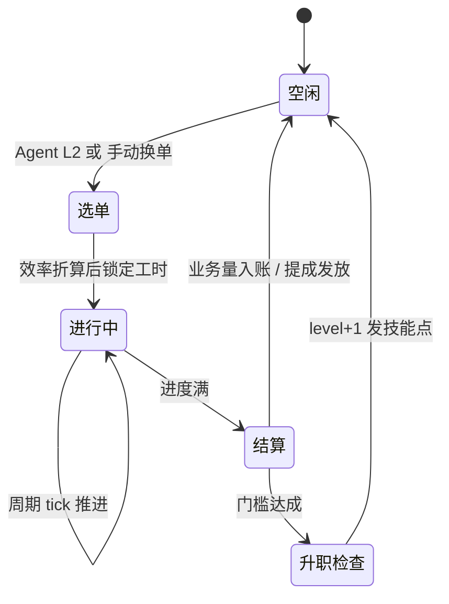
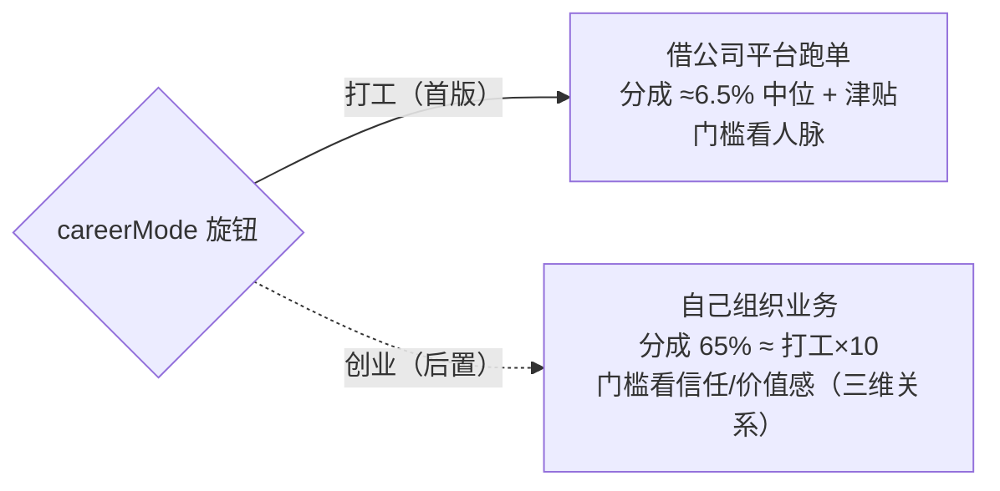

# 03 · 职业与业务系统

> 口径源：`career-numbers-mini.md` §1/§2/§4。打工线先上，创业线后置（依赖三维关系）。

## 跑单管线（放置期自动 / 操作期可换单）

## 业务单状态机

## 打工 / 创业双模式（同表不同分成）

## 备注

- 业务量是进度量纲（万），不消费；金币仍是唯一货币。
- 首版模板池 ~12 条（每圈层 3~4 条）；全部参数进 SETTINGS_DEFAULT。
