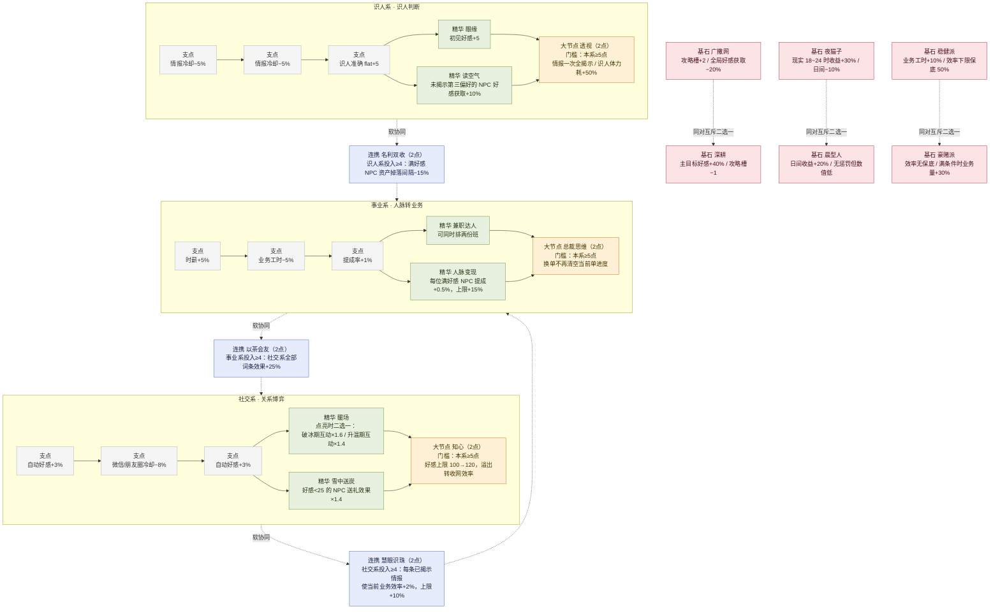
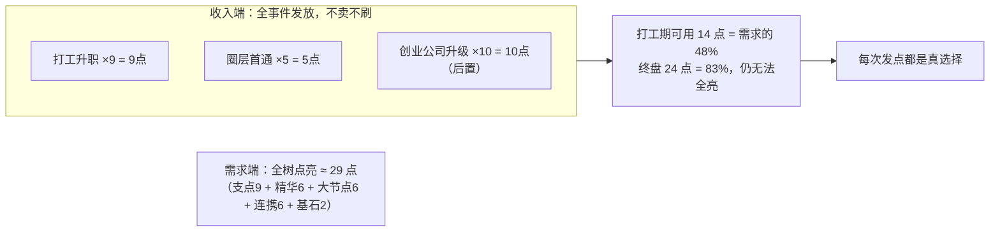

# 04 · 关系天赋网（重制版）

> 口径源：`growth-evolution-mini.md` §1（本文为其展开）。
> 重制动因：原「9 节点 × 1~3 级」是三个孤立 +% 列表，无结构、无相互关系、无取舍。
> 设计参考（2026-08 调研）：
>
> | 来源 | 抄什么 | 教训防什么 |
> | --- | --- | --- |
> | PoE 被动树 | 小节点→精华→基石四层结构；基石=强力+代价，Build 围绕它组建 | 树过大导致选择瘫痪（PoE 自己都在做减法） |
> | 暗黑2 协同 | 跨系协同：A 系投入强化 B 系效果；点数永远不够（98 点 vs 600 点需求） | 硬协同逼出全民同质 Build（v1.10 三元素法师灭绝）→ 用软协同 |
> | 恐怖黎明 星座 | 亲和资源解锁路径，「过路点事后退款」的路径规划玩法 | 亲和规则新手不可读 → 我们的连携条件必须一眼看懂 |
> | 暗黑4 精华强化 | 同一节点升级时二选一强化 | —— |

## 1. 四层节点结构（替换单一节点概念）

| 层 | 数量 | 消耗 | 特征 |
| --- | --: | --: | --- |
| 支点（道路） | 9 | 1 点 | 小额 flat/add，构成通往精华的路径，本身是「走哪条路」的选择 |
| 精华（聚落核心） | 6 | 1 点 | 命名强词条，多数带**触发条件**而非纯 +% |
| 大节点（分支顶点） | 3 | 2 点 | 需**本系已投入 ≥5 点**才可点亮——深度承诺奖励 |
| 基石（互斥对） | 3 对取 1 | 1 点 | 强力+明确代价，同对互斥且全树只能取一侧，定义 Build 身份 |
| 连携（跨系桥） | 3 | 2 点 | 效果由**另一系的投入量**驱动（软协同），跨在两系之间 |

## 2. 全树拓扑

## 3. 为什么这样就有玩点了

1. **路径即选择**：9 个支点是路标不是垃圾——走到不同精华要经过不同支点组合，点数永远不够走完全部路（PoE 的 suburbs/roads 结构）；
2. **软协同制造跨系张力**：连携要求另一系 ≥4 点，于是「三系平均流」和「单系深耕流」都成立但没有一个是最优解（吸取 D2 v1.10 硬协同把三元素法师逼灭绝的教训）；
3. **基石是身份不是数值**：「广撒网 vs 深耕」「夜猫子 vs 晨型人」「稳健 vs 豪赌」三组直接改变玩家怎么安排攻略槽、作息时段和接单策略——对应 TBH pejdw 加点文里「流派」的感觉；
4. **条件词条 > 白板 +%**：读空气/雪中送炭/暖场都绑定已有系统状态（情报揭示、阶段、好感区间），同一词条在不同局面下价值不同；
5. **大节点的深度门槛**让「攒点憋大招」成为合法策略（D2 访谈证实囤点行为本身有乐趣）。

## 4. 点数经济（刻意永远不够）

## 5. 洗点与实现

- 洗点：费用 = `已投点数 × 20000 × (1+已洗次数)` 金币，首次免费；参数进 SETTINGS_DEFAULT（对标 PoE2 金币洗点的摩擦感）；
- 解锁门槛仍挂职级段（专员期开第 1 层支点/精华，经理期开连携，总监期开基石与大节点）；
- 词条照旧注册进 bonuses 聚合器；条件类词条（读空气/夜猫子等）新增 `cond` 字段由结算点自行判定；
- 文案继续走 `{0}%` 模板进 texts.js；
- 成本上调为 **4~5 天**（拓扑 UI 是主要工作量；逻辑复用聚合器所以不贵）。

## 6. 验收基线

- 同对基石互斥由存档校验，迁移幂等；
- 连携条件实时读取他系投入计数，tests 补三条连携的单测；
- 洗点后 bonuses 重算正确（回归用例：洗掉基石后攻略槽/好感乘区恢复）。
