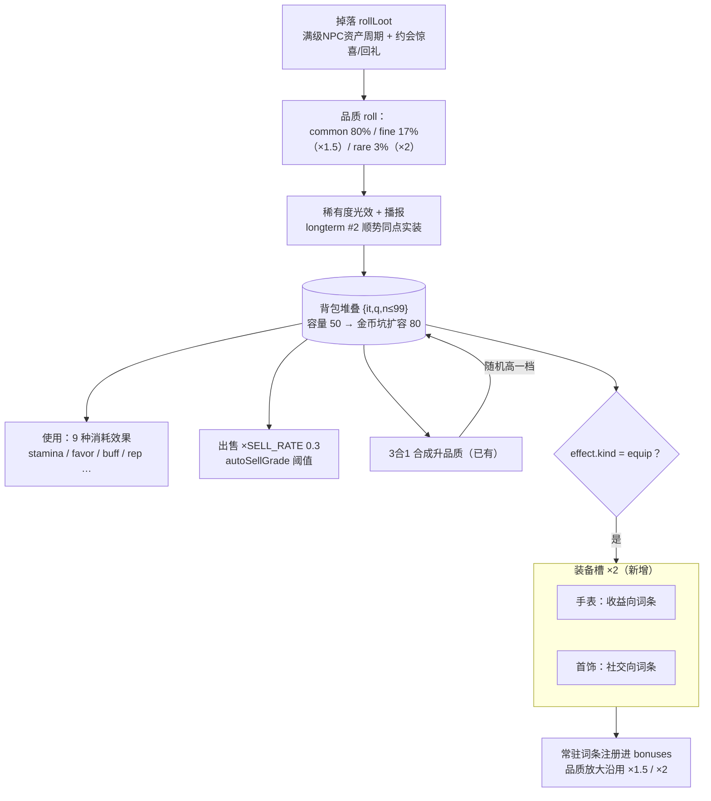
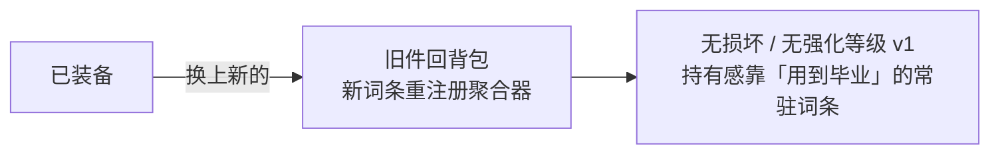

# 05 · 物品与装备系统

> 口径源：`growth-evolution-mini.md` §2。现有 12 件消耗品 + 3合1合成保留，最小步 = 加 2 个装备槽。

## 物品生命周期

```mermaid
flowchart TD
    DROP["掉落 rollLoot<br/>满级NPC资产周期 + 约会惊喜/回礼"]
    Q["品质 roll：<br/>common 80% / fine 17%（×1.5）/ rare 3%（×2）"]
    RARE["稀有度光效 + 播报<br/>longterm #2 顺势同点实装"]
    DROP --> Q --> RARE
    INV[("背包堆叠 {it,q,n≤99}<br/>容量 50 → 金币坑扩容 80")]
    RARE --> INV

    INV --> USE["使用：9 种消耗效果<br/>stamina / favor / buff / rep …"]
    INV --> SELL["出售 ×SELL_RATE 0.3<br/>autoSellGrade 阈值"]
    INV --> SYN["3合1 合成升品质（已有）"]
    SYN -->|"随机高一档"| INV
    INV --> ISEQ{"effect.kind = equip？"}

    subgraph EQS["装备槽 ×2（新增）"]
        W["手表：收益向词条"]
        J["首饰：社交向词条"]
    end
    ISEQ -->|"是"| EQS
    EQS --> REG["常驻词条注册进 bonuses<br/>品质放大沿用 ×1.5 / ×2"]
```

## 装备替换语义

```mermaid
flowchart LR
    OLD["已装备"] -->|"换上新的"| SWAP["旧件回背包<br/>新词条重注册聚合器"]
    SWAP --> NOLOSE["无损坏 / 无强化等级 v1<br/>持有感靠「用到毕业」的常驻词条"]
```

## 备注

- 魔方/自定义词条明确后置；不做交易市场（TBH 差评教训）。
- 成本约 2 天（含光效播报联动）。
