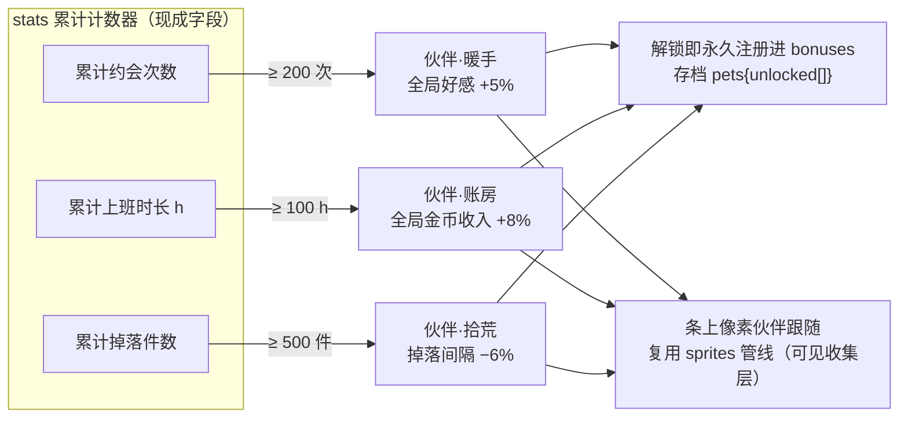
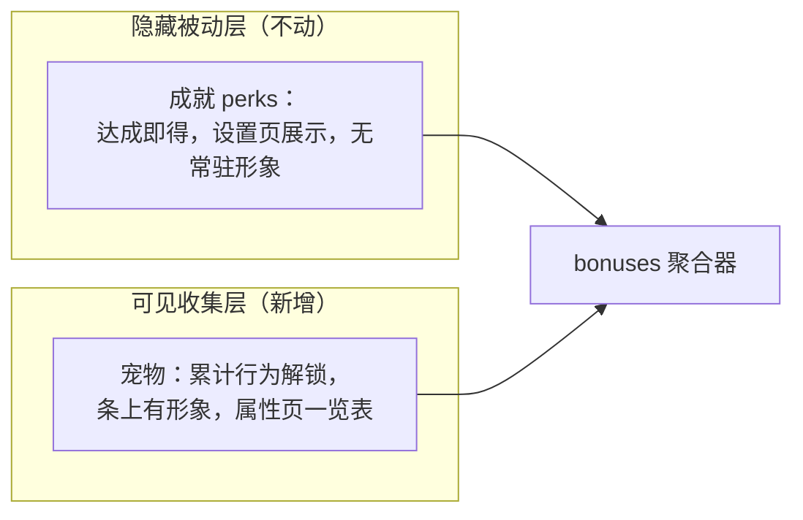

# 06 · 宠物系统

> 口径源：`growth-evolution-mini.md` §3 + gamemad TBH 宠物说明。
> 照抄 TBH 四定理：**永久全局生效 / 无需上阵 / 可叠加无上限 / 越早解锁复利越大**。

## 解锁与生效链路

## 与成就 perks 的分工

## 后置项（只记录不实施）

- 更多宠物按新行为计数器扩充（累计识人次数 / 完成业务单数）；
- DLC 卖宠物的商业化路线：TBH 案例为「付费弱于免费」反教材，若上 Steam 只做外观向。

## 备注

- 首版 3 只对应三资源；数值全部进 balance.js 可后台调。
- 成本约 2~3 天（依赖 01 聚合器 + sprites）。
