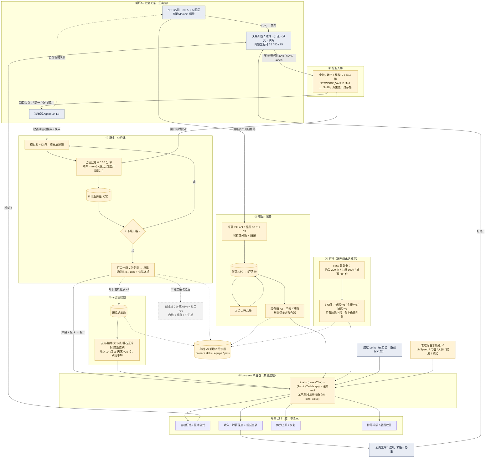

# 07 · 全模块总图（All-in-One）

> 整合 01~06 与已实装系统为一张图。口径权威源不变：
> `growth-evolution-mini.md` + `career-numbers-mini.md`；各模块细节见同目录 01~06。

## 图例

| 样式 | 含义 |
| --- | --- |
| 蓝灰实底 | 已实装（NPC 名册 / 决策器 / 消费菜单 / 成就 perks） |
| 金色实底 | 本轮规划新增（①聚合器 ②人脉 ③职业 ④技能 ⑤物品装备 ⑥宠物） |
| 灰色虚边 | 后置项（创业线 / 存档联动为虚线仅示意归属） |

## 总图

## 阅读顺序

1. 左上循环 A（已实装）产出「关系」→ ②人脉；
2. 人脉作闸门喂给 ③业务管线，业务量推 ③十级升职；
3. 升职发点给 ④天赋网、发钱进 ①聚合器；
4. ⑤装备与 ⑥宠物与技能一样只向 ①注册词条；
5. ①是唯一出口：好感/收入/体力/掉落四个结算点取值后回流循环 A——闭环。
