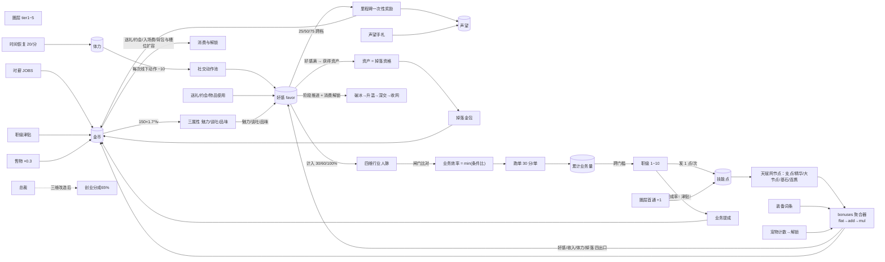

# 08 · 数值全景图（每个数值是什么 / 怎么涨 / 影响什么）

> 本文是全部数值的**单一速查入口**：§1 一张流程总图看流向，§2~§3 两张表逐项查细节，§4 公式速查，§5 封顶与护栏。
> 标注【已有】= 当前代码已实装（含 balance.js 键名）；【规划】= growth-evolution-mini / career-numbers-mini 待实装。
> 格式说明：明细用表格（比 mermaid 更适合「一行一数值」的查阅），mermaid 只画资源流向一张图。

## §1 资源流向总图

## §2 已有数值明细【已有】

| 数值 | 存哪 / 键名 | 怎么提升 | 影响什么 | 上限 / 封顶 |
| --- | --- | --- | --- | --- |
| 金币 | `state.gold` | 时薪（25/30/45+晚班×1.5）、掉落金包、售物×0.3、里程碑、离线 | 属性升级、送礼约会办事、圈层入场费、背包/槽位扩容 | 无上限（靠下方消耗坑回收） |
| 声望 rep | `state.rep` | 里程碑 MILESTONE_REP、声望手札 LETTER_REP、满级 FULL_REP、REP_PASSIVE 每秒被动 | **唯一用途：圈层准入** canEnterTier | 无上限 |
| 体力 stamina | `state.stamina` | 恢复 20/分（后台旋钮）、能量咖啡等物品 | 线下互动−10 / 微信−2 / 职场−6 / 上班按时扣；归零进歇业，回 30% 复岗 | STAMINA_MAX 100 |
| 好感 favor | `npcs[id].favor` | 微信+2 / 朋友圈+1 / 职场+3 / 线下互动（公式见§4）/ 送礼 4/10/25 / 约会 6/15/35 / 办事 60 | 里程碑奖励、阶段推进、消费解锁、满级得资产（掉落资格）、规划中人脉计入 | FAVOR_MAX 100 |
| 魅力 charm | `state.attrs.charm` | 金币升级 150×1.7^lv | 自动好感系数 +(0.08×lv)，即 ATTR_EFFECT | 无硬上限（成本指数自限） |
| 谈吐 talk | 同上 | 同上 | 互动收益 ×(1+0.08×lv) | 同上 |
| 品味 taste | 同上 | 同上 | 高圈层入场门槛（t3 需10/t4 需25/t5 需50）、大礼品味门槛 LARGE_TASTE | 同上 |
| 圈层 tier | 派生自 rep+taste+入场费 | 声望攒够 + 交费 + 品味达标 | 资产收入倍率 mult 1→40、矜持 restraint 1.0→3.0、掉落间隔、模板池开放 | 5 级封顶 |
| 攻略槽 slots | `state.slots` | 金币扩容 50000/500000/8000000/1e8 | 同时攻略人数 | SLOTS_MAX 7 |
| 成就 perks | `state.perks` | 达成统计条件（互动次数/工时/掉落数等） | perkMul 全局乘区（如捡漏之王 dropMul） | 一次性，达成即永久 |

## §3 规划数值明细【规划】

| 数值 | 存哪 | 怎么提升 | 影响什么 | 上限 / 封顶 |
| --- | --- | --- | --- | --- |
| 行业人脉 ×3 + 总人脉 | **不进存档，实时派生** | 只随好感里程碑涨：NETWORK_VALUE(t1=2…t5=16)×计入比例 30/60/100% | 业务闸门比对、Agent 选人缺口反馈 | 名册全收满为天花板（派生无溢出风险） |
| 累计业务量 | `career.bizVolumeTotal` | 跑单：基准量×效率；效率=min(人脉比/类型比/…) | 唯一用途：升职门槛判定 | 不消费不清零（进度量纲） |
| 职级 level | `career.level` | 业务量跨门槛自动+1 | 提成率 8→18%、津贴 200→600000、技能点+1/次、（后置）NPC 初始价值感 | 打工 10 级封顶 |
| 技能点 | `skills.points` | 升职/公司升级/圈层首通各+1 | 在天赋网点亮节点 | 收入端全期 14 点（打工）/24 点（含创业），见下行 |
| 天赋网节点 | `skills.nodes{}` | 消耗技能点点亮；大节点需本系≥5点；同对基石互斥；连携效果看他系投入 | 词条注册进聚合器（flat/add/cond 型） | 全树需求 ≈29 点 > 可得 14/24 点——永远无法全亮 |
| 装备词条 | `equips{watch,jewel}` | 掉落 equip 类物品穿上；品质放大 ×1.5/×2 | 常驻注册进聚合器 | 2 槽；同类 add 词条总上限 +100% |
| 宠物计数 | `stats.total*`（现成） | 约会 200 次 / 上班 100h / 掉落 500 件 | 解锁即永久全局词条 + 条上像素形象 | 可叠加无上限（TBH 定理） |

## §4 公式速查

| 公式 | 表达式 | 出处 |
| --- | --- | --- |
| 自动好感 | `0.5 × (1+0.08×魅力) ÷ 矜持 × (1+辅助加成) × perkMul` | engine.js:159 |
| 线下互动 | 自动好感 × 5 × (1+0.08×谈吐) | engine.js:170 |
| 属性升级成本 | `150 × 1.7^当前等级` | balance.js:24 |
| 工资 | `wage × 班长h × (晚班1.5 / 离线1.2)` | engine.js:247 |
| 业务提成 | `基准量 × 提成率 × TIERS.mult^0.5`（防顶层爆炸） | career-mini §2 |
| 创业收入 | `业务价值 × 65%` ≈ 打工中位 ×10 | start.md §11 |
| 掉落间隔 | `INTERVAL_S[tier] ÷ 个体系数 × jitter(0.7~1.3) × perkMul(dropMul)` | engine.js:577 |
| 掉落品质 | common .80 / fine .17 / rare .03（辅助型稀有权重×2） | balance.js:118 |
| 业务效率 | `min(1, 人脉A比, 人脉B比, 类型计数比, …)`，不足不打折失败只降产量 | start.md §12 |
| 聚合器叠序 | `(base+Σflat) × (1+min(Σadd,+100%cap)) × 连乘mul` | growth-mini §0 |

## §5 通胀护栏（哪些地方故意封顶）

| 护栏 | 数值 | 目的 |
| --- | --- | --- |
| add 词条同类总和 | ≤ +100%，超出转独立 mul | 防百分比叠穿 |
| 提成的圈层修正 | `mult^0.5` 而非全额 mult | 顶层收入不脱缰 |
| 技能点总量 vs 树需求 | 14 < 29；创业后 24 < 29 | Build 取舍，防全配平推 |
| 天赋网基石 | 同对互斥且全树只取一侧 | 身份 Build 不叠加 |
| 大节点门槛 | 本系投入 ≥5 点才可点亮 | 防浅尝辄止白嫖顶点 |
| 好感 | FAVOR_MAX 100，claimed 防重复领 | 里程碑不可刷 |
| 办事 | 每人一次 | 高性价比动作限次 |
| 离线 | 12h 上限 OFFLINE_CAP_H | 挂机封顶 |
| 掉率口径 | 全部进 SETTINGS_DEFAULT 后台可调 + 档案卡公示 | TBH「爆率黑箱」差评教训 |
