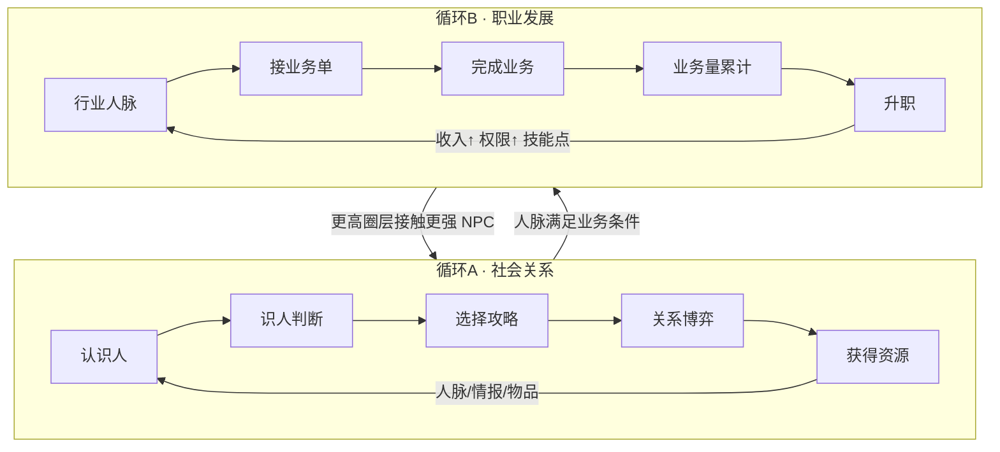
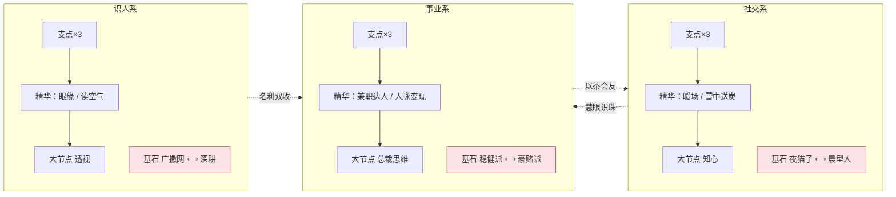

# 人脉圈 · 完整策划案（alpha3 整合版 · 实现快照）

> **本册定位（2026-08-25 重写）**：逐条对照 `src/` 当前代码核写的**真实完整实现快照**——
> 所有公式、数值、概率、规则均与代码一致，未实装的内容一律显式标注【未实装】/【后置】。
> 设计推导与历史沿革仍在同目录 `README.md` + `01~08` 分文件；若与本文冲突，**以本文（即代码）为准**。
> 标注约定：【实装】=当前代码已实现；【未实装】=设计存在但代码没有；【后置】=明确延后。

---

## 0. 导览

游戏一句话：**贴在 Windows 任务栏上的像素放置游戏——你经营的不是战斗小队，而是你的社会关系网，并把人脉转化成职业资本。**

建议阅读顺序：§1 定位 → §2 核心循环 → §11 天赋网（玩点最密集）→ §10 职业 → §4~§9 按需查数。
待拍板的设计问题集中在 §19 开放问题，共 10 条。

---

## 1. 游戏定位

| 维度 | 内容 |
| --- | --- |
| 形态 | 任务栏常驻约 100px 高的像素条 + 点击升起的 420px 功能面板；干预式放置（玩家只在关键节点出手）【实装】 |
| 题材 | 都市社交与人脉经营；NPC 名册 30 人 × 5 圈层（全男性名册）【实装】 |
| 基调 | 「清醒体面向上」，成就/文案走打工人共鸣路线（对标 TBH 的上班摸鱼梗） |
| 赛道参照 | 《TBH: Task Bar Hero》验证产品形态；其差评教训是我们的红线（见 §18） |
| 平台现状 | Electron 单机，存档 JSON 本地（userData/save.json）；不上服务器，永不开放交易 |

---

## 2. 核心循环（双循环互锁）



- **三层成长**（低熵原则，所有成长只归这三层）：个人能力（属性/天赋）→ 关系网络（好感/人脉）→ 职业资本（职级/业务量/收入）。
- **操作期**玩家决定攻略谁、走哪个行业；**放置期**由决策器自动跑：社交→攒人脉→跑业务→发钱→推升级。
- 三种 Build 方向（金融/地产/高科技）通过行业选择 + 基石互斥对体现。

### 系统树（七系统，含状态）

```text
1. NPC系统        固有属性+关系阶段+domain标注        【实装】
2. 识人系统       情报/第三偏好/雷区 + 识人动作        【实装】
3. 社交系统       渠道动作+消费菜单+约会随机           【实装】
4. 人脉系统       行业化派生 + 缺口反馈                【实装】
5. 职业系统       三行业+打工10级                      【实装·打工线】创业【后置】
6. 成长系统       天赋网/装备槽/宠物                   【实装】
7. 自动化系统     Agent L0~L3 + gap补位                【实装】
```

---

## 3. 主角：属性 / 体力 / 槽位 / 圈层【实装】

### 3.1 属性与升级

| 项 | 数值/公式 |
| --- | --- |
| 三属性 | 魅力 charm / 谈吐 talk / 品味 taste，初始 0 |
| 升级成本 | `round(150 × 1.7^当前等级 × priceRate)`；品味画册 buff 下一次升级 **÷2（向上取整）并消耗** |
| 属性效果 | 每级 +8%（ATTR_EFFECT=0.08）：魅力→自动好感、谈吐→线下互动、品味→圈层门槛与大礼解锁 |

### 3.2 体力

| 项 | 数值 |
| --- | --- |
| 上限 | `staminaMax(默认100) + 成就词条`（人脉广博 +20） |
| 恢复 | 20/游戏分（staminaRegenPerMin），不超过上限 |
| 消耗 | 线下互动 10 / 微信 2 / 职场 6 / 识人 12（均可后台调） |
| 歇业 | 上班中体力扣至 0 → 自动歇业（无惩罚）；恢复到上限 30% 自动复岗 |

### 3.3 攻略槽

- 初始 3，购买上限 7：扩容费 `{4:5万, 5:50万, 6:800万, 7:1亿} × priceRate`；
- **有效槽位** `slotCapOf = clamp(已购数 + slotsAdd词条, 1, 9)`——广撒网 +2 / 深耕 −1 叠加在其上；
- 开局资金 10000；新档自动入槽第一目标顾言（t1_gu）。

### 3.4 圈层（TIERS）

| tier | 名 | 声望门槛 | 入场费 | 品味 | 收入倍率 mult | 矜持 restraint |
| -: | --- | --: | --: | --: | --: | --: |
| 1 | 职场圈 | 0 | 0 | 0 | 1 | 1.0 |
| 2 | 精英圈 | 100 | 1万 | 0 | 2.5 | 1.2 |
| 3 | 名流圈 | 600 | 10万 | 10 | 6 | 1.5 |
| 4 | 富豪圈 | 3500 | 150万 | 25 | 15 | 2.0 |
| 5 | 顶层圈 | 2万 | 3000万 | 50 | 40 | 3.0 |

- 进入规则：声望/入场费/品味三达标 + **逐级进入**；**首次进入每圈层发 1 技能点**；
- 声望来源（当前实现仅此三类）：①声望型 NPC 里程碑 `MILESTONE_REP{1:8,2:20,3:55,4:140,5:360}`；②声望手札 `LETTER_REP{1:1,2:2,3:4,4:8,5:15}`；③满级转资产 `FULL_REP{1:5,2:10,3:27,4:70,5:180}`（声望型 ×2）。
- ⚠️ `REP_PASSIVE{0.1~4}`（每秒被动声望）在数值表中保留但**代码未接线【未实装】**。

---

## 4. 关系与社交【实装】

### 4.1 关系状态机

`locked（圈层未开且未被引荐）→ available → courting（入槽）→ asset（好感满）`；引荐（referred）可跳过圈层锁。
关系阶段：破冰 0-24 / 升温 25-49 / 深交 50-74 / 收网 75-100；NPC 条目带 `met`（是否已结识，迁移时按旧档补）。

### 4.2 好感结算管线（grantFavor——所有好感入口统一走这里）

```text
实得 = min(好感上限, 当前 + amount
        × 离线效率(_offMul，离线=50%)
        × [知心 且 当前好感≥100 → ×2]                # 收网区
        × favorMul乘区(条件词条按ctx判定) )           # 渠道固定好感经 noBonus 跳过整段
```
- favorMul 乘区内的条件词条：读空气（未揭示第三偏好 ×1.10）、深耕（主目标=首位槽位 ×1.40）、广撒网（全局 ×0.80）、摸鱼大师/暖人/暖手/首饰等；
- 跨里程碑 25/50/75：声望型发 `MILESTONE_REP[tier]`，金钱/辅助型发 `MILESTONE_GOLD[tier]{300/750/1800/4500/12000}`（每 NPC 每档一次）；
- 好感达上限 → **转资产**：移出槽位、发满级声望、解锁 `refer` 引荐链上的下家（referred=true）；
- 好感上限 = 100（FAVOR_MAX）；**知心**天赋 +20 → 120。

### 4.3 渠道动作（免费池）

| 动作 | 好感 | 体力 | 冷却 | 限制 | 加成 |
| --- | --: | --: | --- | --- | --- |
| 微信聊天 | +2 固定 | 2 | 30游戏分/NPC（×socialCd词条） | 任意时段 | **不受任何好感加成** |
| 朋友圈互动 | +1 固定 | 0 | 2游戏时/NPC（×socialCd词条） | 任意时段 | 不受加成 |
| 职场互动 | +3 固定 | 6 | 60分/NPC | 仅 T1 且在岗且入槽 | 不受加成 |
| 线下互动 | 公式 | 10 | 无 | 非在岗 | 走 favorMul + 暖场 |
| 识人 | 2+flat词条 | 12（×identifyCost） | 360游戏分/NPC（×identifyCd） | 非在岗、入槽 | 见 §4.8 |

- 线下互动公式：`自动好感 × 5 × (1+0.08×谈吐) × 暖场阶段乘区`
  其中 `自动好感 = 0.5 × (1+0.08×魅力) ÷ 圈层矜持 × (1+辅助资产加成)`；
  辅助资产加成 = 每个 aux 型资产 +5%，上限 50%；
  暖场（s14 二选一）：破冰期 ×1.6 / 升温期 ×1.4。
- 话术（s12）：微信/朋友圈冷却 ×0.92。

### 4.4 消费动作

**送礼**（好感 = 固定值 × favorPerYuanRate × 雪中送炭）：

| 档 | 好感 | 价格（T1→T5） | 备注 |
| --- | --: | --- | --- |
| 小礼 | +4 | 80 / 400 / 2000 / 1万 / 5万 | — |
| 中礼 | +10 | 250 / 1300 / 6500 / 3.3万 / 16万 | — |
| 大礼 | +25 | 800 / 4000 / 2万 / 10万 / 50万 | 需品味 `{3:5, 4:13, 5:25}` |

雪中送炭（s15）：目标好感 <25 时送礼效果 ×1.4（含物品等效礼）。大礼/远行/办事后按 8% 概率触发 NPC 回礼（每周每 NPC 限 1 次，品质 +1 档，**回礼池不含装备**）。

**约会**（价格 = 基准礼物价 × 倍数 × priceRate × 名片夹0.8 × datePriceMul词条）：

| 档 | 好感基 | 解锁好感 | 价格倍数 | 变体 |
| --- | --: | --: | --- | --- |
| 轻约 | +6 | 0 | 小礼×1.5 | 街角咖啡[市井/美食] · 看展[文艺/收藏] · 球赛[运动/时尚] |
| 正餐 | +15 | ≥25 | 中礼×1.5 | 家常馆子[市井/美食] · 商务宴请[商务/酒局] · 私厨[美食/收藏] |
| 远行 | +35 | ≥50 | 大礼×2.5 | 音乐节之旅[文艺/时尚] · 城市漫游[美食/旅行] · 高尔夫周末[商务/运动] |

- 匹配：变体 tag 与 NPC 偏好（tags + 已揭示第三偏好）交集 ≥1 → **×1.2**，否则 **×0.8**；雷区 tag（mine）强制按 0.8 口径；
- 热点命中（当日热点 tag 交集）再 **×1.2**；
- 读空气（i15）：目标第三偏好未揭示时好感获取 ×1.10；
- 社交悍匪（成就）：约会价格 ×0.95。

**办事**：+60 × favorPerYuanRate，价格 = 大礼×6 × priceRate（T1=4800），好感 ≥75 解锁，**每人限一次**。

### 4.5 约会随机事件（每次约会结算时掷一次）

| 事件 | 基础权重 | 效果 |
| --- | --: | --- |
| 顺其自然 | 60 | ×1 |
| 相谈甚欢 | 20 | ×1.5 |
| 小插曲 | 12 | ×0.7 |
| 惊喜时刻 | 5 | ×2 且掉 1 件普通物品（池：奶茶券/纪念品/名片夹/体力咖啡/双人展票） |
| 偶遇贵人 | 3 | ×1 且送 1 条情报（revealIntel） |

权重修正：偏好匹配时「惊喜时刻」×2；热点命中时积极事件（相谈甚欢/惊喜）×2；消费风格=豪掷时积极事件 ×1.2。
约会计入 `stats.totalDates`（社交悍匪/暖手成就计数）。

### 4.6 邀约

- 每游戏日切时判定：好感 ≥40、非资产、无未过期邀约的 NPC，概率 `15% × (匹配轻约变体 ? 1.2 : 0.8)`；
- 邀约 24 游戏时过期；接受 = **免费正餐档**约会（自动选最优变体，走完整事件掷骰）；设置可切「先问我」。

### 4.7 热点日历

每日切刷新 1~2 个热点（池 8 个，各带 2 tag）；当日约会变体命中热点 tag → 好感 ×1.2。

### 4.8 识人系统

- 情报三类：`third` 隐藏第三偏好 / `line` 引荐线索 / `mine` 雷区；
- 获取来源：①rep 型 NPC 掉落的 intel 分支（20%）②约会「偶遇贵人」③**识人动作**④透视天赋；
- **识人动作**（alpha3 新增宿主动作）：对入槽 NPC，花 `12体力 × identifyCost词条`，冷却 `360游戏分 × identifyCd词条`，随机揭示一条缺失情报，附好感 `2 + identifyFavor flat词条`（察言观色 +5）；情报读全后按钮置灰「已看透」；
- **透视**（i16）点亮瞬间：对所有**已结识**（名册有记录或正在槽内）NPC 全量揭示；之后识人体力耗 ×1.5。

---

## 5. 掉落与物品【实装】

### 5.1 资产掉落（唯一主渠道）

- 触发：asset NPC 周期掉落。间隔 = `INTERVAL_S[tier]{120/150/240/420/720}s ÷ NPC个体系数 × jitter(0.7~1.3) × dropIntervalRate × dropMul词条`；声望手札间隔 ×2；名利双收（y3，识人系≥4）对资产 NPC 再 ×0.85；
- 内容分流（按 NPC 类型）：money `[金70/物品20/功能10]`、rep `[手札55/情报20/金15/功能10]`、aux `[功能45/金35/物品20]`；`itemDropChance` 旋钮缩放物品分支，未中回落金包/手札；
- 金包金额 = `BASE_OUTPUT[type]{money:1.0, rep:0.35, aux:0.15} × 圈层mult × NPC系数 × 3600 × dropValueRate × jitter(0.6~1.4)`（期望对齐 v1 秒产 ×70% 金币占比）；**金包到账 × incomeMul 词条（账房）**；
- 品质 roll：普通 80% / 精致 17%（效果 ×1.5）/ 稀有 3%（×2；`rareItemRate` 可调；辅助型稀有权重 ×2）；
- 功能分支 8% 出装备（`equipDropRate` 可调，二选一：精钢腕表/青玉平安扣）；普通物品分支 70% 礼物盒 / 30% 限量藏品；
- 手动 3 秒内点中金包 = ×2（自动拾取关闭时）；掉落 3s 后按自动出售阈值处理或入包。

### 5.2 物品表（14 件）

| 物品 | 品质 | 效果（普通基准，精致×1.5/稀有×2） |
| --- | --- | --- |
| 心动奶茶券 🧋 | 普通 | 随机一名槽内 NPC 好感 +3 |
| 体力咖啡 🥤 | 普通 | 体力 +30 |
| 纪念品 🎀 | 普通 | 送任意攻略对象，好感 +2（send 类） |
| 商务名片夹 📇 | 普通 | 24 游戏时内约会价格 ×0.8 |
| 内部简报 📰 | 普通 | 声望 +`max(1, ceil(2×圈层mult/10))` |
| 手写请柬 ✉️ | 精致 | 指定 NPC 免费轻约一次 |
| 双人展票 🎟️ | 精致 | 免费约会（好感≥25 自动升正餐档，自动选最优变体） |
| 品味画册 🖼️ | 精致 | 下一次属性升级 5 折 |
| 惊喜蛋糕 🍰 | 精致 | 全部槽内 NPC 好感 +2 |
| 礼物盒 🎁 | 精致 | 等效中礼免费送出（可攒） |
| 引荐名片 💼 | 稀有 | 解锁一名上一层未结识 NPC |
| 限量藏品 💎 | 稀有 | 等效大礼免费送出 |
| 精钢腕表 ⌚ | 基准 | **装备【手表】**：时薪 +6%（词条按品质放大） |
| 青玉平安扣 📿 | 基准 | **装备【首饰】**：全局好感 +5%（词条按品质放大） |

### 5.3 背包

- 容量 50；堆叠上限 99/格（同 id 同品质）；满包时新掉落**挤占普通品质**堆，全稀有包拒收普通；
- 出售折价 30%（整堆/部分）；自动出售阈值 off/普通及以下/精致及以下（离线同口径，稀有必入包）；
- 扩容金币坑：5万→60 格 / 50万→70 / 500万→80。

### 5.4 合成 3合1

3 件同品质（稀有不可再合）→ 1 件高一档**随机**物品（全物品表均匀，**装备除外**）；满包且腾不出格时原子拒绝。

### 5.5 装备槽 ×2

- 手表（收益向：精钢腕表 时薪+6%）/ 首饰（社交向：青玉平安扣 全局好感+5%）；词条按**穿戴品质** ×1.5/×2 放大后常驻注册进聚合器；
- 换装旧件回背包（原子预检）、无损坏无强化；卸下即注销词条；装备只能从掉落获得（合成/回礼池排除）。

---

## 6. 工作与时间【实装】

### 6.1 工作

| 职业 | 时薪 | 体力/时 | 解锁 | 特性 |
| --- | --: | --: | --- | --- |
| 奶茶店服务员 | 25 | 8 | 开局 | 小费概率 12%，金额 5~20 |
| 餐厅服务员 | 30 | 12 | 开局 | 现实 18:00-22:00 时薪 ×1.5 |
| 便利店夜班 | 45 | 20 | 资产≥3 | 离线挂班收益 ×1.2 |

- 排班档位 2/4/8 游戏时；工资公式 = `时薪 × workWageRate ÷ 3600 × wageMul词条 × incomeFactors × (兼职达人?×2)`（餐厅晚班再 ×1.5，按**真实时刻**逐段判定）；小费每游戏时掷一次 `P=tipChance`；
- 兼职达人（c14）：工资与体力消耗同时 ×2（等价同时两份班）。

### 6.2 时间

- `timeScale` 缩放游戏时间流速（默认 1）；游戏时钟 `gt` 随 step 累计；
- 日切（每 24 游戏时）：日预算台账清零、热点刷新、邀约判定与过期清理。

### 6.3 离线结算

- 上限 = `(12h + min(12h, 辅助资产数×1.5h)) ÷ timeScale`，超出标记 capped；
- 好感：全部好感入账 ×50%（`_offMul=offlineFavorRate`）；
- 分段推进（≤400 段 ×10min 真实时）跑完整 `step`：工资（按各段真实时刻判晚班窗口）、掉落、业务单、日切全部照跑；决策器动作（若启用）逐段执行；
- 离线包裹：物品按自动出售阈值过滤后入包，折价金直接入账；简报含工资/业务量/提成/津贴/离线升职/里程碑/包裹/售出件数。

---

## 7. 决策器 Agent【实装】

- **L0 战略**：读 settings——消费风格 frugal/standard/generous/lavish、日预算/单人预算、体力分配优先级；
- **L1 阶段白名单**：免费动作恒可用（互动/微信/朋友圈/职场/识人/物品）；付费按阶段——破冰：无；升温：+轻约/小中礼；深交：+正餐/远行/大礼；收网：+办事；frugal 只留免费+小礼，generous/lavish 跳阶段门；
- **L2 效用评分**：`得分 = 收益 ÷ (0.02×费用/当前金币 + 1.0×体力)`；邀约对象 ×2；距下一里程碑 ≤3 时 ×1.5（milestonePushWeight）；豪掷风格付费动作 ×1.1；同分取便宜；物品动作走生成期固定分（补体力 4~5、免费好感 0.5、免费约会 2.5、免费礼 favor/10、识人 0.6）；
- **L3 护栏**：体力 reserve（先工作 75% / 比例 40% / 先社交 0%），体力近溢出无视 reserve；预算硬护栏同手动；
- **自动补位**（资产腾槽后）：off / 产出优先 / 引荐优先 / 声望优先 / **gap 缺口优先**（按当前行业模板最大人脉缺口的 domain 排序候选）。

---

## 8. 数值底座：bonuses 聚合器【实装】

```text
词条 = { attr, kind: flat | add | mul, cond? }        # 来源：成就/天赋网/装备/宠物
final = (base + Σflat) × (1 + min(Σadd, +100%cap)) × 连乘mul
```
- add 同类总和封顶 +100%，超出部分**按条转独立 mul**（按值降序填充，与注册顺序无关）；
- 条件词条（cond）由结算点传 ctx 判定：thirdHidden / favorLt25 / mainTarget / night(18-24时) / day(6-18时) / stageIce / stageWarm；
- 以茶会友（y2，事业系≥4）：社交系全部词条效果 ×1.25（mul 型按 `1+(v-1)×1.25` 放大）；
- 缓存：`_bCache/_bSig` 签名（perks/节点值/点数/装备/宠物/职级）任一变化自动重建；**不入档**（保存前剔除）。

---

## 9. 成就 perks（隐藏被动层）【实装】

| 成就 | 条件 | 被动 |
| --- | --- | --- |
| 摸鱼大师 | 累计线下互动 1000 次 | 全局好感 +3% |
| 全勤打工人 | 累计上班 100 游戏时 | 时薪 +10% |
| 捡漏之王 | 累计拾取 500 件 | 掉落间隔 −5% |
| 社交悍匪 | 累计约会 100 次 | 约会价格 −5% |
| 人脉广博 | 资产数 10 | 体力上限 +20 |

达成即永久生效（`stats` 计数器：totalInteract/totalWorkMs/totalLoot/totalDates/assets）。

---

## 10. 行业人脉【实装】

- 30 名册各带 `domain`（金融/地产/高科技 各 10 人）；
- 人脉值 `NETWORK_VALUE = {t1:2, t2:4, t3:7, t4:11, t5:16}`；计入比例按好感里程碑：≥25→30%，≥50→60%，≥75→100%（不衰减）；
- **派生值不进存档**，实时计算：`人脉[域] = Σ 值×比例 × networkGainMul`；输出四维（三域+总）；
- 用途：①业务闸门比对（§11）②Agent gap 补位排序。

---

## 11. 职业与业务【实装·打工线】

### 11.1 单位与周期

- 业务量单位「万」，只累计不消费；金币是唯一货币；同时只跑 1 单；
- 业务周期 = 模板工时（18~45 分）× `bizSpeed × (1+工时词条)`；放置自动接单推进、**离线照跑**、手动可换单。

### 11.2 打工十级表（T-CAREER）

| 级 | 职位 | 门槛(万) | 提成率 | 津贴(金/周期) |
| -: | --- | --: | --: | --: |
| 1 | 副专员 | 0 | 8% | 0 |
| 2 | 专员 | 100 | 9% | 200 |
| 3 | 副主管 | 500 | 10% | 800 |
| 4 | 主管 | 1000 | 11% | 2500 |
| 5 | 副经理 | 2500 | 12% | 6000 |
| 6 | 经理 | 6000 | 13% | 15000 |
| 7 | 副总监 | 15000 | 14% | 40000 |
| 8 | 总监 | 40000 | 15% | 100000 |
| 9 | 副总裁 | 100000 | 16% | 250000 |
| 10 | 总裁 | 250000 | 18% | 600000 |

- **实得提成（金）= 基准量(万) × 提成率 × TIERS.mult^0.5 × 300（COMMISSION_PER_WAN 换算系数）× commissionScale × incomeFactors**；
  提成率 = 职级基准 + 敬业II(+1%) + 人脉变现（每资产 +0.5%，≤+15%）；
  incomeFactors = incomeMul（账房 ×1.08）× goldWin（夜猫子 18-24时 +30%/日间 −10% 或 晨型人日间 +20%）；
- 结算同时发职级津贴（固定值，不随乘区）；
- **升职即事件**：可跨多级一次结清，每级发 1 技能点 + toast；门槛 × bizThresholdMul。

### 11.3 业务模板池（15 条，圈层逐级开放）

| 模板 | 行业 | 要求 | 基准量 | 工时 | 职级 |
| --- | --- | --- | --: | --: | --: |
| 散户开户冲量 | 金融 | 金融≥6 | 5万 | 20分 | 1 |
| 社区看房接驳 | 地产 | 地产≥5 | 4万 | 18分 | 1 |
| 门店系统地推 | 高科技 | 高科技≥5 | 4万 | 18分 | 1 |
| 楼盘分销带看 | 地产 | 地产≥10，金钱型×1 | 25万 | 25分 | 2 |
| 券商开户返佣 | 金融 | 金融≥12 | 22万 | 24分 | 2 |
| SaaS年费续约 | 高科技 | 高科技≥10，声望型×1 | 20万 | 22分 | 2 |
| 天使轮跟投 | 高科技 | 高科技≥14，金钱型×1 | 120万 | 30分 | 4 |
| 商业地产包销 | 地产 | 地产≥30，金钱型×1 | 100万 | 28分 | 3 |
| 私募代销份额 | 金融 | 金融≥35，声望型×1 | 110万 | 30分 | 3 |
| 并购过桥融资 | 金融 | 金融≥40，金钱型×2 | 900万 | 35分 | 6 |
| 地块联合开发 | 地产 | 地产≥60，声望型×1 | 850万 | 34分 | 7 |
| 独角兽轮跟投 | 高科技 | 高科技≥70，金钱型×1 | 800万 | 32分 | 8 |
| 跨境资产配置 | 金融 | 金融≥120 | 2600万 | 40分 | 8 |
| 城市更新基金 | 地产 | 地产≥150 | 2400万 | 42分 | 9 |
| 硬科技并购基金 | 高科技 | 高科技≥180 | 2200万 | 45分 | 9 |

（类型计数比按「非锁定」NPC 计——含可攻略未入槽者。）

- **效率替代随机失败**：`效率 = min(1, 各人脉比, 各类型计数比) + 慧眼识珠加成`，慧眼识珠（y1，社交系≥4）= `min(+10%, 已揭示情报数 × 2%)`；稳健派（k3a）效率下限保底 50%；结果钳到 [0,1]；不足只降产量且 UI 明示缺口；
- 实得业务量 = `基准量 × 效率 ×（豪赌派 且 效率=1 ? ×1.3）`；
- 自动选单：行业内可用模板按 `量×效率/工时` 取最优；手动换单默认清进度，**总裁思维（c16）按已耗时携带**（钳到新单工时）；
- `careerMode` 旋钮当前仅 `employee` 生效。

### 11.4 创业【后置·未实装】

公司十级沿用门槛表、65% 分成率、核心 NPC 信任/价值感门槛、`初始价值感 = 10 + 职级×4`——全部依赖三维关系改造，未落地。

---

## 12. 关系天赋网【实装】

### 12.1 规则

| 层 | 数量 | 消耗 | 规则 |
| --- | --: | --: | --- |
| 支点 | 9 | 1点 | 链式前置（prev） |
| 精华 | 6 | 1点 | 部分二选一（暖场）/条件词条 |
| 大节点 | 3 | 2点 | 需本系已投入 ≥5 点 + 前置任一精华 |
| 基石互斥对 | 3对 | 1点 | **同对互斥**（存档校验保先到一侧），职级 ≥8 解锁 |
| 连携 | 3 | 2点 | 本系投入 ≥4 + 职级 ≥6 |

- 职级门槛：支点/精华 gate=1（常开），连携 gate=6（经理），基石与大节点 gate=8（总监）；
- 点数收入：升职 ×9 + 圈层首通 ×5 = **14 点**；全树需求 ≈29 点——永不能全亮；
- 洗点费 = `已投点数 × respecBase(2万) × (1+已洗次数)`，**首次免费**；返还全部点数、清空节点、词条重算。

### 12.2 全节点清单（数值与代码一致）

**识人系**：耳目I/II（识人冷却 ×0.95 ×2）· 察言观色（识人好感 flat+5）｜眼缘（首次入槽好感+5）· 读空气（未揭第三偏好者好感 ×1.10）｜**透视**（点亮即全揭示已结识情报；识人体力耗 ×1.5）｜基石 广撒网（槽+2/全局好感 ×0.8）⟷ 深耕（主目标好感 ×1.4/槽−1）

**社交系**：暖人I/II（favorMul add +3% ×2）· 话术（微信/朋友圈冷却 ×0.92）｜暖场（点亮二选一：破冰互动 ×1.6 / 升温互动 ×1.4）· 雪中送炭（好感<25 送礼 ×1.4）｜**知心**（好感上限 100→120；≥100 收网区收益 ×2）｜基石 夜猫子（现实18-24时金币收益+30%/日间−10%）⟷ 晨型人（日间+20%）

**事业系**：敬业I（时薪+5%）· 提效（业务工时−5%）· 敬业II（提成率+1%）｜兼职达人（双份班：工资与耗体 ×2）· 人脉变现（每资产提成+0.5%，≤+15%）｜**总裁思维**（换单按已耗时携带进度）｜基石 稳健派（工时+10%/效率保底50%）⟷ 豪赌派（满条件业务量+30%）

**跨系连携**：慧眼识珠（社交≥4：每条情报业务效率+2%，≤+10%）· 以茶会友（事业≥4：社交系词条+25%）· 名利双收（识人≥4：资产 NPC 掉落间隔−15%）



---

## 13. 宠物（可见收集层）【实装】

TBH 四定理：永久全局生效 / 无需上阵 / 可叠加 / 越早解锁复利越大。与成就同检查时机解锁，解锁即永久注册词条，条上像素跟随 + 成长页一览。

| 伙伴 | 条件 | 效果 |
| --- | --- | --- |
| 伙伴·暖手 🐱 | 累计约会 200 次 | 全局好感 +5% |
| 伙伴·账房 🦜 | 累计上班 100 小时 | 全局金币收入 +8%（时薪/提成/掉落金包） |
| 伙伴·拾荒 🐶 | 累计拾取 500 件 | 掉落间隔 −6% |

---

## 14. 存档契约 v3【实装】

新增四组字段（迁移幂等，旧字段不动）：

```json
career   { industry, level, bizVolumeTotal, currentBiz{tplId,eff,workMs,doneMs} }
skills   { points, nodes{}, washed }
equips   { watch{it,q}|null, jewel{it,q}|null }
pets     { unlocked[] }
```

迁移规则（v1→v3 链式、v2/v3 直接规范化）：非法行业归 null、职级钳 1-10、未知/互斥节点剔除（同对保先到）、装备槽校验物品与槽位匹配、宠物白名单过滤、`_bCache/_bSig` 缓存不入档、老档已认识 NPC 补 `met=true`（防眼缘补发）。

---

## 15. 后台总旋钮（SETTINGS_DEFAULT 权威默认值）【实装】

| 组 | 键（默认值） |
| --- | --- |
| 体力 | staminaRegenPerMin(20) staminaMax(100) interactStaminaCost(10) wechatStaminaCost(2) workplaceInteractCost(6) offlineRegen(true) |
| 时间 | timeScale(1.0) offlineCapHours(12) offlineFavorRate(0.5) |
| 经济 | startGold(1万) dropIntervalRate(1.0) dropValueRate(1.0) itemDropChance(1.0) **equipDropRate(0.08)** rareItemRate(0.03) priceRate(1.0) favorPerYuanRate(1.0) workWageRate(1.0) tipChance(0.12) |
| 职业与业务 | bizSpeed(1.0) bizThresholdMul(1.0) networkGainMul(1.0) commissionScale(1.0) careerMode(employee) identifyCdMin(360) identifyStaminaCost(12) respecBase(2万) |
| 自动攻略 | decisionIntervalSec(5) spendStyle(standard) dailyBudget(2万) perNpcBudget(5000) milestonePushWeight(1.5) autoSlotOrder(off/output/refer/reputation/gap) |
| 界面/背包 | autoPickup(true) notifyLevel(all) decisionLogDepth(50) autoSellGrade(off) invitePolicy(auto) |

预设：标准（默认）/ 休闲（回复40、物价0.8、掉落价值1.2）/ 极速（回复60、timeScale 2、预算不限）。
⚠️ `wechatEfficiency(0.4)` 在表中保留但**代码未接线【未实装】**。

---

## 16. GM 工具（管理后台）【实装】

+1万金 / +100万金 / +100声望 / 体力回满 / 发随机稀有物品 / 解锁下一圈层（不发技能点）/ 全 NPC 好感+10 / 导出存档 / 导入存档（导入走完整迁移校验）。改动会标记存档 `customMode`。

---

## 17. 未实装清单【后置/规划】

| 项 | 状态 |
| --- | --- |
| 创业模式全套（公司十级、65% 分成、信任/价值感门槛、初始价值感） | 【后置】依赖 NPC 三维关系改造 |
| 关系衰减语义 | 【后置】同上（当前人脉永续） |
| 装备魔方/自定义词条、第三装备槽 | 【后置】 |
| 多面板并排停靠 | 【后置】 |
| `REP_PASSIVE` 每秒被动声望、`wechatEfficiency` | 数值表保留，**代码未接线** |
| 宠物 DLC/付费 | 仅记录，不实施（红线 3） |

## 18. 设计红线（TBH 差评「不做清单」）

1. **永不开放交易/市场**；2. **不做随机失败**——条件不足降效率并明示缺口；3. **不做数值付费**；4. **掉率透明**——全部阈值进后台参数+公示；5. **不抄战斗语义**。

## 19. 开放问题（待拍板）

1. 天赋网 21 节点+3 连携对放置游戏是否过重？
2. 夜猫子/晨型人用现实时钟，与「清醒体」基调是否冲突？
3. 技能点 14 点前期张力偏晚（连携需各系≥4），是否降门槛？
4. 业务周期 30 分钟/单槽节奏是否偏慢？
5. 提成率 8→18% 曲线与津贴量级**未经模拟校准**（含 COMMISSION_PER_WAN=300 换算系数的绝对额）；
6. 人脉永续不衰减是否接受？
7. 装备 2 槽是否够「毕业装」情感？
8. 创业后置期打工终盘是否需要过渡性创业 Lite？
9. 洗点定价对休闲玩家是否过狠？
10. 宠物正式命名与像素形象方向。

## 20. 实施状态（alpha3 排期 ①~⑧）

| 切片 | 状态 |
| --- | --- |
| ① bonuses 聚合器 | ✅ 实装（含缓存签名、溢出转 mul） |
| ② 职业数据表 + 旋钮 | ✅ 实装（15 模板，超原计划 12 条） |
| ③ domain 标注 + 人脉派生 | ✅ 实装（30 条，每域 10 人） |
| ④ 业务管线 MVP | ✅ 实装（自动接单/离线照跑/跨档升职/津贴） |
| ⑤ 天赋网 | ✅ 实装（含拓扑 UI 成长页、洗点、存档校验） |
| ⑥ 装备槽 | ✅ 实装（含稀有光效播报、equipDropRate 旋钮） |
| ⑦ 宠物 | ✅ 实装（条上跟随 + 一览） |
| ⑧ 创业 + 三维关系 | ⏸ 后置 |
| 识人动作（宿主机制） | ✅ 实装（设计隐含，实现期补全） |

验证：`npm test` 引擎 283 项 + 决策器 16 项全绿；真实渲染层可视化验收通过（成长页/业务跑单/天赋点亮/装备穿脱/识人/宠物跟随/稀有播报/离线简报）。

---

*本文件为 alpha3 实现快照；修订请同步分文件与代码。评审意见直接批注。*
