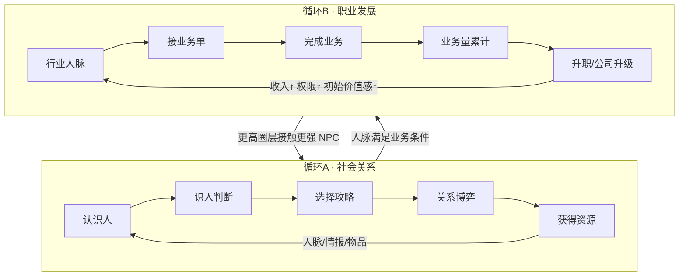
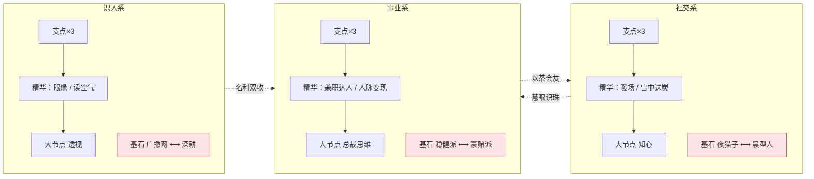

# 人脉圈 · 完整策划案（alpha3 整合版）

> **单文件快照**（2026-08-25）：把截至 alpha3 的全部设计整合为一册，供其他策划通读并给建议。
> 图集与分模块细节在同目录 `README.md` + `01~08`；若日后口径修订，**以分文件为准**，本文只做同步快照。
> 标注约定：【已有】=当前代码已实装；【规划】=本轮排期目标；【后置】=明确延后。

---

## 0. 给评审策划的导览

游戏一句话：**贴在 Windows 任务栏上的像素放置游戏——你经营的不是战斗小队，而是你的社会关系网，并把人脉转化成职业资本。**

建议阅读顺序：§1 定位 → §2 核心循环 → §9 天赋网（玩点最密集）→ §7 职业 → 其余按需。
最需要你们帮忙拍板的问题集中在 **§16 开放问题**，共 10 条。

---

## 1. 游戏定位

| 维度 | 内容 |
| --- | --- |
| 形态 | 任务栏常驻约 100px 高的像素条 + 点击升起的 420px 功能面板；干预式放置（玩家只在关键节点出手） |
| 题材 | 都市社交与人脉经营；NPC 名册 30 人 × 5 圈层（全男性名册，v2 需求③） |
| 基调 | 「清醒体面向上」，成就/文案走打工人共鸣路线（对标 TBH 的上班摸鱼梗） |
| 赛道参照 | 《TBH: Task Bar Hero》（23 万峰值在线）验证了产品形态；其差评教训是我们的红线（见 §15） |
| 平台现状 | Electron 单机，存档 JSON 本地；不上服务器，永不开放交易 |

---

## 2. 核心循环（双循环互锁）



- **三层成长**（低熵原则，所有成长只归这三层）：个人能力（属性/天赋）→ 关系网络（好感/人脉）→ 职业资本（职级/业务量/收入）。
- **操作期**玩家决定攻略谁、走哪个行业、打工还是创业；**放置期**由决策器自动跑：认识新人→社交博弈→攒人脉→跑业务→发钱→推升级。
- 玩家后期玩的不是「攻略某个人」，而是**社会资本配置策略**（金融帝国/地产大亨/科技创业者三种 Build 方向）。

### 系统树（七系统，含状态）

```text
1. NPC系统        固有属性+关系阶段            【已有】
2. 识人系统       情报/第三偏好/雷区            【已有】
3. 社交系统       渠道动作+消费菜单+约会随机     【已有】
4. 人脉系统       工作渠道+转介绍               【已有】→ 行业化【规划】
5. 职业系统       三行业+打工10级+创业10级      【规划】打工先行，创业【后置】
6. 成长系统       技能/宝物/宠物                【规划】（天赋网/装备槽/宠物）
7. 自动化系统     Agent L0~L3                   【已有】→ 挂钩业务选单【规划】
```

---

## 3. 已实装基础速览【已有】

### 3.1 主角属性与体力

| 项 | 数值 | 出处 |
| --- | --- | --- |
| 三属性 | 魅力/谈吐/品味，金币升级 `150×1.7^lv` | balance.js ATTR_* |
| 属性效果 | 每级 +8% 对应系数（ATTR_EFFECT 0.08） | 同上 |
| 体力 | 上限 100，恢复 20/分；互动−10 微信−2 职场−6；歇业回 30% 复岗 | STAMINA_* |
| 攻略槽 | 初始 3，扩容费 5万/50万/800万/1亿，上限 7 | SLOTS_* |
| 开局资金 | 10000 金币 | START_GOLD |

### 3.2 核心公式

| 公式 | 表达式 |
| --- | --- |
| 自动好感 | `0.5 × (1+0.08魅力) ÷ 矜持 × (1+辅助加成) × perkMul` |
| 线下互动 | 自动好感 × 5 × (1+0.08谈吐) |
| 辅助资产加成 | 每个 +5%，上限 50%（AUX_BONUS_*） |

### 3.3 圈层（TIERS）

| tier | 名 | 声望门槛 | 入场费 | 品味 | 收入倍率 mult | 矜持 restraint |
| -: | --- | --: | --: | --: | --: | --: |
| 1 | 职场圈 | 0 | 0 | 0 | 1 | 1.0 |
| 2 | 精英圈 | 100 | 1万 | 0 | 2.5 | 1.2 |
| 3 | 名流圈 | 600 | 10万 | 10 | 6 | 1.5 |
| 4 | 富豪圈 | 3500 | 150万 | 25 | 15 | 2.0 |
| 5 | 顶层圈 | 2万 | 3000万 | 50 | 40 | 3.0 |

声望来源：里程碑 MILESTONE_REP(8~360)、声望手札 LETTER_REP(1~15)、满级 FULL_REP(5~180)、REP_PASSIVE 每秒被动(0.1~4)。**声望唯一用途 = 圈层准入**。

### 3.4 社交渠道与消费菜单

| 动作 | 好感 | 冷却 | 备注 |
| --- | --: | --- | --- |
| 微信聊天 | +2 | 30分/NPC | 不受加成 |
| 朋友圈互动 | +1 | 2时/NPC | 免费 |
| 职场互动 | +3 | 60分 | 仅 T1 且在岗时段 |
| 线下互动 | 公式 | 手动/Agent | −10 体力 |
| 送礼 小/中/大 | +4/+10/+25 | —— | 价格随圈层 80→50万 |
| 约会 轻/正餐/远行 | +6/+15/+35 | —— | 解锁好感 0/25/50；tag 匹配 ×1.2 否则 ×0.8 |
| 办事 | +60 | 每人一次 | 解锁好感 75 |

约会事件表：顺其自然60% / 相谈甚欢20%(×1.5) / 小插曲12%(×0.7) / 惊喜时刻5%(×2+掉物品) / 偶遇贵人3%(送情报)；偏好匹配时惊喜权重×2。

### 3.5 掉落系统（07 号文档落地）

- **触发**：满级 NPC 资产周期掉落（唯一主渠道），间隔 `INTERVAL_S[tier]=120~720s ÷个体系数 ×jitter(0.7~1.3)`；
- **内容分流**：money 型 `[gold70,item20,func10]`、rep 型 `[letter55,intel20,gold15,func10]`、aux 型 `[func45,gold35,item20]`；
- **品质**：common 80% / fine 17%(效果×1.5) / rare 3%(×2)；辅助型稀有权重×2；
- **其余来源**：约会惊喜时刻、NPC 回礼（品质+1档，每周每限1次）、离线包裹；
- 手动 3 秒内点中金包 = ×2；背包上限 50（金币坑扩至 80）；售出 ×0.3。

### 3.6 成就 perks 与决策器

- **成就即被动**【已有】：达成统计条件永久生效（如捡漏之王 → dropMul），是隐藏被动层；
- **Agent L0~L3**【已有】：L0 战略读 settings（风格/预算）→ L1 阶段剧本白名单（免费恒可用，付费按阶段解锁）→ L2 效用评分（α金币/β体力，里程碑差≤3 加权×1.5）→ L3 护栏中断（体力 reserve、溢出强耗、预算兜底）。

---

## 4. 数值底座：bonuses 聚合器【规划·前置】

一切后续成长的前置改造（约半天）：`perkMul` 硬编码散点改为统一注册制。

```text
词条 = { attr, kind: flat | add | mul | cond, value }
final = (base + Σflat) × (1 + min(Σadd, +100%cap)) × 连乘mul
```

- 来源五类：成就 perks / 天赋网节点 / 装备词条 / 宠物 / 职业职级；后台旋钮另算；
- boot 时 reset+注册，step 与动作结算统一取值；存档只存来源数据，词条可随时重算；
- `cond` 型条件词条（如「仅破冰期」「仅夜间」）由结算点自行判定。

---

## 5. 行业人脉【规划】

- 名册 30 人新增 `domain`（金融/地产/高科技）标注；人脉值 `NETWORK_VALUE = t1:2 / t2:4 / t3:7 / t4:11 / t5:16`；
- 计入比例随既有好感里程碑：≥25 → 30%，≥50 → 60%，≥75 → 100%；v1 不衰减；
- **派生值不进存档**，实时由名册算出（杜绝同步 bug）；输出四维：金融/地产/高科技/总人脉；
- 用途①业务闸门比对（§6）；用途②Agent 缺口反馈：「金融还差 18」→ 筛对应 domain 未攻略 NPC 入队列——「我缺一个银行家」成为驱动再入循环A的钩子。

---

## 6. 职业与业务【规划·主线】

### 6.1 单位锚定（先定这个否则全表失真）

- **业务量 ≠ 金币**：业务量单位「万」，进度量纲只累计不消费；金币仍是唯一货币；
- 收入双轨：现有 JOBS 时薪保底（不动）+ 业务提成主轨；
- **业务周期 = 现实 30 分钟**，同时只跑 1 单，放置自动推进、离线照跑、手动可换单。

### 6.2 打工十级表（T-CAREER）

| 级 | 职位 | 门槛(万) | 提成率 | 津贴(金/周期) |
| -: | --- | --: | --: | --: |
| 1 | 副专员 | 0 | 8% | 0 |
| 2 | 专员 | 100 | 9% | 200 |
| 3 | 副主管 | 500 | 10% | 800 |
| 4 | 主管 | 1000 | 11% | 2500 |
| 5 | 副经理 | 2500 | 12% | 6000 |
| 6 | 经理 | 6000 | 13% | 15000 |
| 7 | 副总监 | 15000 | 14% | 40000 |
| 8 | 总监 | 40000 | 15% | 100000 |
| 9 | 副总裁 | 100000 | 16% | 250000 |
| 10 | 总裁 | 250000 | 18% | 600000 |

（门槛单位「万」；津贴单位「金/周期」。）提成结算 = `基准量 × 提成率 × TIERS.mult^0.5`（平方根修正防顶层爆炸）。**升职即事件**：提成率↑、津贴↑、发技能点 1、toast。

### 6.3 业务模板（T-BIZ，首版池 ~12 条按圈层开放）

每单 `{行业, 需行业人脉A/B, 需NPC类型×n, 需职级, 基准量, 工时}`，示例：

| 模板 | 行业 | 要求 | 基准量 | 工时 |
| --- | --- | --- | --: | --: |
| 散户开户冲量 | 金融 | 金融人脉≥6 | 5万 | 20分 |
| 楼盘分销带看 | 地产 | 地产≥10，开发商×1 | 25万 | 25分 |
| 天使轮跟投 | 高科技 | 高科技≥14，创业者×1，职级≥4 | 120万 | 30分 |
| 并购过桥融资 | 金融 | 金融≥40，银行×1，企业主×1，职级≥6 | 900万 | 35分 |

**效率替代随机失败**：`效率 = min(1, 人脉A比, 人脉B比, 类型计数比…)`，不足只降产量且 UI 明示缺口——不赌运气，去改善关系。

### 6.4 创业【后置】

- 公司等级沿用同一张门槛表；`创业收入 = 业务价值 × 65%` vs 打工 ≈6.5% 中位 → 实现 start.md 的「同级 ×10」倍率原则（倍率固定，绝对额可调）;
- 创业单额外要求核心 NPC 信任/价值感 ≥ 阈值——**依赖三维关系改造**，未落地前整体后置；先上打工线已是完整循环；
- 职级反向抬 NPC 初始价值感：`初始价值感 = 10 + 职级×4`（随三维一起实装）。

---

## 7. 关系天赋网【规划】（玩点核心）

> 原「9 个孤立被动」重制。调研基础：PoE 四层结构与基石、暗黑2 协同与点数稀缺、恐怖黎明路径解谜、暗黑4 二选一强化。

### 7.1 五类节点

| 层 | 数量 | 消耗 | 特征 |
| --- | --: | --: | --- |
| 支点（道路） | 9 | 1点 | 小额 flat/add，构成路径，「走哪条路」即选择 |
| 精华 | 6 | 1点 | 命名强词条，多为**条件触发**；部分点亮时二选一强化 |
| 大节点 | 3 | 2点 | 需本系已投入 ≥5 点——深度承诺奖励 |
| 基石互斥对 | 3对取1 | 1点 | 强力+代价，同对互斥，定义 Build 身份 |
| 连携（跨系桥） | 3 | 2点 | 效果由**另一系投入量**驱动的软协同 |

### 7.2 节点清单

**识人系**：支点 情报冷却−5%×2、识人准确 flat+5 ｜精华 眼缘(初见好感+5)、读空气(未揭第三偏好者好感获取+10%) ｜大节点 透视(情报一次全揭示/识人体力+50%) ｜基石对 广撒网(槽+2/全局好感−20%) ⟷ 深耕(主目标好感+40%/槽−1)

**社交系**：支点 自动好感+3%×2、微信朋友圈冷却−8% ｜精华 暖场(二选一：破冰互动×1.6 或 升温×1.4)、雪中送炭(好感<25 送礼×1.4) ｜大节点 知心(好感上限100→120，溢出转收网效率) ｜基石对 夜猫子(18~24时收益+30%/日间−10%) ⟷ 晨型人(日间+20% 无惩罚但低)

**事业系**：支点 时薪+5%、业务工时−5%、提成率+1% ｜精华 兼职达人(同时两份班)、人脉变现(每位满好感NPC提成+0.5%，≤+15%) ｜大节点 总裁思维(换单不清空进度) ｜基石对 稳健派(工时+10%/效率保底50%) ⟷ 豪赌派(无保底/满条件业务量+30%)

**跨系连携**：慧眼识珠(社交系≥4点：每条情报使业务效率+2%，≤+10%) ｜以茶会友(事业系≥4点：社交系词条+25%) ｜名利双收(识人系≥4点：满好感NPC掉落间隔−15%)

### 7.3 点数经济与规则

```text
收入端：升职×9 + 圈层首通×5 = 14 点（创业公司升级再 +10，后置）
需求端：全树 ≈29 点（支点9+精华6+大节点6+连携6+基石2）
→ 打工期覆盖率 48%、终盘 83%：永远无法全亮，每次发点都是真选择
```

- 发放纯事件驱动：不卖、不随时间产出、不可刷；
- 解锁分段：专员期开支点/精华 → 经理期开连携 → 总监期开基石与大节点；
- 洗点费 = `已投点数 × 20000 × (1+已洗次数)`，首次免费（后台可调）。

### 7.4 全树拓扑图（详版见 `04-skills.md`）



---

## 8. 物品与装备【规划】

- 保留：12 件消耗品（9 种效果）、3合1合成升品质、稀有度光效+播报（longterm #2 同点实装）；
- 新增 **2 装备槽**：手表（收益向）/ 首饰（社交向）；equip 类物品穿上后词条常驻进聚合器，品质放大沿用 ×1.5/×2——复刻「一件首饰用到毕业」的持有感；
- 换装旧件回包、无损坏无强化等级（v1）；魔方自定义词条【后置】。

## 9. 宠物【规划】

TBH 四定理照抄：**永久全局生效 / 无需上阵 / 可叠加无上限 / 越早解锁复利越大**。解锁条件翻译成「累计行为」（计数器现成）：

| 伙伴 | 条件 | 效果 |
| --- | --- | --- |
| 暖手 | 累计约会 200 次 | 全局好感 +5% |
| 账房 | 累计上班 100h | 全局金币收入 +8% |
| 拾荒 | 累计掉落 500 件 | 掉落间隔 −6% |

与成就 perks 分层：perks 是隐藏被动层不动；宠物是可见收集层（条上像素伙伴 + 属性页一览）。DLC 卖宠物仅记录不实施（TBH「付费弱于免费」反教材）。

---

## 10. 后置项清单

| 项 | 依赖 |
| --- | --- |
| 创业模式全套（信任/价值感门槛、初始价值感、公司十级） | NPC 三维关系改造（亲密/信任/价值感） |
| 关系衰减语义 | 同上（v1 人脉锁定后永久计入） |
| 装备魔方/自定义词条 | 装备槽验证后 |
| 多面板并排停靠 | 笔记本布局方案 |

## 11. 存档契约 v2→v3

迁移幂等、旧字段不动，仅新增：

```json
career   { industry, level, bizVolumeTotal, currentBiz }
skills   { points, nodes{} }
equips   { watch, jewel }
pets     { unlocked[] }
```

## 12. 排期切片（合并排序）

```text
① bonuses 聚合器                        半天   ← 一切的前置
② 职业数据表进 balance.js + 旋钮         半天
③ NPC domain 标注 + 人脉派生             1天
④ 业务管线 MVP（单槽/效率/升职/津贴）     2~3天
⑤ 天赋网挂钩升职发点                     0.5天（拓扑 UI 另计 ≈4~5天）
⑥ 装备槽（含光效播报联动）               2天
⑦ 宠物                                  2~3天
⑧ 创业 + 三维关系                        单独排期【后置】
```

⑤⑥⑦ 互不依赖可并行；只做一个先做①；做完⑤游戏第一次出现 Build 感。

## 13. 数值全景速查

完整明细表（每个数值是什么/怎么涨/影响什么/封顶在哪）与全部公式出处见 `08-numbers-map.md` §2~§5；关键护栏摘录：

| 护栏 | 数值 |
| --- | --- |
| add 词条同类总和 | ≤ +100%，超出转独立 mul |
| 提成圈层修正 | `mult^0.5` 而非全额 |
| 技能点 | 14 < 树需求29（终盘24仍不全亮） |
| 基石 | 同对互斥、全树一侧 |
| 大节点 | 本系≥5点才可点亮 |
| 好感/办事 | FAVOR_MAX 100 / 每人一次 |
| 离线 | 12h 上限 |

## 14. 后台总旋钮（SETTINGS_DEFAULT 新增）

`bizSpeed` / `bizThresholdMul` / `networkGainMul` / `commissionScale` / `careerMode` ＋ 洗点价 `respecBase/respecGrowth`。

## 15. 设计红线（从 TBH 差评学到的「不做清单」）

1. **永不开放交易/市场**（工作室刷爆经济是 TBH 差评轰炸根源）；
2. **不做随机失败**——条件不足降效率并明示缺口，不赌概率；
3. **不做数值付费**——技能点/宠物全事件发放；商业化若上 Steam 只做支持者礼包（外观/仓库位）；
4. **掉率透明**——全部阈值进后台参数+档案卡公示口径，拒绝爆率黑箱；
5. **不抄战斗语义**——一切成长翻译成社交/职业语言。

## 16. 开放问题（欢迎拍板/开喷）

1. **天赋网规模**：21 节点+3连携对放置游戏会不会太重？要不要砍到「3系×(2支点+1精华)+基石」的最小版先行验证？
2. **基石「夜猫子/晨型人」用现实时钟**——鼓励深夜挂机是否与「清醒体面向上」基调冲突？
3. **技能点 14 点是否过紧**：前期 3 点内看不到连携（各系≥4），张力来得偏晚，是否把连携门槛降到 ≥3？
4. **业务周期 30 分钟/单槽**：午休 1 小时只能跑 2 单，节奏是否太慢？或应允许离线加速结算？
5. **提成率 8→18% 曲线与津贴量级**未经模拟校准，需要一次期望收益对齐评审（对照 06-numbers-delta 方法）。
6. **人脉永续不衰减**：数值上干净，但「社会关系会淡」的叙事张力被放弃，接受吗？
7. **装备只有 2 槽**：够不够承载「毕业装」情感？第三槽（如名片夹=识人向）要不要预留？
8. **创业 ×10 倍率**：65% 分成率在三维关系未实装前无法验证，担心后置太久导致打工线终盘无事可做——是否需要一个过渡性创业 Lite？
9. **洗点定价** `点数×2万×递增`：对休闲玩家是否过狠？
10. **宠物命名/形象**：暖手/账房/拾荒是功能名，正式名与像素形象方向待定（拟物 vs 拟人同事）。

---

*本文件由 alpha3 各分文件整合生成；评审意见请直接批注在本文或对应分文件。*
