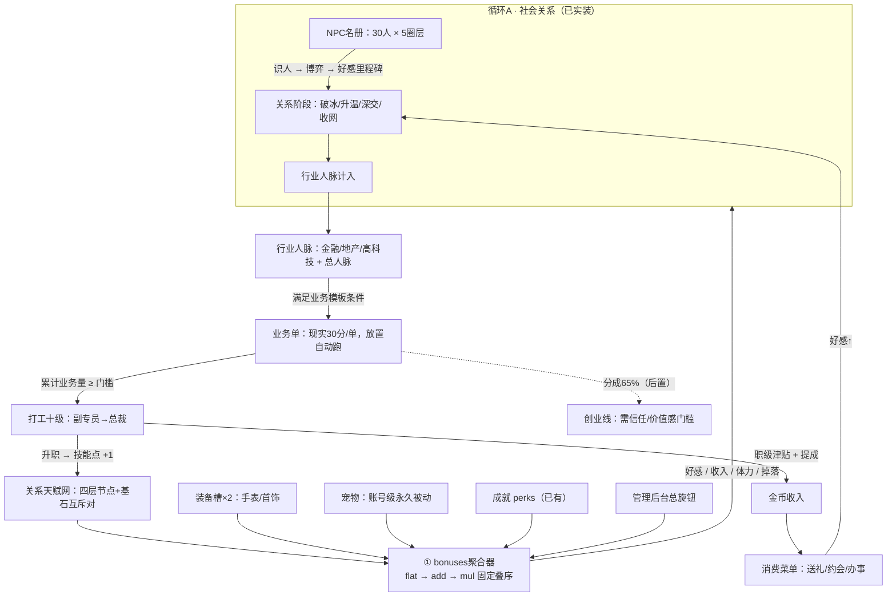
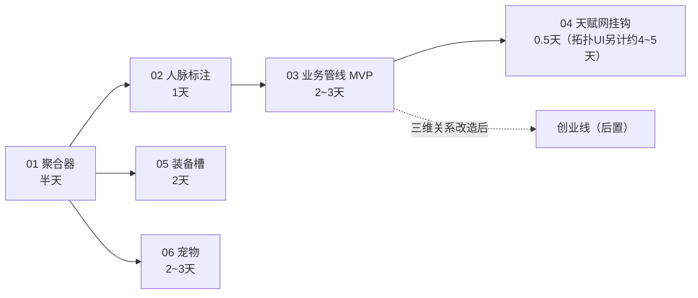
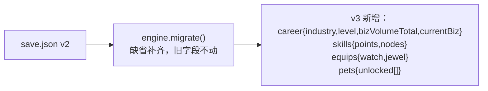

# alpha3 · 成长与职业系统图集（Mermaid）

> 本目录只放图，不放口径。数值权威源：`growth-evolution-mini.md`（成长四件套）+ `career-numbers-mini.md`（职业数值）。
> 已实装系统（NPC 名册 / 决策器 Agent / 消费菜单）只作边界节点出现，不在本目录展开。

## 总览：实现后的完整循环

## 文件索引

| 文件 | 模块 | 图 |
| --- | --- | --- |
| [01-bonus-aggregator.md](01-bonus-aggregator.md) | 数值底座 | 聚合管线图 + 结算时序图 |
| [02-network.md](02-network.md) | 行业人脉 | 派生计算图 + 业务闸门用法 |
| [03-career-business.md](03-career-business.md) | 职业/业务 | 跑单管线图 + 业务单状态机 |
| [04-skills.md](04-skills.md) | 关系天赋网 | 全树拓扑图 + 点数经济 + 洗点与实现 |
| [05-items-equipment.md](05-items-equipment.md) | 物品/装备 | 物品生命周期图 |
| [06-pets.md](06-pets.md) | 宠物 | 解锁与生效链路图 |
| [07-all-in-one.md](07-all-in-one.md) | **全模块总图** | 单图整合 01~06 与已实装系统（含配色图例与阅读顺序） |
| [08-numbers-map.md](08-numbers-map.md) | **数值全景速查** | 资源流向总图 + 已有/规划数值明细表 + 公式速查 + 通胀护栏 |
| [09-full-gdd.md](09-full-gdd.md) | **完整策划案（单文件）** | 截至 alpha3 的全部设计整合一册，供外部策划通读评审；含开放问题清单 |

## 实现顺序（依赖关系）

## 存档契约（全模块共用）

v2 → v3 迁移幂等，仅新增四组字段：

