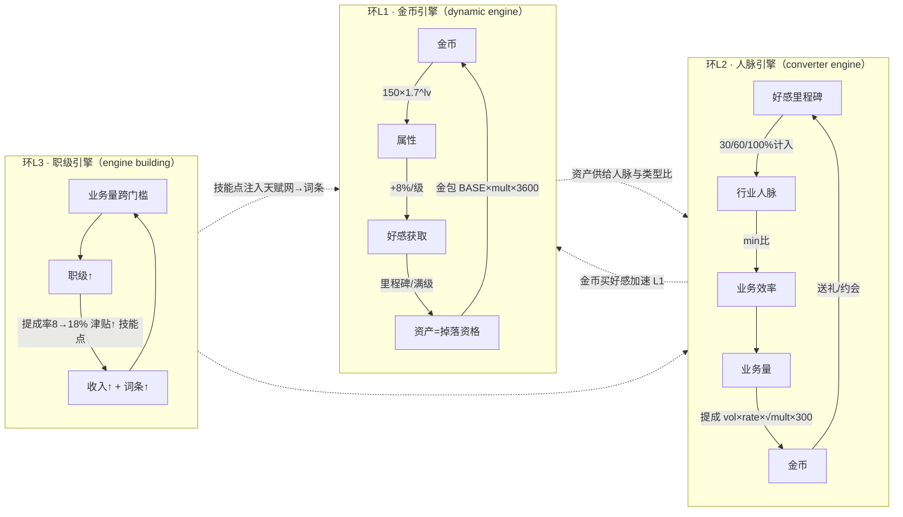

# 01 · 经济反馈回路建模（machinations 视角）

> 方法：machinations-skill 的建模流程——①识别资源并分类 → ②标注经济功能（source/drain/converter/trader）→ ③连出反馈环 → ④**每个放大环检查是否配了摩擦** → ⑤用设计模式词表命名。
> 本文只做审计不改数值；结论喂给 02 的模拟器去验证。

## 1. 资源清单与分类

| 资源 | 类型（machinations 语义） | 存哪 | 经济功能 |
| --- | --- | --- | --- |
| 金币 | tangible（守恒、可支付） | `state.gold` | 唯一可支出货币 |
| 好感 favor | intangible（计数不守恒） | `npcs[].favor` | 关系进度量纲 |
| 声望 rep | intangible | `state.rep` | 圈层准入（单一用途，健康） |
| 体力 stamina | abstract 行动点 | `state.stamina` | 每游戏分再生，动作消耗 |
| 业务量「万」 | abstract（只累计不消费） | `career.bizVolumeTotal` | 升职门槛量纲 |
| 人脉 ×3+总 | abstract **派生** | 不入档实时算 | 业务闸门比对 |
| 物品/装备 | tangible 实体 | 背包/槽位 | 可转换（合成/出售）也可交易语义（红线：永不开放） |

## 2. 三重正反馈环（审计对象）

- **三环嵌套且共享同一瓶颈**：好感时间（矜持÷restraint）与体力。这是放置游戏可控性的来源——但意味着任何一处加成词条都会被三环**三次放大**（好感词条→人脉→提成；好感词条→里程碑→掉落资格）。聚合器的 add 封顶 +100%（engine.js:306）只约束了单结算点，没约束跨环节复合倍率。
- **模式命名**：L1 = dynamic engine（正·建设性）；L2 = converter engine；L3 = engine building。圈层推进 = escalating challenge。词表里**缺失的模式：attrition / slow cycle / dynamic friction**——即下节的缺口。

## 3. 负反馈（摩擦）盘点

| 摩擦 | 作用环 | 随时间/圈层如何增长 | 审计意见 |
| --- | --- | --- | --- |
| 矜持 restraint 1.0→3.0 | L1/L2 关系侧 | 线性 ×3 | ✅ 主摩擦，位置正确 |
| 礼物价格表（小礼 80→5万） | L2 输入端 | 每圈层 ×5，累计 ×625 | ✅ 强于收入增速（mult 仅 ×40），刻意的前紧后紧 |
| 圈层入场费（0→3000万）+ 品味门槛 | 全局一次性坑 | 台阶式 | ⚠️ 一次性坑只延迟不减速；T3→T4 跳变见 02-H3 |
| 提成 √mult 修正 | L2/L3 收入侧 | √40≈6.3 | ✅ 但**仅此一个**收入侧持续阻尼 |
| add 词条封顶 +100%、基石互斥、点数 14<29 | 词条层 | 常量 | ✅ 防叠穿，静态 |
| 属性成本 1.7^lv | L1 输入端 | 指数 | ✅ 自限 |

**结论（假设，待 02 模拟判定）**：负反馈集中在「关系侧 + 一次性坑」，收入侧随版本推移只有 √mult 一个阻尼。若模拟显示后期收入曲线陡于消耗曲线，候补摩擦按侵入度排序：
1. 掉落间隔在 T4/T5 再拉长一档【纯数据】；
2. 高圈层礼物成本从 ×5/档 改为 ×5.5~6/档【纯数据】；
3. 动态摩擦：金币存量越高，非必需消费价格微涨（通胀税）【改公式，谨慎，先不做】。

## 4. 死配置与悬空语义

| 项 | 位置 | 问题 | 处置建议 |
| --- | --- | --- | --- |
| `REP_PASSIVE{0.10~4}` | balance.js:50 | 表保留、代码未接线（GDD §3.4 ⚠️） | 要么接线要么删除；声望唯一用途是准入，「每秒被动声望」会架空手札掉落——建议**删除**并在文档注明 |
| `wechatEfficiency(0.4)` | SETTINGS_DEFAULT:370 | 同上未接线 | 微信固定 +2 不受加成是刻意的免费池锚点，建议**删除该旋钮** |
| errand（办事 +60/大礼×6 价） | balance.js:83 | 性价比是否主导未验证 | 列入 02-H4 动作性价比矩阵 |

## 5. 产出约定

本文确立的回路图（§2 mermaid）与摩擦盘点表（§3）作为 01 号资产维护：每次实装新系统/新词条来源时，必须回答两个问题——
1. 它给哪个环加了多大增益？是否被三环复合放大？
2. 对应的摩擦在哪？没有就写进 §3 候补清单。
