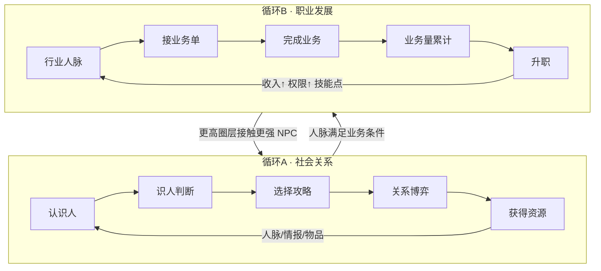
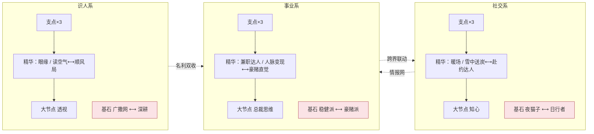

# 人脉圈 · 完整策划案（alpha4 整合版 · 实现快照）

> **本册定位（2026-08-26 重写）**：逐条对照 `src/` 当前代码核写的**真实完整实现快照**——
> 所有公式、数值、概率、规则均与代码一致，未实装的内容一律显式标注【未实装】/【后置】。
> alpha4 主线 = 「校准驱动 + 维度补全」：全部核心曲线经无头模拟器校准（§21），补齐消亡（衰减 Lite）/变化（景气轮换）/确定性（掉落保底）三维。
> 设计推导：同目录 `README.md` + `00~04`；alpha3 沿革见 `../alpha3/`；数值结论 `docs/reports/alpha4-h1h6-conclusions.md`。若与本文冲突，**以本文（即代码）为准**。
> 标注约定：【实装】=当前代码已实现；【未实装】=设计存在但代码没有；【后置】=明确延后；【D6/D7】=待拍板决策。

---

## 0. 导览

游戏一句话：**贴在 Windows 任务栏上的像素放置游戏——你经营的不是战斗小队，而是你的社会关系网，并把人脉转化成职业资本。**

建议阅读顺序：§1 定位 → §2 核心循环 → §12 天赋网（玩点最密集）→ §11 职业 → §21 校准基线 → §4~§10 按需查数。
待拍板事项集中在 §19 开放问题（alpha3 遗留 2 条 + alpha4 新增 3 条）。

---

## 1. 游戏定位

| 维度 | 内容 |
| --- | --- |
| 形态 | 任务栏常驻约 100px 高的像素条 + 点击升起的 420px 功能面板；干预式放置（玩家只在关键节点出手）【实装】 |
| 题材 | 都市社交与人脉经营；NPC 名册 30 人 × 5 圈层（全男性名册）【实装】 |
| 基调 | 「清醒体面向上」，成就/文案走打工人共鸣路线（对标 TBH 的上班摸鱼梗） |
| 赛道参照 | 《TBH: Task Bar Hero》验证产品形态；其差评教训是我们的红线（见 §18） |
| 平台现状 | Electron 单机，存档 JSON 本地（userData/save.json，**v4**）；不上服务器，永不开放交易 |

---

## 2. 核心循环（双循环互锁）



- **三层成长**（低熵原则，所有成长只归这三层）：个人能力（属性/天赋）→ 关系网络（好感/人脉）→ 职业资本（职级/业务量/收入）。
- **操作期**玩家决定攻略谁、走哪个行业；**放置期**由决策器自动跑：社交→攒人脉→跑业务→发钱→推升级。
- 三种 Build 方向（金融/地产/高科技）通过行业选择 + 基石互斥对体现；**官方 Build 预设**三套一键点亮（§12.3）。
- **alpha4 新增环境层**：行业景气周切（业务量与人脉计入 ±20%/−15%，§11.4）+ 业务风险单（产量方差 [0.7,1.3]，§11.3）+ 关系衰减 Lite（默认 off 旋钮，§4.9）。

### 系统树（七系统，含状态）

```text
1. NPC系统        固有属性+关系阶段+domain标注+互动锚点      【实装】
2. 识人系统       情报/第三偏好/雷区 + 识人动作              【实装】
3. 社交系统       渠道动作+消费菜单+约会随机+衰减Lite        【实装】
4. 人脉系统       行业化派生 + 缺口反馈 + 景气计入           【实装】
5. 职业系统       三行业+打工10级+景气/风险单                【实装·打工线】创业【后置】
6. 成长系统       天赋网/装备槽/宠物三阶/成就二阶            【实装】
7. 自动化系统     Agent L0~L3 + gap补位（景气偏好）          【实装】
```

---

## 3. 主角：属性 / 体力 / 槽位 / 圈层【实装】

### 3.1 属性与升级

| 项 | 数值/公式 |
| --- | --- |
| 三属性 | 魅力 charm / 谈吐 talk / 品味 taste，初始 0 |
| 升级成本 | `round(150 × 1.24^当前等级 × priceRate)`；品味画册 buff 下一次升级 **÷2（向上取整）并消耗** |
| 属性效果 | 每级 +8%（ATTR_EFFECT=0.08）：魅力→自动好感、谈吐→线下互动、品味→圈层门槛与大礼解锁 |
| 校准注 | 指数 1.7→1.24：旧指数把 taste 0→50 定价在 7×10¹³ 金（T5 硬墙，sim 20/20 卡死）；现 0→25≈13.5万、0→50≈2931万，弃坑点 lv15+（仍晚于 T3，H5 通过） |

### 3.2 体力

| 项 | 数值 |
| --- | --- |
| 上限 | `staminaMax(默认100) + 成就词条`（人脉广博 +20 / 人脉广博II 再+10） |
| 恢复 | 12/游戏分（staminaRegenPerMin，alpha4 校准 20→12），不超过上限 |
| 消耗 | 线下互动 30 / 微信 3 / 职场 6 / 识人 12（均可后台调；互动 10→30 为校准双收紧） |
| 歇业 | 上班中体力扣至 0 → 自动歇业（无惩罚）；恢复到上限 30% 自动复岗 |

### 3.3 攻略槽

- 初始 3，购买上限 7：扩容费 `{4:5万, 5:50万, 6:800万, 7:1亿} × priceRate`；
- **有效槽位** `slotCapOf = clamp(已购数 + slotsAdd词条, 1, 9)`——广撒网 +2 / 深耕 −1 叠加在其上；
- 开局资金 10000；新档自动入槽第一目标顾言（t1_gu）。

### 3.4 圈层（TIERS，alpha4 校准重定标）

| tier | 名 | 声望门槛 | 入场费 | 品味 | 收入倍率 mult | 矜持 restraint |
| -: | --- | --: | --: | --: | --: | --: |
| 1 | 职场圈 | 0 | 0 | 0 | 1 | 24 |
| 2 | 精英圈 | 500 | 4万 | 0 | 2.5 | 26 |
| 3 | 名流圈 | 3200 | 40万 | 10 | 6 | 31 |
| 4 | 富豪圈 | 12000 | 600万 | 25 | 15 | 36 |
| 5 | 顶层圈 | 32000 | 5500万 | 50 | 40 | 42 |

- 进入规则：声望/入场费/品味三达标 + **逐级进入**；**首次进入每圈层发 1 技能点 + 1 张试洗券**（§12.3）；
- 矜持 restraint 是好感主摩擦（alpha4 ×8~14 抬升：原 1.0~3.0 在掉落洪水下形同虚设）；
- 声望来源（仅此三类）：①声望型 NPC 里程碑 `MILESTONE_REP{1:8,2:20,3:55,4:140,5:360}`；②声望手札 `LETTER_REP{1:1,2:2,3:4,4:8,5:15}`（间隔 ×6）；③满级转资产 `FULL_REP{1:5,2:10,3:27,4:70,5:180}`（声望型 ×2）。
- ~~`REP_PASSIVE`~~ alpha4 已删除（D2：被动声望会架空手札流）。

---

## 4. 关系与社交【实装】

### 4.1 关系状态机

`locked（圈层未开且未被引荐）→ available → courting（入槽）→ asset（好感满）`；引荐（referred）可跳过圈层锁。
关系阶段：破冰 0-24 / 升温 25-49 / 深交 50-74 / 收网 75-100；NPC 条目带 `met`（是否已结识）与 `lastActGt`（衰减锚点，§4.9）。

### 4.2 好感结算管线（grantFavor——所有好感入口统一走这里）

```text
实得 = min(好感上限, 当前 + amount
        × 离线效率(_offMul，离线=50%)
        × [知心 且 当前好感≥100 → ×2]                # 收网区
        × favorMul乘区(条件词条按ctx判定) )           # 渠道固定好感经 noBonus 跳过整段
```

- favorMul 乘区内的条件词条：读空气（未揭示第三偏好 ×1.10）、深耕（主目标=首位槽位 ×1.40）、广撒网（全局 ×0.80）、赴约达人（存在有效邀约 ×1.04）、摸鱼大师/暖人/暖手/首饰等；
- 跨里程碑 25/50/75：声望型发 `MILESTONE_REP[tier]`，金钱/辅助型发 `MILESTONE_GOLD[tier]{300/750/1800/4500/12000}`（每 NPC 每档一次）；
- 好感达上限 → **转资产**：移出槽位、发满级声望、解锁 `refer` 引荐链上的下家（referred=true）；
- 好感上限 = 100（FAVOR_MAX）；**知心**天赋 +20 → 120。

### 4.3 渠道动作（免费池，alpha4 校准压低+拉长 CD）

| 动作 | 好感 | 体力 | 冷却 | 限制 | 加成 |
| --- | --: | --: | --- | --- | --- |
| 微信聊天 | +0.3 固定 | 3 | 120游戏分/NPC（×socialCd词条） | 任意时段 | **不受任何好感加成** |
| 朋友圈互动 | +0.2 固定 | 0 | 120游戏分/NPC（×socialCd词条） | 任意时段 | 不受加成 |
| 职场互动 | +1 固定 | 6 | 60分/NPC | 仅 T1 且在岗且入槽 | 不受加成 |
| 线下互动 | 公式 | 30 | 无 | 非在岗 | 走 favorMul + 暖场 |
| 识人 | 2+flat词条 | 12（×identifyCost） | 360游戏分/NPC（×identifyCd） | 非在岗、入槽 | 见 §4.8 |

- 线下互动公式：`自动好感 × 5 × (1+0.08×谈吐) × 暖场阶段乘区`
  其中 `自动好感 = 0.5 × (1+0.08×魅力) ÷ 圈层矜持 × (1+辅助资产加成)`；
  辅助资产加成 = 每个 aux 型资产 +5%，上限 50%；
  暖场（s14 二选一）：破冰期 ×1.6 / 升温期 ×1.4。
- 话术（s12）：微信/朋友圈冷却 ×0.92。
- 校准注：固定渠道好感 2/1/3 → 0.3/0.2/1 且 CD 30→120 分——原值让免费池成为前期主泵（首资产 0.09 日的元凶）。

### 4.4 消费动作（好感均 ×favorPerYuanRate(0.35)，alpha4 校准 1.0→0.35）

**送礼**（好感 = 固定值 × favorPerYuanRate × 雪中送炭）：

| 档 | 好感 | 价格（T1→T5） | 备注 |
| --- | --: | --- | --- |
| 小礼 | +4 | **240** / 400 / 2000 / 1万 / 5万 | T1 ×3 重定价（校准 iter4） |
| 中礼 | +10 | **700** / 1300 / 6500 / 3.3万 / 16万 | T1 ×2.8 |
| 大礼 | +25 | **2200** / 4000 / 2万 / 10万 / 50万 | 需品味 `{3:5, 4:13, 5:25}`；T1 ×2.75 |

雪中送炭（s15 二选一）：目标好感 <25 时送礼效果 ×1.4（含物品等效礼）。大礼/远行/办事后按 8% 概率触发 NPC 回礼（每周每 NPC 限 1 次，品质 +1 档，**回礼池不含装备**）。

**约会**（好感基 ×favorPerYuanRate；价格 = 基准礼物价 × 倍数 × priceRate × 名片夹0.8 × datePriceMul词条）：

| 档 | 好感基 | 解锁好感 | 价格倍数 | 变体 |
| --- | --: | --: | --- | --- |
| 轻约 | **+8** | 0 | 小礼×1.5 | 街角咖啡[市井/美食] · 看展[文艺/收藏] · 球赛[运动/时尚] |
| 正餐 | **+20** | ≥25 | 中礼×1.5 | 家常馆子[市井/美食] · 商务宴请[商务/酒局] · 私厨[美食/收藏] |
| 远行 | **+45** | ≥50 | 大礼×2.5 | 音乐节之旅[文艺/时尚] · 城市漫游[美食/旅行] · 高尔夫周末[商务/运动] |

- 校准注：好感基 +33%（6/15/35→8/20/45）——原值让约会被同档礼物全面压制、约会计数器饿死（百日 3 次）；价格未动；
- 匹配：变体 tag 与 NPC 偏好（tags + 已揭示第三偏好）交集 ≥1 → **×1.2**，否则 **×0.8**；雷区 tag（mine）强制按 0.8 口径；
- 热点命中（当日热点 tag 交集）再 **×1.2**；
- 读空气（i15 二选一）：目标第三偏好未揭示时好感获取 ×1.10；
- 社交悍匪（成就 I+II）：约会价格 ×0.95 × 0.975。

**办事**：+60 × favorPerYuanRate，价格 = 大礼×6 × priceRate（T1=13200），好感 ≥75 解锁，**每人限一次**。

### 4.5 约会随机事件（每次约会结算时掷一次）

| 事件 | 基础权重 | 效果 |
| --- | --: | --- |
| 顺其自然 | 60 | ×1 |
| 相谈甚欢 | 20 | ×1.5 |
| 小插曲 | 12 | ×0.7 |
| 惊喜时刻 | 5 | ×2 且掉 1 件普通物品（池：奶茶券/纪念品/名片夹/体力咖啡/双人展票） |
| 偶遇贵人 | 3 | ×1 且送 1 条情报（revealIntel） |

权重修正：偏好匹配时「惊喜时刻」×2；热点命中时积极事件（相谈甚欢/惊喜）×2；消费风格=豪掷时积极事件 ×1.2。
约会计入 `stats.totalDates`（仅付费约会；邀约/物品免单走 resolveDate 不计数）。

### 4.6 邀约

- 每游戏日切时判定：好感 ≥40、非资产、无未过期邀约的 NPC，概率 `15% × (匹配轻约变体 ? 1.2 : 0.8)`；
- 邀约 24 游戏时过期；接受 = **免费正餐档**约会（自动选最优变体，走完整事件掷骰，**刷新衰减锚点**）；设置可切「先问我」。

### 4.7 热点日历

每日切刷新 1~2 个热点（池 8 个，各带 2 tag）；当日约会变体命中热点 tag → 好感 ×1.2。

### 4.8 识人系统

- 情报三类：`third` 隐藏第三偏好 / `line` 引荐线索 / `mine` 雷区；
- 获取来源：①rep 型 NPC 掉落的 intel 分支（20%）②约会「偶遇贵人」③**识人动作**④透视天赋；
- **识人动作**：对入槽 NPC，花 `12体力 × identifyCost词条`，冷却 `360游戏分 × identifyCd词条`，随机揭示一条缺失情报，附好感 `2 + identifyFavor flat词条`（察言观色 +5）；**刷新衰减锚点**；情报读全后按钮置灰「已看透」；
- **透视**（i16）点亮瞬间：对所有**已结识** NPC 全量揭示；之后识人体力耗 ×1.5。

### 4.9 关系衰减 Lite（S2，实验特性·默认关闭）【实装·off】

- 总开关 `decayEnabled=false`（设置页勾选「实验特性·默认关闭」，豁免 customMode 标记）；
- 规则（开启时）：**入槽且好感 ≥50** 的非资产 NPC，`gt − lastActGt ≥ 3 游戏日` → 日切 −1，**钳到当前阶段下限**（25/50/75 平台不破）；资产化免疫；
- 互动刷新 `lastActGt`：微信/朋友圈/职场互动/线下互动/送礼/办事/约会/接受邀约/识人（被动自动好感**不**刷新）；
- 人脉联动：好感跌破里程碑 → 计入比例自动降档（派生值零额外代码）；
- 档案卡**不展示倒计时信息**（防挂机焦虑，TBH 教训）；开启/关闭对旧档无副作用。

---

## 5. 掉落与物品【实装】

### 5.1 资产掉落（唯一主渠道）

- 触发：asset NPC 周期掉落。间隔 = `INTERVAL_S[tier]{120/150/240/420/720}s ÷ NPC个体系数 × jitter(0.7~1.3) × dropIntervalRate(默认2.0，校准×2) × dropMul词条`；声望手札间隔 ×**6**（校准 ×2→×6）；名利双收（y3，识人系≥4）对资产 NPC 再 ×0.85；豪赌直觉（c15 二选一）进行中为风险单时 ×0.96；
- 内容分流（按 NPC 类型）：money `[金70/物品20/功能10]`、rep `[手札55/情报20/金15/功能10]`、aux `[功能45/金35/物品20]`；`itemDropChance` 旋钮缩放物品分支，未中回落金包/手札；
- 金包金额 = `BASE_OUTPUT[type]{money:1.0, rep:0.35, aux:0.15} × 圈层mult × NPC系数 × 3600 × dropValueRate(默认0.08，校准÷12.5) × jitter(0.6~1.4)`；**金包到账 × incomeMul 词条（账房）**；掉落降级为风味副收入，经济主泵交还业务/工资（H1）；
- 品质 roll：普通 80% / 精致 17%（效果 ×1.5）/ 稀有 3%（×2；`rareItemRate` 可调；辅助型稀有权重 ×2）；**稀有保底见 §5.6**；
- 功能分支 8% 出装备（`equipDropRate` 可调，二选一：精钢腕表/青玉平安扣）；普通物品分支 70% 礼物盒 / 30% 限量藏品；
- 手动 3 秒内点中金包 = ×2（自动拾取关闭时）；掉落 3s 后按自动出售阈值处理或入包。

### 5.2 物品表（14 件）

| 物品 | 品质 | 效果（普通基准，精致×1.5/稀有×2） |
| --- | --- | --- |
| 心动奶茶券 🧋 | 普通 | 随机一名槽内 NPC 好感 +3 |
| 体力咖啡 🥤 | 普通 | 体力 +30 |
| 纪念品 🎀 | 普通 | 送任意攻略对象，好感 +2（send 类） |
| 商务名片夹 📇 | 普通 | 24 游戏时内约会价格 ×0.8 |
| 内部简报 📰 | 普通 | 声望 +`max(1, ceil(2×圈层mult/10))` |
| 手写请柬 ✉️ | 精致 | 指定 NPC 免费轻约一次 |
| 双人展票 🎟️ | 精致 | 免费约会（好感≥25 自动升正餐档，自动选最优变体） |
| 品味画册 🖼️ | 精致 | 下一次属性升级 5 折 |
| 惊喜蛋糕 🍰 | 精致 | 全部槽内 NPC 好感 +2 |
| 礼物盒 🎁 | 精致 | 等效中礼免费送出（可攒） |
| 引荐名片 💼 | 稀有 | 解锁一名上一层未结识 NPC |
| 限量藏品 💎 | 稀有 | 等效大礼免费送出 |
| 精钢腕表 ⌚ | 基准 | **装备【手表】**：时薪 +6%（词条按品质放大） |
| 青玉平安扣 📿 | 基准 | **装备【首饰】**：全局好感 +5%（词条按品质放大） |

### 5.3 背包

- 容量 50；堆叠上限 99/格（同 id 同品质）；满包时新掉落**挤占普通品质**堆，全稀有包拒收普通；
- 出售折价 30%（整堆/部分）；自动出售阈值 off/普通及以下/精致及以下（离线同口径，稀有必入包）；
- 扩容金币坑：5万→60 格 / 50万→70 / 500万→80。

### 5.4 合成 3合1

3 件同品质（稀有不可再合）→ 1 件高一档**随机**物品（全物品表均匀，**装备除外**）；满包且腾不出格时原子拒绝。

### 5.5 装备槽 ×2

- 手表（收益向：精钢腕表 时薪+6%）/ 首饰（社交向：青玉平安扣 全局好感+5%）；词条按**穿戴品质** ×1.5/×2 放大后常驻注册进聚合器；
- 换装旧件回背包（原子预检）、无损坏无强化；卸下即注销词条；装备只能从掉落获得（合成/回礼池排除）。

### 5.6 掉落透明保底 pity（S3，alpha4 新增）【实装】

| 计数器 | 阈值 | 口径 | 触发效果 |
| --- | --: | --- | --- |
| `loot.pityRare` | 240 | **任何物品分支**的每次非稀有品质掉落 +1（金包/手札/情报不碰） | 下件物品品质强制稀有，计数清零 |
| `loot.pityEquip` | 120 | **仅 func 分支**：未出装备 +1（item 分支礼盒/限量不消耗也不触发） | 下次 func 分支必出装备且品质 ≥精致（先按正常稀有权重掷，未中则精致），计数清零 |

- 双保底叠加：装备保底先锁物品，稀有保底再抬品质；辅助位 ×2 稀有权重保留；
- 离线分段结算走同一 `rollLoot` 管线，计数照跑（同种子逐位一致）；
- UI：背包页「掉落保底」双进度条（n/240、n/120）+ 掉率透明文案；档案卡【掉落公示】行；管理后台「重置保底」按钮；
- 依据：稀有装备自然期望 ≈4167 掉落（H2 证实不可达），保底后 ETA ≈70 游戏时/资产，总裁前可达（G2 ✅）。

---

## 6. 工作与时间【实装】

### 6.1 工作

| 职业 | 时薪 | 体力/时 | 解锁 | 特性 |
| --- | --: | --: | --- | --- |
| 奶茶店服务员 | 25 | 8 | 开局 | 小费概率 12%，金额 5~20 |
| 餐厅服务员 | 30 | 12 | 开局 | 现实 18:00-22:00 时薪 ×1.5 |
| 便利店夜班 | 45 | 20 | 资产≥3 | 离线挂班收益 ×1.2 |

- 排班档位 2/4/8 游戏时；工资公式 = `时薪 × workWageRate ÷ 3600 × wageMul词条 × incomeFactors × (兼职达人?×2)`（餐厅晚班再 ×1.5，按**真实时刻**逐段判定）；小费每游戏时掷一次 `P=tipChance`；
- 兼职达人（c14）：工资与体力消耗同时 ×2（等价同时两份班）。

### 6.2 时间

- `timeScale` 缩放游戏时间流速（默认 1）；游戏时钟 `gt` 随 step 累计；
- 日切（每 24 游戏时）：日预算台账清零、热点刷新、邀约判定与过期清理、**衰减 Lite 结算**（§4.9）；
- 周切（每 7 游戏时×24）：**行业景气轮掷**（§11.4）。

### 6.3 离线结算

- 上限 = `(12h + min(12h, 辅助资产数×1.5h)) ÷ timeScale`，超出标记 capped；
- 好感：全部好感入账 ×50%（`_offMul=offlineFavorRate`）；
- 分段推进（≤400 段 ×10min 真实时）跑完整 `step`：工资（按各段真实时刻判晚班窗口）、掉落（**pity 计数照跑**）、业务单、景气周切、日切全部照跑；决策器动作（若启用）逐段执行；
- 离线包裹：物品按自动出售阈值过滤后入包，折价金直接入账；简报含工资/业务量/提成/津贴/离线升职/里程碑/包裹/售出件数。

---

## 7. 决策器 Agent【实装】

- **L0 战略**：读 settings——消费风格 frugal/standard/generous/lavish、日预算/单人预算、体力分配优先级；
- **L1 阶段白名单**：免费动作恒可用（互动/微信/朋友圈/职场/识人/物品）；付费按阶段——破冰：无；升温：+轻约/小中礼；深交：+正餐/远行/大礼；收网：+办事；frugal 只留免费+小礼，generous/lavish 跳阶段门；
- **L2 效用评分**：`得分 = 收益 ÷ (0.02×费用/当前金币 + 1.0×体力)`；邀约对象 ×2；距下一里程碑 ≤3 时 ×1.5（milestonePushWeight）；豪掷风格付费动作 ×1.1；同分取便宜；物品动作走生成期固定分（补体力 4~5、免费好感 0.5、免费约会 2.5、免费礼 favor/10、识人 0.6）；风险单按期望值评分（jit 期望中性，无需改公式）；
- **L3 护栏**：体力 reserve（先工作 75% / 比例 40% / 先社交 0%），体力近溢出无视 reserve；预算硬护栏同手动；
- **自动补位**（资产腾槽后）：off / 产出优先 / 引荐优先 / 声望优先 / **gap 缺口优先**（按当前行业模板最大人脉缺口的 domain 排序候选；alpha4 S1：**景气质押稳定前置**——景气行业的候选优先补位）。

---

## 8. 数值底座：bonuses 聚合器【实装】

```text
词条 = { attr, kind: flat | add | mul, cond? }        # 来源：成就/天赋网/装备/宠物
final = (base + Σflat) × (1 + min(Σadd, +100%cap)) × 连乘mul
```

- add 同类总和封顶 +100%，超出部分**按条转独立 mul**（按值降序填充，与注册顺序无关）；
- 条件词条（cond）由结算点传 ctx 判定，alpha4 扩容后全集：`thirdHidden / favorLt25 / mainTarget / night(18-24时) / day(6-18时) / stageIce / stageWarm / boomHot(当前单为景气行业) / hasInvite(存在有效邀约) / riskyRun(进行中为风险单)`；
- choice 泛化（S8）：节点可带 `choice:[...keys] + choiceTxt + choiceEntries`，点亮时二选一、存档键任意字符串（UI 校验合法键）；现有四对：读空气⟷顺风局（i15）、暖场 ice⟷warm（s14）、雪中送炭⟷赴约达人（s15）、人脉变现⟷豪赌直觉（c15）；
- 以茶会友（y2，事业系≥4）：社交系全部词条效果 ×1.25（mul 型按 `1+(v-1)×1.25` 放大）；
- 缓存：`_bCache/_bSig` 签名（perks/节点值/点数/装备/宠物阶段/职级）任一变化自动重建；**不入档**（保存前剔除）；景气/风险态不进签名（结算点实时判定，无陈旧缓存路径）。

---

## 9. 成就 perks（隐藏被动层，alpha4 二阶 ×10）【实装】

| 成就 | 条件 | 被动 |
| --- | --- | --- |
| 摸鱼大师 | 累计线下互动 1000 次 | 全局好感 +3% |
| 全勤打工人 | 累计上班 100 游戏时 | 时薪 +10% |
| 捡漏之王 | 累计拾取 500 件 | 掉落间隔 −5% |
| 社交悍匪 | 累计约会 100 次 | 约会价格 −5% |
| 人脉广博 | 资产数 10 | 体力上限 +20 |
| 摸鱼大师II | 线下互动 5000 次 | 全局好感 **再**+2% |
| 全勤打工人II | 上班 500 游戏时 | 时薪 **再**+5% |
| 捡漏之王II | 拾取 2500 件 | 掉落间隔 **再**−2.5% |
| 社交悍匪II | 约会 500 次 | 约会价格 **再**−2.5% |
| 人脉广博II | 资产数 25 | 体力上限 **再**+10 |

- 二阶规则：goal ×5，效果 = 一阶 + 一阶的一半（叠加不替换）；复用同一检查器/聚合器注册路径；
- 达成即永久生效（`stats` 计数器：totalInteract/totalWorkMs/totalLoot/totalDates/assets）；
- ⚠ II 阶目标按 alpha3 原案保留，当前行动经济下 touch/social 系百日不可达 → **D7 待拍板**（§19）。

---

## 10. 行业人脉【实装】

- 30 名册各带 `domain`（金融/地产/高科技 各 10 人）；
- 人脉值 `NETWORK_VALUE = {t1:2, t2:4, t3:7, t4:11, t5:16}`；计入比例按好感里程碑：≥25→30%，≥50→60%，≥75→100%（不衰减；衰减 Lite 开启时好感跌破里程碑自动降档）；
- **景气计入（S1）**：业务闸门比对时 `人脉[域] × boomNetMulOf(域)`（景气 +20% / 低谷 −15%），作用于 min-ratio 之前、reqTypes 类型计数不乘；
- **派生值不进存档**，实时计算：`人脉[域] = Σ 值×比例 × networkGainMul`；输出四维（三域+总）；
- 用途：①业务闸门比对（§11）②Agent gap 补位排序。

---

## 11. 职业与业务【实装·打工线】

### 11.1 单位与周期

- 业务量单位「万」，只累计不消费；金币是唯一货币；同时只跑 1 单；
- 业务周期 = 模板工时（18~45 分）× `bizSpeed × (1+工时词条)`；放置自动接单推进、**离线照跑**、手动可换单。

### 11.2 打工十级表（T-CAREER，alpha4 校准 need 整形）

| 级 | 职位 | 门槛(万) | 提成率 | 津贴(金/周期) |
| -: | --- | --: | --: | --: |
| 1 | 副专员 | 0 | 8% | 0 |
| 2 | 专员 | 150 | 9% | 200 |
| 3 | 副主管 | 700 | 10% | 600 |
| 4 | 主管 | 1600 | 11% | 1500 |
| 5 | 副经理 | 4500 | 12% | 3000 |
| 6 | 经理 | 12000 | 13% | 6000 |
| 7 | 副总监 | 30000 | 14% | 15000 |
| 8 | 总监 | 90000 | 15% | 20000 |
| 9 | 副总裁 | 400000 | 16% | 50000 |
| 10 | 总裁 | 1200000 | 18% | 120000 |

- **实得提成（金）= 基准量(万) × 提成率 × TIERS.mult^0.5 × 300（COMMISSION_PER_WAN）× commissionScale × incomeFactors**；
  提成率 = 职级基准 + 敬业II(+1%) + 人脉变现（每资产 +0.5%，≤+15%；c15 选豪赌直觉侧则无此加成）；
  incomeFactors = incomeMul（账房/账房宠物）× goldWin（夜猫子 18-24时 +30%/日间 −10% 或 日行者日间 +20%）× 顺风局（i15 二选一，当前单景气行业 +4%）；
- 结算同时发职级津贴（固定值，不随乘区；高段津贴校准削减 60~80% 防 H1 独占）；
- **升职即事件**：可跨多级一次结清，每级发 1 技能点 + toast；门槛 × bizThresholdMul。

### 11.3 业务模板池（15 条，圈层逐级开放；★=风险单 certainty:'risky'）

| 模板 | 行业 | 要求 | 基准量 | 工时 | 职级 |
| --- | --- | --- | --: | --: | --: |
| 散户开户冲量 | 金融 | 金融≥6 | 5万 | 20分 | 1 |
| 社区看房接驳 | 地产 | 地产≥5 | 4万 | 18分 | 1 |
| 门店系统地推 | 高科技 | 高科技≥5 | 4万 | 18分 | 1 |
| 楼盘分销带看 | 地产 | 地产≥10，金钱型×1 | 25万 | 25分 | 2 |
| 券商开户返佣 | 金融 | 金融≥12 | 22万 | 24分 | 2 |
| SaaS年费续约 | 高科技 | 高科技≥10，声望型×1 | 20万 | 22分 | 2 |
| 天使轮跟投 | 高科技 | 高科技≥14，金钱型×1 | 120万 | 30分 | 4 |
| 商业地产包销 | 地产 | 地产≥30，金钱型×1 | 100万 | 28分 | 3 |
| ★私募代销份额 | 金融 | 金融≥35，声望型×1 | **127万** | 30分 | 3 |
| 并购过桥融资 | 金融 | 金融≥40，金钱型×2 | 900万 | 35分 | 6 |
| ★地块联合开发 | 地产 | 地产≥60，声望型×1 | **978万** | 34分 | 7 |
| 独角兽轮跟投 | 高科技 | 高科技≥70，金钱型×1 | 800万 | 32分 | 8 |
| 跨境资产配置 | 金融 | 金融≥120 | 2600万 | 40分 | 8 |
| ★城市更新基金 | 地产 | 地产≥150 | **2760万** | 42分 | 9 |
| 硬科技并购基金 | 高科技 | 高科技≥180 | 2200万 | 45分 | 9 |

- **效率替代随机失败**：`效率 = min(1, 各人脉比(×景气计入), 各类型计数比) + 慧眼识珠加成`，慧眼识珠（y1，社交系≥4）= `min(+10%, 已揭示情报数 × 2%)`；稳健派（k3a）效率下限保底 50%；结果钳到 [0,1]；不足只降产量且 UI 明示缺口；
- **风险单（S6）**：T3 起每圈层恰 1 条 `certainty:'risky'`，开工时掷 `jit ∈ [0.7,1.3]` 均匀（期望中性，rng 全路径注入确定性），基准量已烘焙 **+15% 风险溢价**（110→127 / 850→978 / 2400→2760）；结算乘区 `业务量 = 基准量 × 效率 × jit × (豪赌派 且 效率=1 ? ×1.3) × 景气乘区`——jit 与 k3a 保底/豪赌派加成正交复合（保底后整体仍可能 <1）；红线：这是**产量方差**不是随机失败；
- 自动选单：行业内可用模板按 `量×效率/工时` 取最优；手动换单默认清进度，**总裁思维（c16）按已耗时携带**（钳到新单工时）；
- `careerMode` 旋钮当前仅 `employee` 生效。

### 11.4 行业景气轮换（S1，alpha4 新增）【实装】

- 每游戏周切（`gt/WEEK_MS` 游标 `career.boomWeek`）对金融/地产/高科技**各自独立**掷三态：景气（权重30）/ 平稳（45）/ 低谷（25）（累计权重式）；
- 乘区：`boomVolMulOf` 作用于结算业务量、`boomNetMulOf` 作用于人脉计入比——景气 ×1.2 / 平稳 ×1.0 / 低谷 ×0.85（`boomScale=0.2 / boomLowScale=0.15`，总开关 `boomEnabled=true`）；
- 周切发 toast + 决策日志一行「本周景气：金融↑ 地产— 科技↓」；业务页每条模板带景气角标（tooltip 公示 ±%）；
- 与天赋网联动：顺风局（i15 二选一，cond boomHot）/ 豪赌直觉（c15 二选一，cond riskyRun）/ 赴约达人（s15 二选一，cond hasInvite）；
- 存档：`career.boom{finance,estate,tech}` 三枚举（stable/boom/low），迁移幂等默认平稳。

### 11.5 创业【后置·未实装】

公司十级沿用门槛表、65% 分成率、核心 NPC 信任/价值感门槛、`初始价值感 = 10 + 职级×4`——全部依赖三维关系改造，未落地。

---

## 12. 关系天赋网【实装】

### 12.1 规则

| 层 | 数量 | 消耗 | 规则 |
| --- | --: | --: | --- |
| 支点 | 9 | 1点 | 链式前置（prev） |
| 精华 | 6 | 1点 | 部分二选一（choice 泛化：暖场/读空气⟷顺风局/雪中送炭⟷赴约达人/人脉变现⟷豪赌直觉） |
| 大节点 | 3 | 2点 | 需本系已投入 ≥5 点 + 前置任一精华 |
| 基石互斥对 | 3对 | 1点 | **同对互斥**（存档校验保先到一侧），职级 ≥8 解锁 |
| 连携 | 3 | 2点 | 本系投入 ≥4 + 职级 ≥6 |

- 职级门槛：支点/精华 gate=1（常开），连携 gate=6（经理），基石与大节点 gate=8（总监）；
- 点数收入：升职 ×9 + 圈层首通 ×5 = **14 点**；全树需求 ≈29 点——永不能全亮；
- 洗点费 = `已投点数 × respecBase(2万) × (1+已洗次数)`，**首次免费**；**试洗券**（S7）：每圈层首通发 1 张（`wash.tierDone` 游标防重发），持有者下次洗点半价（向上取整）并消耗一张——首免优先于券；返还全部点数、清空节点、词条重算。

### 12.2 全节点清单（数值与代码一致）

**识人系**：耳目I/II（识人冷却 ×0.95 ×2）· 察言观色（识人好感 flat+5）｜眼缘（首次入槽好感+5）· **读空气⟷顺风局**（二选一：未揭第三偏好者好感 ×1.10 / 当前单景气行业收入 +4%）｜**透视**（点亮即全揭示已结识情报；识人体力耗 ×1.5）｜基石 广撒网（槽+2/全局好感 ×0.8）⟷ 深耕（主目标好感 ×1.4/槽−1）

**社交系**：暖人I/II（favorMul add +3% ×2）· 话术（微信/朋友圈冷却 ×0.92）｜**暖场**（二选一：破冰互动 ×1.6 / 升温互动 ×1.4）· **雪中送炭⟷赴约达人**（二选一：好感<25 送礼 ×1.4 / 存在有效邀约好感 +4%）｜**知心**（好感上限 100→120；≥100 收网区收益 ×2）｜基石 夜猫子（现实18-24时金币收益+30%/日间−10%）⟷ 日行者（日间+20%）

**事业系**：敬业I（时薪+5%）· 提效（业务工时−5%）· 敬业II（提成率+1%）｜兼职达人（双份班：工资与耗体 ×2）· **人脉变现⟷豪赌直觉**（二选一：每资产提成+0.5% ≤+15% / 风险单进行中掉落间隔 −4%）｜**总裁思维**（换单按已耗时携带进度）｜基石 稳健派（工时+10%/效率保底50%）⟷ 豪赌派（满条件业务量+30%）

**跨系连携**：情报网（社交≥4：每条情报业务效率+2%，≤+10%）· 跨界联动（事业≥4：社交系词条+25%）· 名利双收（识人≥4：资产 NPC 掉落间隔−15%）



### 12.3 Build 预设（S7，alpha4 新增）【实装】

- 成长页天赋网区三套官方预设按钮，一键按序尝试点亮（点数/前置/互斥/门槛全走 `takeSkill` 同一校验，choice 节点默认取第一项；不可行节点自动跳过）：
  - **广撒网流** `net`：i11→i15 + k1a + y3（8点）
  - **深耕流** `deep`：s11→s16 + k1b（8点）
  - **跑单流** `rush`：c11→c16 + k2b（8点）
- 点击弹确认框（展示可负担前缀消耗），确认后执行并 toast 摘要；剩余自由点留给玩家。

---

## 13. 宠物（三阶成长，alpha4 S4）【实装】

TBH 四定理：永久全局生效 / 无需上阵 / 可叠加 / 越早解锁复利越大。与成就同检查时机升阶（只升不降，可跨阶），`pets{id:stage}` 存档；条上阶段徽标（Ⅰ/Ⅱ/Ⅲ）+ 升阶进度条 + 底栏跟随图标随阶缩放。

| 伙伴 | 阶 | 条件 | 效果 |
| --- | --- | --- | --- |
| 伙伴·暖手 🐱 | Ⅰ / Ⅱ / Ⅲ | 累计约会 8 / 16 / 24 次【D6 二修待拍板】 | 全局好感 +5% / +8% / +12% |
| 伙伴·账房 🦜 | Ⅰ / Ⅱ / Ⅲ | 累计上班 100 / 300 / 1000 小时 | 全局金币收入 +8% / +12% / +16% |
| 伙伴·拾荒 🐶 | Ⅰ / Ⅱ / Ⅲ | 累计拾取 500 / 1500 / 5000 件 | 掉落间隔 −6% / −9% / −12% |

- 效果为**替换**（取当前阶 entries 注册），非叠加；
- ⚠ D6 依据：`totalDates` 只计付费约会，校准后经济下 d15~30 即名册饱和平台化（P50 封顶 ≈24.5 次）——原 200/600/2000 结构性不可达；60~90 日锚定与可达不可兼得，取可达；根治需 alpha5 结构提案（回忆约会/高圈层 NPC 分批入场）。

---

## 14. 存档契约 v4【实装】

alpha4 新增五组字段（v3→v4 链式幂等迁移，v1/v2 走既有链后汇入）：

```json
loot        { pityRare, pityEquip }
pets        { "nuanshou": 1, "zhangfang": 2 }        // unlocked[] 旧档映射 stage:1
career      { industry, level, bizVolumeTotal, currentBiz{tplId,eff,workMs,doneMs,jit},
              boom{finance,estate,tech}, boomWeek }
skills      { points, nodes{}, washed }               // nodes 值可为 true | choice键('ice'/'warm'/'read'/'wind'/'snow'/'date'/'cash'/'nerve')
wash        { vouchers, tierDone }
npcs[id]    { favor, claimed[], asset, referred, met, lastActGt }
```

- 迁移规则：非法行业归 null、职级钳 1-10、未知/互斥节点剔除（同对保先到）、装备槽校验、宠物白名单+阶段钳 1..3、景气枚举白名单、`_bCache/_bSig` 不入档、老档已认识 NPC 补 `met=true`、`lastActGt` 以档内 gt 播种；双迁移逐字节一致（幂等）；
- **校准重定基**（alpha4 ③）：v3→v4 且 `customMode=false` 的档，8 个平衡旋钮（staminaRegenPerMin/interactStaminaCost/wechatStaminaCost/dropIntervalRate/dropValueRate/favorPerYuanRate/dailyBudget/perNpcBudget）对齐新默认——旧档不带 alpha3 节奏进 alpha4；`customMode=true`（玩家改过后台）保留玩家值。

---

## 15. 后台总旋钮（SETTINGS_DEFAULT 权威默认值，alpha4 校准后）【实装】

| 组 | 键（默认值） |
| --- | --- |
| 体力 | staminaRegenPerMin(**12**) staminaMax(100) interactStaminaCost(**30**) wechatStaminaCost(**3**) workplaceInteractCost(6) offlineRegen(true) |
| 时间 | timeScale(1.0) offlineCapHours(12) offlineFavorRate(0.5) |
| 经济 | startGold(1万) dropIntervalRate(**2.0**) dropValueRate(**0.08**) itemDropChance(1.0) equipDropRate(0.08) rareItemRate(0.03) priceRate(1.0) favorPerYuanRate(**0.35**) workWageRate(1.0) tipChance(0.12) |
| 职业/业务 | bizSpeed(1.0) bizThresholdMul(1.0) networkGainMul(1.0) commissionScale(1.0) careerMode(employee) identifyCdMin(360) identifyStaminaCost(12) respecBase(2万) |
| 自动攻略 | decisionIntervalSec(5) spendStyle(standard) dailyBudget(**26000**) perNpcBudget(**6000**) milestonePushWeight(1.5) autoSlotOrder(off/output/refer/reputation/gap) |
| 界面/背包 | autoPickup(true) notifyLevel(all) decisionLogDepth(50) autoSellGrade(off) invitePolicy(auto) |
| **alpha4 新增** | **boomEnabled(true) boomScale(0.2) boomLowScale(0.15) boomWeights([30,45,25]) decayEnabled(false)** |

- 预设：标准（默认）/ 休闲（回复40、物价0.8、掉落价值1.2）/ 极速（回复60、timeScale 2、预算不限）；
- ~~`REP_PASSIVE`~~（D2 删除）、~~`wechatEfficiency`~~（D2 删除）——balance-report §F 死配置自检永久盯防；
- `decayEnabled` 豁免 customMode 标记（实验旋钮不污染「玩家自定义」语义）。

---

## 16. GM 工具（管理后台）【实装】

+1万金 / +100万金 / +100声望 / 体力回满 / 发随机稀有物品 / 解锁下一圈层（**不发技能点与试洗券**，GM 捷径语义）/ 全 NPC 好感+10 / **重置保底**（alpha4 新增，双计数清零）/ 导出存档 / 导入存档（导入走完整迁移校验）。改动会标记存档 `customMode`。

---

## 17. 未实装清单【后置/规划】

| 项 | 状态 |
| --- | --- |
| 创业模式全套（公司十级、65% 分成、信任/价值感门槛、初始价值感） | 【后置】依赖 NPC 三维关系改造 |
| 装备魔方/自定义词条、第三装备槽 | 【后置】S3 pity 落地后「毕业感」由可达性解决，槽数非根因 |
| 宠物像素三阶变体（换色/配饰） | 【后置】当前以阶段徽标+图标缩放代替（D6-2 偏差） |
| 约会目标更新机制（回忆约会/高圈层 NPC 分批入场） | 【后置·alpha5 提案】根治约会平台化（D6 根因） |
| 多面板并排停靠 | 【后置】 |
| 宠物 DLC/付费 | 仅记录，不实施（红线 3） |

## 18. 设计红线（TBH 差评「不做清单」）

1. **永不开放交易/市场**；2. **不做随机失败**——条件不足降效率并明示缺口（S6 风险单为**产量方差** [0.7,1.3]，非失败）；3. **不做数值付费**；4. **掉率透明**——全部阈值进后台参数+公示（alpha4 正面案例：pity 双计数条 + 档案卡【掉落公示】+ 景气角标 tooltip）；5. **不抄战斗语义**；6. **不惩罚离线**（衰减 Lite 仅作默认 off 的实验旋钮，且只软漂移不破阶段）。

## 19. 开放问题（待拍板）

**alpha3 遗留（alpha4 回应情况）**：

1. ~~天赋网是否过重~~ → 已实装且验收通过，维持；
2. ~~夜猫子现实时钟~~ → 维持（基调自洽）；
3. ~~连携门槛偏晚~~ → sim 策略组分化验证通过，needOther 维持 4；
4. ~~业务周期偏慢~~ → 校准后时刻表落区间（§21）；
5. ~~提成曲线未校准~~ → sim.js + balance 报告入库，commissionScale 维持 1.0；
6. ~~人脉永续不衰减~~ → S2 衰减 Lite 上线（默认 off，开/关旋钮在设置页）；
7. ~~装备毕业感~~ → S3 pity 落地，稀有装备总裁前可达（ETA ≈70 游戏时/资产）；
8. 创业后置期打工终盘过渡 → 维持后置；
9. ~~洗点定价~~ → 试洗券落地（每圈层首通一张半价）；
10. 宠物命名/像素形象 → 命名已定（暖手/账房/拾荒），像素三阶变体后置。

**alpha4 新增**：

- A. **D6 追认**：暖手三阶 200/600/2000 → 8/16/24（sim 证据：约会平台化 ≈24.5 次，原值不可达；III 实测 P50≈d5 达成，早于 60~90 锚——「可达」优先）。附带接受度确认：暖手对 frugal 流派不可达（白名单无付费约会）；
- B. **D7 拍板**：成就 II 阶目标是否下调（touch 5000→1200、social 500→60 等）——不下调则全成就日超出 60~90 目标带（结构性：interact 经济封顶 ≈355 次/百日）；
- C. 原生右键/☰ 菜单（Electron native Menu）视觉复核——功能管线 CDP 验证通过，观感待人工确认。

## 20. 实施状态（alpha4 排期 ①~⑪ + 收尾）

| 切片 | 状态 |
| --- | --- |
| ① sim.js 无头模拟器 | ✅（5 策略 / R=200 默认 / worker 分片 / 卡点诊断 / 策略分化断言） |
| ② balance-report 静态报告 | ✅（§A~§F + 死配置自检 + 自动标记汇总） |
| ③ 数据校准 patch | ✅（6 轮迭代，只动旋钮与表数据；§21） |
| ④ 掉落 pity S3 | ✅（func 分支口径 + 离线照跑 + UI 双条 + GM 重置） |
| ⑤ 宠物三阶 S4 | ✅（阈值 D6 二修；条上徽标/进度/缩放） |
| ⑥ 成就二阶 S5 | ✅（10 条，II 阶叠加语义） |
| ⑦ Build 预设+试洗券 S7 | ✅（三预设 + 首通发券半价） |
| ⑧ 存档 v4 合并迁移 | ✅（链式幂等 + 校准重定基 + 双迁移逐字节一致） |
| ⑨ 景气轮换 S1 + 词条扩容 S8 | ✅（周切三态双乘区 + choice 泛化三对新词条） |
| ⑩ 风险三角 S6 | ✅（3 条 risky + jit 确定性注入 + 正交复合） |
| ⑪ 衰减 Lite S2 | ✅（默认 off + 阶段钳制 + 资产免疫 + 九个互动锚点） |
| 清理：REP_PASSIVE / wechatEfficiency | ✅ 已删除（D2） |
| 实机 UI 审核 | ✅（CDP 驱动逐页截图；5 问题修复：弹窗裁剪/原生菜单/背包空白/节点名 undefined/旧档重定基） |

验证：`npm test` 引擎 **514** 项 + 决策器 **16** 项全绿（alpha4 新增 231 项断言：pity 边界/景气周切/risky 钳制/宠物阶段迁移/衰减漂移与免疫/迁移幂等/券经济/预设合法性）；`npm run sim -- --quick` 全策略无异常且策略组分化；真实渲染层可视化验收通过（背包保底条/景气角标/风险单徽标/预设弹窗/伙伴三阶/成就II/衰减开关/离线简报展开/重置保底）。

## 21. 校准基线（D1 采纳，sim 证据）

目标区间（standard 策略 P50）与终版实测（R=80）：

| 里程碑 | 目标区间 | 实测 P50 | 判定 |
| --- | --- | --: | --- |
| 首资产 | 1~2 日 | 1.00 | ✅ 贴下限（风险 R1：实测偏快则微调 T1 restraint） |
| T2 精英圈 | 3~5 日 | 4.26 | ✅ |
| T3 名流圈 | 8~14 日 | 11.89 | ✅（停留 12.7 日非死区，H3 证伪） |
| T4 富豪圈 | 18~30 日 | 24.56 | ✅ |
| T5 顶层圈 | 35~60 日 | 43.73 | ✅ |
| 职级10 总裁 | 45~75 日 | 49.57 | ✅ |
| 全成就 + 宠物III | 60~90 日 | 宠物III ≈d5（D6）；全成就超窗（D7） | ⚠ 待拍板 |

关键旋钮动作（完整 changelog 见结论文档）：dropValueRate 1→0.08、dropIntervalRate ×2、TIERS.restraint 24~42、TIERS.rep/fee 重定标、渠道好感压低+CD 120、GIFTS T1 ×2.75~3、约会好感 +33%、favorPerYuanRate 0.35、regen 12/互动耗 30、ATTR_COST_GROWTH 1.7→1.24、CAREER need 整形 + allowance 高段削减、日/人预算 26000/6000、LETTER_INTERVAL_MUL ×6。

H1~H6 一句话结论：H1 部分证实已控住（业务提成后期 83.2% <90% 独占线）；H2 证实（自然 ≈4167 掉落不可达）但 pity 后总裁前可达；H3 证伪（T3→T4 三跳存在但停留非死区）；H4 倒挂仍在但限次兜底有效（人均 0.1 次）；H5 通过（弃坑点 lv15+ 晚于 T3）；H6 已处置（死配置删除 + 报告自检）。

---

*本文件为 alpha4 实现快照；修订请同步分文件与代码。评审意见直接批注。*
