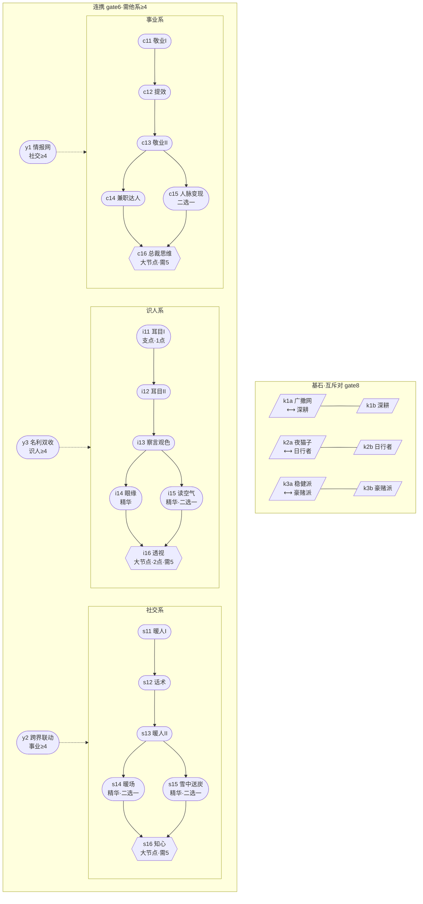

# 人脉圈 · 高维导览（低熵版）

> **读法**：正文只写「结构与因果」，不出现需要记忆的数字；数字唯一收敛于[附录A 数据总表](#附录A%20数据总表)；**所有名词均可点击**，跳到对应词条标题查释义。
> 链接为标准 Markdown 标题锚（Obsidian / VS Code / GitHub 均可跳转；Obsidian 大纲面板即词典索引）。
> 事实来源：[09-full-gdd.md](./09-full-gdd.md)（实现快照）与 `src/` 代码；冲突时以代码为准。本文不新增设定。
> 标注沿用：【实装】已实现 /【未实装】仅有设计 /【后置】明确延后 /【D6/D7】待拍板。

## 0 文档地图

| 你想知道 | 去 |
| --- | --- |
| 这是个什么游戏 | [1 定位层](#1%20定位层) |
| 世界由哪些实体构成 | [2 本体层](#2%20本体层：世界只有五类实体) |
| 玩家与系统各自做什么 | [3 行为层](#3%20行为层) |
| 数字怎么算出来的 | [4 法则层](#4%20法则层：五条主公式) |
| 系统之间怎么咬合 | [5 结构层](#5%20结构层：七系统树) |
| 节奏目标与验证证据 | [6 目标层](#6%20目标层：节奏与证据) |
| 什么是不能做的 | [7 约束层](#7%20约束层) |
| 某个词什么意思 | [附录B 术语表](#附录B%20术语表) |

---

## 1 定位层

一个[任务栏放置游戏](#任务栏放置游戏)：像素条常驻任务栏，点击展开功能面板；玩家只在关键节点出手（[干预式放置](#干预式放置)），其余时间交给[放置期](#操作期)自动运转。

- 题材：都市社交经营——把关系网转化为[职业资本](#职业资本)。
- 参照：《TBH》验证了产品形态；其差评教训固化为六条[设计红线](#设计红线)。
- 平台：[Electron](#Electron) 单机，本地 JSON 存档（[存档v4](#存档v4)），不上服务器、永不开放交易。

---

## 2 本体层：世界只有五类实体

其余一切都是这五类实体的属性或[派生值](#派生值)。

| 实体 | 构成 | 数据 |
| --- | --- | --- |
| [主角](#主角) | [三属性](#三属性)、[体力](#体力)、[攻略槽](#攻略槽)、[技能点](#技能点) | [A1](#A1%20主角) |
| [NPC](#NPC) | 30 人名册 × [圈层](#圈层) × [行业](#行业domain) × [类型](#NPC类型)；带[关系阶段](#关系阶段)与隐藏[情报](#情报) | [A2](#A2%20圈层)/[A3](#A3%20关系) |
| [物品](#物品) | 14 种 × 3 [品质](#品质)，其中 2 种是[装备](#装备) | [A9](#A9%20物品背包装备) |
| 资源 | [金币](#金币)（唯一货币）、[业务量](#业务量)（万，只累计）、[声望](#声望)、[人脉值](#人脉值)（派生） | [A14](#A14%20行业人脉)/[A15](#A15%20职业与业务) |
| [游戏时钟 gt](#游戏时钟gt) | 驱动一切[冷却](#冷却CD)/[工时](#工时)/[衰减](#衰减Lite)；触发[日切](#日切)与[周切](#周切) | [A10](#A10%20工作与时间) |

---

## 3 行为层

### 3.1 双循环（唯一的宏观结构）

```text
循环A 社交：认识 → 识人 → 攻略 → 博弈 → 得资源 ─┐
                                                ├─ 人脉满足接单条件 ↓ / 更高圈层接触更强NPC ↑
循环B 职业：接单 → 完成 → 累计 → 升职 ←──────────┘
```

- 循环 A 产出：[人脉值](#人脉值)、[情报](#情报)、[物品](#物品)；
- 循环 B 产出：[金币](#金币)、[职级](#打工十级)（权限与[津贴](#津贴)）、[技能点](#技能点)；
- 两循环的**唯一耦合点**是[业务闸门](#业务闸门)：接单需通过对应[行业](#行业domain)的[人脉计数](#计入比例)与[类型计数](#类型计数)比对。

### 3.2 玩家动作全集（仅五类）

| 类别 | 动作 | 性质 | 数据 |
| --- | --- | --- | --- |
| [渠道动作](#渠道动作)（免费池） | [微信聊天](#微信聊天)、[朋友圈互动](#朋友圈互动)、[职场互动](#职场互动)、[线下互动](#线下互动) | 固定小额好感，多数不受加成 | [A4](#A4%20渠道动作) |
| [消费动作](#消费动作) | [送礼](#送礼)、[约会](#约会)、[办事](#办事) | 好感主力，统一受 [favorPerYuanRate](#favorPerYuanRate) 缩放 | [A5](#A5%20消费动作) |
| [识人](#识人) | 花体力揭示[情报](#情报) | 信息获取 | [A6](#A6%20识人与情报) |
| [工作](#工作) | [排班](#排班)打工赚[工资](#工资)与[小费](#小费) | 保底收入 | [A10](#A10%20工作与时间) |
| [天赋网](#天赋网) | 花[技能点](#技能点)点亮[词条](#词条) | 被动构建 | [A16](#A16%20天赋网) |

被动触发：[邀约](#邀约)、[约会随机事件](#约会随机事件)、[回礼](#回礼)。

### 3.3 系统自动做的事（放置期）

- [决策器](#决策器Agent)：L0 读[消费风格](#消费风格) → L1 [阶段白名单](#阶段白名单) → L2 [效用评分](#效用评分) → L3 [护栏](#护栏)，另有[自动补位](#自动补位)；
- 例行结算：[日切](#日切)（预算清账、[热点](#热点日历)刷新、邀约判定、[衰减Lite](#衰减Lite)）；[周切](#周切)（[景气轮换](#景气轮换)）；
- [离线结算](#离线结算)：分段跑完整 step，[掉落保底](#掉落保底)计数照跑。

---

## 4 法则层：五条主公式

只给骨架；精确常数一律见[附录A](#附录A%20数据总表)。

| # | 公式 | 骨架 | 摩擦点 |
| --- | --- | --- | --- |
| F1 | [好感管线 grantFavor](#grantFavor好感管线) | 实得 = min(上限, amount × [离线效率](#离线效率) × [知心翻倍](#知心) × [favorMul 乘区](#favorMul乘区)) | [矜持](#矜持) 压低来源量；[渠道固定好感](#渠道动作) 小额恒定 |
| F2 | [掉落](#掉落) | 间隔 = 基准 ÷ [个体系数](#coef) × [jitter](#jitter) × [旋钮](#旋钮) × 词条；[金包](#金包) = 基数 × [圈层 mult](#收入倍率) × 3600 × [dropValueRate](#dropValueRate) × jitter | [dropValueRate](#dropValueRate) 把掉落压成副收入（经济主泵让位业务） |
| F3 | 收入 | [工资](#工资) = 时薪 ÷ 3600 × 词条 × [incomeFactors](#incomeFactors)；[提成](#提成率) = 基准量 × 提成率 × [mult^0.5](#收入倍率) × 300 × 缩放 | mult^0.5 阻尼高圈层滚雪球 |
| F4 | [效率](#效率) | = min(1, Σ[人脉比](#计入比例)(×[景气计入](#景气计入)), Σ[类型比](#类型计数)) + [慧眼识珠](#慧眼识珠)；不足只降产量不失败 | 人脉门槛即双循环耦合摩擦 |
| F5 | [bonuses 聚合器](#bonuses聚合器) | final = (base + Σflat) × (1 + min(Σadd, +100%)) × Πmul；超限 add 转 mul | add 封顶防词条无限叠加 |

> **这五条为何是这个形状**（每条的“结构动因 / 常数来历 / 反事实”）——定量校准值见对应附录，`engine.js` 行号可点：

> **F1 好感管线 `min(上限, amount×离线效率×知心×favorMul)`** — `engine.js:513-529`
> - *`min(上限,…)` 而非溢出累积*：上限 100（知心 120）把 25/50/75 的[里程碑](#里程碑)切成四个“平台”，溢出截断保平台感；若溢出累进到下一段，破冰期一次大礼就能跨两段，失去分段解锁（轻约/正餐/远行/办事）的剧本节奏。
> - *`×离线效率 0.5` 独立乘区*：全好感流在 `settleOffline: _offMul=0.5` 的 400 段模拟里对折，与 [矜持](#矜持) 分工——矜持管“圈层难”（分母），离线管“人不在”（速度），二者正交不挤占。
> - *`知心 ≥100 → ×2` 仅收网区*：`if(s.favor>=FAVOR_MAX) amt*=2` 让最磨的 75~120 段反成加速带，是长线不弃坑的第一性激励；若全程×2则前期更快、后期无感。
> - *`favorMul` 九条件逐人判定*：`bonusMulOf('favorMul',{def,favor,isMain,stageKey,nowReal})` 调 `COND_FNS` 十函数，读空气只对 `thirdHidden`、深耕只对 `mainTarget==首槽`——同天赋在不同人/时间强度不同，做策略分化；`noBonus:true` 让微信/朋友圈固定值绕过整段，保持矜持为唯一主摩擦（原 1~3 形同虚设的教训，见[A4 为什么](#A4%20渠道动作)）。

> **F2 掉落 `间隔 = 基准÷coef×jitter×旋钮×词条` / `金包 = 基数×mult×3600×dropValueRate×jitter`** — `engine.js:1013-1041`
> - *`÷coef` 与 `×coef` 对冲*：`INTERVAL_S[120→720]÷coef(0.8~1.5)` 让大佬来得快，`BASE_OUTPUT 1.0/0.35/0.15 × mult × coef` 又让大佬包更大——时间与数额在两式互抵，体感“大佬少而肥”而非“又多又小”。
> - *两级 `jitter` 分工*：`JITTER 0.7~1.3` 抖间隔节拍、`PACK 0.6~1.4` 抖单包数额——节拍不均防机械、数额惊喜增悬念，和谐共存。
> - *`LETTER×6` 与三味分流*：`LETTER_INTERVAL_MUL 6` 从×2 提至×6 是校准关键——×2 时手札数日内洪水、圈层门槛失效（`balance.js:132`）；`CONTENT` 30 表 matrix 已把“哪类人值得养”烘焙到掉落期望锚 `expectedIncomePerSec = BASE*mult*coef`。
> - *`0.08` 压成副收入*：`BASE 1.0×3600×0.08 ≈ 288金/时·资产`，正好把掉落主泵交还业务提成与工资（`H1` 83.2% 控制线）；改单人体感应动 `BASE` 或 `coef`，调全表松紧才动 `dropValueRate`（见[B12 dropValueRate](#dropValueRate)）。

> **F3 收入 `工资 = 时薪÷3600×词条×incomeFactors` / `提成 = 基准量×提成率×mult^0.5×300×缩放`** — `engine.js:577-590,1474-1477`
> - *`÷3600` 是单位换算*：时薪（金/时）化为金/秒与 `gdt` 秒对齐，再 `×86400` 才是日薪量级；`workWageRate×wageMul×incomeFactors` 三乘让成就、装备与时段窗口在同一口径叠。
> - *`mult^0.5` 非线性阻尼*：`mult 1→40` 若线性进提成则后期 `>90%` 独占；`sqrt` 把 40 压成 6.3，再与高段津贴削 60~80% 联合才把提成控在 83.2%（`H1`）；若用 `mult^1` 则需把 `COMMISSION_PER_WAN 300` 降 6 倍，跨层全表都要重算。
> - *`300` 是 10^4 量级常数*：`vol(万)×rate×sqrt(mult)×300` 中 300≈`1万×标尺`，使“25万×9%”体感兑成数千金币可读。
> - *`incomeFactors = incomeMul×goldWin×顺风局`*：夜猫子 18~24 时×1.3 的现实时钟抖动与景气×1.04 的宏观抖动分属时段与周切，二者与提成乘区正交。

> **F4 效率 `min(1, Σ人脉比×景气, Σ类型比)+慧眼≤1` → 只降产量** — `engine.js:1398-1428`
> - *`min` 而非加权平均*：最短板决定产量，直接把「差哪类人」明示到 `gaps[]` UI 与决策器；若加权平均则某域 0 也能被他域拉平，失去“补人”的驱动。
> - *`景气乘在 have 侧`*：`have = net×boomNetMul` 后才进 `have/need`，体感“同一人在景气行业身价更高”；`reqTypes` 人数不吃景气——宏观风不该把硬人数吹走。
> - *`+慧眼 2%×条≤10%` 开口*：每情报+2% 让识人→业务产生弱耦合，10% 封顶不让情报农场喧宾夺主。
> - *`稳健派 0.5` 保底、`钳[0,1]`、不失败*：`k3a? max(eff,0.5)` 把效率切片为两派——稳健下限 50% 换工时+10%，豪赌无保底但满条件×1.3 换上限；全程 `gaps.push` 明示缺口，六条[设计红线](#设计红线)第二条“不做随机失败”的第一性约束。

> **F5 聚合器 `final=(base+Σflat)×(1+min(add,1.0))×Πmul`，超限转 mul** — `engine.js:283-444`
> - *三层正交量纲*：flat 补基数（体力上限+20 这类一次性的）、add 同系线性叠（暖人+3% 可预期）、mul 跨系放大（宠物/装备的长线复利）——量纲分离使“A1 属性 vs A13 词条 vs A17 宠物”可独立平衡。
> - *`min(add,1.0)` 封顶+降序转 mul*：`BONUS_ADD_CAP=1.0` 把同类叠截到 100%，超额按 `sort(b-a)` 取 `1+(v-room)` 转独立 mul 既不浪费又不爆炸；若直接截断则“点多了等于没点”的挫败感极强。
> - *签名缓存外置*：`bonusSig = perks#nodes#points#watch#jewel#pets#level` 五源串化，任一变化才重建 `bonusEntriesOf` 十几条×五源的表，存 `_bCache/_bSig` 不入档；景气/风险态不进签名而实时读 `currentBizTpl`，无需重算。

> **三维补丁为何站位 F1~F5 之外**：`F2~F4` 管稳态，[景气轮换](#景气轮换)管变化、`[衰减Lite](#衰减Lite)`管消亡、`[风险单](#风险单)`jit 管方差、`[掉落保底](#掉落保底)`管确定性——四者与主公式正交，误放进主公式乘区会相互挤占上限（详见[A15 结算正交](#A15%20职业与业务)与[A19 校准基线](#A19%20校准基线)）。

> 附：正文五条只给形状，每条的**定量校准来历与档位值**见 [附录A 对应小节为什么](#附录A%20数据总表)与源码行号；改数请同步附录与代码。

---

## 5 结构层：七系统树

| 系统 | 职责一句话 | 上游 | 下游 | 关键词 |
| --- | --- | --- | --- | --- |
| 1 NPC 系统 | 定义人 | — | 一切社交对象 | [met](#met)、[lastActGt](#lastActGt) |
| 2 [识人系统](#识人) | 揭示隐藏信息 | 体力 | 三类情报 | [透视](#透视) |
| 3 社交系统 | 好感泵 | 体力/金币 | [好感](#好感) | [grantFavor](#grantFavor好感管线) |
| 4 [人脉系统](#人脉值) | 关系→职业的桥 | 好感里程碑 | [人脉值](#人脉值) | [景气计入](#景气计入) |
| 5 [职业系统](#打工十级) | 钱/权/点 | 人脉过闸 | 工资/提成/技能点 | [风险单](#风险单) |
| 6 成长系统 | 复利可视化 | 计数/点数 | 词条 | [成就二阶](#成就二阶)、[宠物](#宠物)、[天赋网](#天赋网) |
| 7 [自动化系统](#决策器Agent) | 代玩 | 设置 | 动作流 | [gap 补位](#自动补位) |

反馈环视角：

- 正环① 金币：业务→提成→投资属性/槽位→解锁更高[模板](#业务模板池)→更大单；
- 正环② 人脉：[资产 NPC](#资产)→[引荐](#引荐)解锁上家→更多高圈层 NPC→更多人脉；
- 正环③ 职级：升职→技能点+津贴→词条强化→更快升职；
- 对应负反馈：[矜持](#矜持)、[入场费](#入场费)+声望+品味三门槛、[add 封顶](#bonuses聚合器)。

---

## 6 目标层：节奏与证据

- 校准基线（[D1](#决策点D1~D7) 采纳，[sim.js](#sim.js无头模拟器) P50 实测）：首资产 1~2 日 → T2 3~5 → T3 8~14 → T4 18~30 → T5 35~60 → [总裁](#打工十级) 45~75 日；全表见 [A19](#A19%20校准基线)。
- 证据编号三类：[H1~H6](#H1~H6)（假设，已处置）、[D1~D7](#决策点D1~D7)（设计决策）、[S1~S8](#切片S1~S8)（实施切片）。
- 当前待拍板：[D6](#决策点D1~D7) 暖手阈值追认、[D7](#决策点D1~D7) 成就 II 阶目标是否下调、原生菜单观感复核——见[开放问题](#开放问题)。

---

## 7 约束层

1. 六条[设计红线](#设计红线)：永不开放交易 / 不做随机失败 / 不做数值付费 / 掉率透明 / 不抄战斗语义 / 不惩罚离线；
2. [TBH 四定理](#TBH四定理)约束宠物类系统：永久全局、无需上阵、可叠加、早解锁复利；
3. [低熵原则](#低熵原则)：一切成长只归三层——个人能力（属性/[天赋](#天赋网)）、关系网络（好感/[人脉值](#人脉值)）、职业资本（[职级](#打工十级)/业务量/收入）；
4. [未实装清单](#未实装清单)：创业模式、装备魔方、宠物像素变体、回忆约会等，显式后置。

---

# 附录A 数据总表

> 所有数字的唯一出处。改数须同步 [09-full-gdd.md](./09-full-gdd.md) 与代码。

## A1 主角

| 项 | 值 |
| --- | --- |
| [三属性](#三属性) | [魅力](#魅力) / [谈吐](#谈吐) / [品味](#品味)，初始 0 |
| 升级成本 | round(150 × 1.24^当前等级 × [priceRate](#priceRate))；[品味画册](#品味画册)使下次升级 ÷2（向上取整）并消耗 |
| 属性效果 | 每级 +8%（ATTR_EFFECT=0.08）：魅力→[自动好感](#自动好感)、谈吐→[线下互动](#线下互动)、品味→[圈层](#圈层)门槛与[大礼](#送礼)解锁 |
| [体力](#体力) | 上限 = staminaMax(100) + [成就词条](#成就)；恢复 12/[游戏分](#游戏分)；消耗：线下互动 30 / 微信 3 / 职场 6 / 识人 12 |
| [歇业](#歇业) | 在岗体力归零自动歇业（无惩罚）；回到上限 30% 自动复岗 |
| [攻略槽](#攻略槽) | 初始 3，可购至多 7：扩容费 {4:5万, 5:50万, 6:800万, 7:1亿} × priceRate |
| [有效槽位](#有效槽位) | clamp(已购 + slotsAdd 词条, 1, 9)；[广撒网](#广撒网) +2、[深耕](#深耕) −1 叠加其上 |
| 开局 | 资金 10000；新档自动入槽第一目标 t1_gu（顾言） |

> **为什么这样定**（`src/js/data/balance.js:27-30` / `engine.js:498-502,1651-1660`）：
> - *升级成本 `150×1.24^lv×priceRate`*：指数 `1.24` 是六轮 sim 的校准结果——旧指数 `1.7` 把 0→50 的总价推到 `7×10¹³` 金，T5 顶层圈 taste=50 的品味门槛变成硬墙（测试里 20/20 档全卡死），降到 `1.24` 后 0→25≈13~22 万（中期工资可覆盖）、0→50≈2.9千万~8.7千万（与后期业务提成流匹配），弃坑点后移到 Lv15+（仍晚于 T3 名流期，`H5` 达标）。基数 `150` 让首级「体感便宜」利于留存。
> - *`画册÷2`一次性*：向上取整保证至少省去一半但不归零，且消耗品形态防止无限复利；与 [B9 品味画册](#品味画册) 的稀有度联动。
> - *`ATTR_EFFECT=0.08` 线性正交*：每级固定 +8% 倍增，三系分管不同乘区——[魅力](#魅力)仅放分母压 [矜持](#矜持)（见 A4 自动好感式），[谈吐](#谈吐)仅放大线下互动倍数，[品味](#品味)只做门槛与大礼解锁——三者不堆叠避免单一滚雪球。代码里 `autoFavorPerMin: 0.5*(1+0.08*charm)/restraint` 与 `interactGain: ...*(1+0.08*talk)` 各自独立，见 `engine.js:470-476`。
> - *[体力](#体力)12/分与 30/3/6/12*：十二分恢复与 30 点互动是一次「收手代价」——双收紧（原 20/→12、10→30）把「互动刷好感」的前期主泵降速，使首资产从 0.3 日拉回目标窗 1~2 日；三档免费成本梯度 3/0/6 对应冷却与场景限制（微信随时 3 点、职场 6 点但仅 T1 在岗）。
> - *[有效槽位](#有效槽位) 钳 [1,9]*：广撒网/深耕的 ±2/−1 叠加后强制钳制，防止负槽位或无限槽位脱离平衡；同时与 [A2 入场费](#入场费)的圈层节奏联动——后期槽位多但人贵。

## A2 圈层

| tier | 名 | [声望](#声望)门槛 | [入场费](#入场费) | 品味门槛 | [收入倍率 mult](#收入倍率) | [矜持 restraint](#矜持) |
| -: | --- | --: | --: | --: | --: | --: |
| 1 | 职场圈 | 0 | 0 | 0 | 1 | 24 |
| 2 | 精英圈 | 500 | 4万 | 0 | 2.5 | 26 |
| 3 | 名流圈 | 3200 | 40万 | 10 | 6 | 31 |
| 4 | 富豪圈 | 12000 | 600万 | 25 | 15 | 36 |
| 5 | 顶层圈 | 32000 | 5500万 | 50 | 40 | 42 |

- 进入：三门槛达标 + 逐级进入；首入每圈层发 1 [技能点](#技能点) + 1 张[试洗券](#试洗券)；
- [声望来源仅三类](#声望)：里程碑 MILESTONE_REP{1:8, 2:20, 3:55, 4:140, 5:360}；[声望手札](#声望手札) LETTER_REP{1:1, 2:2, 3:4, 4:8, 5:15}（间隔 ×6）；满级[转资产](#资产化) FULL_REP{1:5, 2:10, 3:27, 4:70, 5:180}（[声望型](#NPC类型) ×2）。REP_PASSIVE 已删除（[D2](#决策点D1~D7)）。

> **为什么这样定**（`balance.js:44-50,52-56` / `engine.js:1669-1696`）：
> - *分段台阶 0→500→3200→12000→32000 声望 / 0→4万→40万→600万→5500万 费用 / 0→0→10→25→50 品味*：三维解耦——声望只由社交里程碑产生（杜绝 `REP_PASSIVE` 架空手札的死配置，`H6`），费用卡经济而品味卡养成；费距 ×10 量级与后期业务提成流同阶，品味台阶 10/25/50 需 Lot15~26 的 taste 投资，对应 A1 成本曲线。
> - *[矜持](#矜持) 24→42*：它是好感主摩擦，从原 1~3 整体 ×8~14 抬升后首资产从 0.09 日拉回 1 日窗（D1 目标反推）；T1 再×1.6 一档让前期交互更「抠」，中后期靠成就/宠物追回。`autoFavorPerMin = 0.5*(1+0.08*charm)/restraint` 中分母直压被动好感，见 `engine.js:470`。
> - *[收入倍率](#收入倍率) 1→2.5→6→15→40 及 `mult^0.5` 阻尼*：提成公式里 `mult^0.5`（见 A15）把 40 压成约 6.3，防止后期圈层滚雪球独占（`H1` 83.2% 控制线）；倍率几何递进又保证每升一圈层体感翻倍。
> - *`MILESTONE/LETTER/FULL` 三梯度*：8/20/55/140/360 与手札 1/2/4/8/15 的 1:4 比值让「重做人」的里程碑与「刷手札掉落」的两条声望流长度相近；手札间隔×6 是校准关键（原×2 时数日内声望洪水、圈层门槛失效，`balance.js:132`）。
> - *`NPC 个体系数 coef` 0.8~1.5*（见 `npcs.js`）：富豪/顶层 money 型 `1.5` 使后期资产掉落额更多，但 `LOOT.INTERVAL_S ÷ coef` 又让 H1 系数高者掉得更快，二者在 `lootIntervalMs`/`rollLoot: gps = BASE_OUTPUT*mult*coef` 两端互抵，见 `engine.js:1013-1039`。

## A3 关系

- [关系状态机](#关系状态机)：locked → available → courting → asset；[引荐](#引荐)可跳过圈层锁；
- [关系阶段](#关系阶段)：[破冰](#破冰) 0-24 / [升温](#升温) 25-49 / [深交](#深交) 50-74 / [收网](#收网) 75-100；
- [好感上限](#好感上限)：100（FAVOR_MAX），[知心](#知心) +20 → 120；
- 跨 25/50/75 [里程碑](#里程碑)：[声望型](#NPC类型)发 MILESTONE_REP[tier]；金钱/辅助型发 MILESTONE_GOLD{300/750/1800/4500/12000}，每 NPC 每档一次。

**grantFavor 管线**

```text
实得 = min(好感上限, 当前 + amount
        × 离线效率(_offMul, 离线=50%)
        × (知心 且 当前好感>=100 ? ×2 : 1)      # 收网区
        × favorMul乘区(条件词条按ctx判定) )      # 渠道固定好感经 noBonus 跳过整段
```

favorMul 内条件词条：[读空气](#读空气⟷顺风局) ×1.10、[深耕](#深耕) ×1.40、[广撒网](#广撒网) ×0.80、[赴约达人](#赴约达人) ×1.04、摸鱼大师/暖人/暖手/首饰等。

> **为什么这样定**（`engine.js:513-549,282-304,385-422`）：
> - *`min(上限, 当前+amount×...)` 钳制*：防止一次性溢出——超限直接截断，超额不累计到下一阶段，保持四阶段 25 分档的「平台感」；[知心](#知心)把上限抬到 120 后收网区 100~120 的 ×2 才有意义。
> - *`_offMul=0.5` 独立乘区*：离线期间全好感流（含被动自动好感与业务提成外的所有 grantFavor 入口）统一对折，与 `settleOffline: _offMul=offlineFavorRate` 的 400 段模拟对齐，避免挂机党超速。通道与时间分离：离线效率管「人不在」，矜持管「圈层难」。
> - *`知心≥100×2` 收网加速*：25/50/75 里程碑后最后 25 分本该最磨，知心用翻倍把「收尾」变成正反馈，配合成就/宠物复利让长线不弃坑；代码 `if(s.favor>=FAVOR_MAX) amt*=2` 见 `engine.js:519`。
> - *`favorMul` 多乘区 + 条件 ctx*：九种 `COND_FNS`（`thirdHidden/favorLt25/mainTarget/night/day/stageIce/stageWarm/boomHot/hasInvite/riskyRun`）由结算点 `bonusMulOf(state,'favorMul',{def,favor,isMain})` 逐条判定，避免全局常驻——读空气只对未揭第三偏好的对象生效，深耕只对首槽主目标生效，既做策略分化又防全队同质。`noBonus` 跳过设计让免费池固定值不受此段放大，保持矜持为唯一主摩擦（原 1~3 形同虚设的教训）。
> - *里程碑与转资产奖励 why*：声望型发 rep 而非金，让两条经济流分离—— rep 型=声望加速器，money/aux 型=金加速器；FULL_REP `rep型×2` 是对「声望型更难变现」的补偿。`claimed` 数组防重复领取。

## A4 渠道动作

| 动作 | 好感 | 体力 | [冷却](#冷却CD) | 限制 | 加成 |
| --- | --: | --: | --- | --- | --- |
| [微信聊天](#微信聊天) | +0.3 固定 | 3 | 120 [游戏分](#游戏分)/NPC（×socialCd） | 任意时段 | 不受任何加成 |
| [朋友圈互动](#朋友圈互动) | +0.2 固定 | 0 | 120 分/NPC（×socialCd） | 任意时段 | 不受加成 |
| [职场互动](#职场互动) | +1 固定 | 6 | 60 分/NPC | 仅 T1 且在岗且入槽 | 不受加成 |
| [线下互动](#线下互动) | 公式 | 30 | 无 | 非在岗 | favorMul + [暖场](#暖场) |
| [识人](#识人) | 2 + flat 词条 | 12（×identifyCost） | 360 分/NPC（×identifyCd） | 非在岗、入槽 | 见 A6 |

线下互动公式：`自动好感 × 5 × (1+0.08×谈吐) × 暖场阶段乘区`；
其中 `自动好感 = 0.5 × (1+0.08×魅力) ÷ 圈层矜持 × (1+[辅助资产加成](#NPC类型))`（aux 每个 +5%，上限 50%）；
暖场：破冰 ×1.6 / 升温 ×1.4；[话术](#话术)：微信/朋友圈冷却 ×0.92。

> **为什么这样定**（`engine.js:470-476,632-661,718-732`）：
> - *`0.5` 基数与 `×5` 放大*：`autoFavorPerMin=0.5*(1+0.08*charm)/restraint*(1+aux)` 本是一个「被动漂」——每分钟约 0.01~0.02 好感（30 分钟≈0.5 点），让放着不点的放置期有微弱心跳但不推塔；`interactGain = auto*5*(1+0.08*talk)` 把主动线下互动定为被动的 5 倍，相当于「一次点按=5 分钟挂机」的体感，比值稳定不受矜持档改变玩法节奏。
> - *`÷restraint` 主摩擦*：与 A2 的矜持抬升联动——T1 的 24 与 T5 的 42 让同一 0 魅力玩家被动好感差 1.75 倍，直接拉开圈层推进速度；魅力每级 +8% 仅线性追回摩擦，投资边际清晰。
> - *`aux×5% 封顶50%`*：10 个 aux 型资产堆满才封顶，量纲与 [A14 人脉值](#人脉值) 的 aux 计数分离但相互印证——辅助人=社交润滑剂但不无敌。
> - *`暖场 1.6/1.4` 二选一*：覆盖破冰/升温两段的早期窗口，让玩家必须在物价与阶段加成间做取舍；与 [A13 choice二选一](#choice二选一) 的泛化机制同源。
> - *渠道三档为何 0.3/0.2/1 固定值且 `noBonus`*：校准把原 2/1/3 全压到 auto 量级并拉长 CD 到 120/60 分——否则免费池成为前期主泵（首资产 0.09 日元凶之一）。`noBonus:true` 在 `channelAct→grantFavor(...,{noBonus:true})` 里整段绕过 favorMul，保证免费流不被天赋稀释，也让矜持重新成为主摩擦。

## A5 消费动作

统一乘数 [favorPerYuanRate](#favorPerYuanRate) = 0.35。

**送礼**（好感 = 固定值 × 0.35 × [雪中送炭](#雪中送炭)）

| 档 | 好感 | 价格 T1→T5 |
| --- | --: | --- |
| 小礼 | +4 | 240 / 400 / 2000 / 1万 / 5万 |
| 中礼 | +10 | 700 / 1300 / 6500 / 3.3万 / 16万 |
| 大礼 | +25 | 2200 / 4000 / 2万 / 10万 / 50万；需品味 {3:5, 4:13, 5:25} |

[回礼](#回礼)：大礼/远行/办事后 8% 概率，每周每 NPC 限 1 次，品质 +1 档，[回礼池](#回礼池)不含装备。

**约会**（价格 = 基准礼物价 × 倍数 × [priceRate](#priceRate) × [商务名片夹](#商务名片夹) 0.8 × datePriceMul 词条）

| 档 | 好感基 | 解锁 | 价格倍数 | 变体 tag |
| --- | --: | --- | --- | --- |
| 轻约 | +8 | 0 | 小礼×1.5 | 街角咖啡[市井/美食]、看展[文艺/收藏]、球赛[运动/时尚] |
| 正餐 | +20 | ≥25 | 中礼×1.5 | 家常馆子[市井/美食]、商务宴请[商务/酒局]、私厨[美食/收藏] |
| 远行 | +45 | ≥50 | 大礼×2.5 | 音乐节之旅[文艺/时尚]、城市漫游[美食/旅行]、高尔夫周末[商务/运动] |

- [偏好匹配](#偏好匹配)：变体 tag 与 NPC tags + 已揭示第三偏好交集 ≥1 → ×1.2，否则 ×0.8；[雷区](#雷区)tag 强制 0.8 口径；
- [热点命中](#热点日历)再 ×1.2；[社交悍匪](#社交悍匪)（I+II）价格 ×0.95 × 0.975。

**办事**：+60 × 0.35；价格 = 大礼×6 × [priceRate](#priceRate)；好感 ≥75 解锁；每人限一次。

> **为什么这样定**（`balance.js:61-65,87-97` / `engine.js:757-770,787-800,813-831`）：
> - *三档基准 +4/+10/+25 与礼品重定价 ×2.75~3*：T1 列价格 240/700/2200 是 `×2.75~3` 重定价后的结果——校准 iter4 发现原价下「里程碑金+启动资金」在单 chunk 内倾泻全天 perNpc 预算，首资产 0.34 日由礼物爆发驱动；提价后前期礼物与约会预算可共存，而 T3~T5 列不动保中后期节奏。
> - *`favorPerYuanRate=0.35` 而非直接改表*：保持三档相对比（4:10:25≈1:2.5:6.25）不动，汇率阀统一压低全线消费好感的「金币→好感」直换强度（详见[B6 favorPerYuanRate 五维](#favorPerYuanRate)）；改单档性价比应动 GIFTS/约会基准，不动此阀。
> - *`雪中送炭×1.4` 与 [赴约达人](#赴约达人)的对位*：<25 好感才生效，让早期破冰更像「救急」而非日常套现，与 A4 的低固定渠道形成高低搭配；代码 `bonusMulOf('giftMul',{favor:..favorLt25})` 逐人判定。
> - *约会价格 `礼物基准×倍数(1.5/1.5/2.5)`*：轻约≈1.5 个小礼价、正餐≈1.5 个中礼价、远行≈2.5 个大礼价——远行的 2.5× 让同钱不如「小礼+轻约」组合，但大礼的品味门槛又卡住大礼流，逼出约会窗口；`商务名片夹 0.8` 与 `datePriceMul`（社交悍匪）在 `priceOf` 里串联，见 `engine.js:757-767`。
> - *`办事+60 一次性`*：收网区 75~100 的「大招」一次性，`+60×0.35≈21` 实得相当于 1.2 个远行但不用拼 tag，设计位是收尾加速；`errandUsed[id]` 防刷。

## A6 识人与情报

- [情报](#情报)三类：[third 第三偏好](#第三偏好)、[line 引荐线索](#引荐线索)、[mine 雷区](#雷区)；
- 来源：①[声望型](#NPC类型)NPC [掉落](#掉落)intel 分支 20% ②约会[偶遇贵人](#约会随机事件) ③[识人动作](#识人) ④[透视](#透视)天赋；
- 识人动作：12 体力 × identifyCost，CD 360 分 × identifyCd，附好感 2 + identifyFavor flat（[察言观色](#察言观色) +5）；刷新 [lastActGt](#lastActGt)；读全后按钮置灰；
- 透视点亮瞬间：对所有[已结识](#met)NPC 全量揭示；之后识人体力耗 ×1.5。

> **为什么这样定**（`engine.js:666-716` / `balance.js:281-311`）：
> - *`360 分(6h) 冷却与 12 体力成本`*：识人被设计为「白天每半日一次」的调查节奏，冷却比微信 120 分更长以限情报流速；`identifyCost×1.5` 的透视惩罚让透视是「开图爽一次+后续更贵」的权衡，而非无脑全开——对应 `PETS` 与 `成就` 的长期可视化目标分离。
> - *`missing=[third,line,mine] 随机挑一`*：每次只揭一条防情报洪水；从微信类 20% 分支、偶遇贵人、识人、透视四源互补（见 A6 列表）——识人是唯一可控源，其他两条是偶然惊喜，透视是大节点爆发。
> - *`2+flat` 好感附带*：避免纯情报动作无人愿按；`察言观色 flat+5` 让识人系首三节点链 `耳目I→耳目II→察言观色` 在跑单/广撒网流派里有独立价值（CD 缩短与好感补贴二合一）。

## A7 衰减Lite（默认关）

开启时：入槽且好感 ≥50 的非资产 NPC，gt − lastActGt ≥ 3 [游戏日](#游戏分) → 日切 −1，钳到当前[阶段下限](#关系阶段)；[资产化](#资产化)免疫；九类主动互动刷新 lastActGt（被动[自动好感](#自动好感)不刷）；档案卡不展示倒计时；开关豁免 [customMode](#customMode) 标记。

> **为什么这样定**（`engine.js:1739-1751,1753-1760` / `balance.js:484-485`）：
> - *`≥50 才衰、−1/日、钳到段下限`*：只做「软漂移」不破段——破冰 0-24 的新人不会掉回负数，深交 50 的也不会掉回 25 以下，保持里程碑附近的「平台感」；代码 `min = stageOf(s.favor).min; s.favor = max(min, s.favor-1)`。资产免疫与钳制是 TBH「放置游戏不惩罚离线」的教训落地。
> - *`3 日窗口与 lastActGt`*：3×DAY_MS 是社交常识的「三天不联系就淡」体感比值，既给离线容错又让长线空窗有代价；`lastActGt` 只由九类主动动作刷新（微信/朋友圈/职场/线下/送礼/办事/约会/接受邀约/识人），被动漂白不算互动——这就是为什么文档强调「档案卡不展示倒计时」防焦虑：计时是后台静默的，不是悬在头上的刀。
> - *默认关且豁免 customMode*：`SETTINGS_DEFAULT.decayEnabled=false` 且 `setSetting` 里 `decayEnabled` 不标 `customMode`，保证实验旋钮开关不污染「玩家是否魔改过」的语义，存档迁移无副作用。

## A8 掉落与保底

- 间隔 = INTERVAL_S[tier]{120/150/240/420/720}s ÷ [NPC 系数](#coef) × jitter(0.7~1.3) × [dropIntervalRate](#dropIntervalRate)(2.0) × dropMul 词条；[声望手札](#声望手札)间隔 ×6；[名利双收](#名利双收) ×0.85；[豪赌直觉](#人脉变现⟷豪赌直觉)进行中为风险单时 ×0.96；
- [内容分流](#内容分流)：money [金70/物品20/功能10]、rep [手札55/情报20/金15/功能10]、aux [功能45/金35/物品20]；[itemDropChance](#itemDropChance)缩放物品分支，未中回落金包/手札；
- [金包](#金包)金额 = BASE_OUTPUT{money:1.0, rep:0.35, aux:0.15} × 圈层 mult × [NPC 系数](#coef) × 3600 × [dropValueRate](#dropValueRate)(0.08) × jitter(0.6~1.4)；到账 × [incomeMul](#incomeMul)（[账房](#账房)）；
- [品质 roll](#品质)：普通 80% / 精致 17%（效果 ×1.5）/ 稀有 3%（×2；rareItemRate 可调；辅助位稀有权重 ×2）；
- 功能分支 8% 出[装备](#装备)（equipDropRate 可调）；普通物品分支 70% [礼物盒](#礼物盒) / 30% [限量藏品](#限量藏品)；
- 手动 3 秒内点中金包 ×2（关自动拾取时）；3 秒后按[自动出售](#自动出售)阈值处理或入包。

### pity 保底双计数

| 计数器 | 阈值 | 口径 | 触发效果 |
| --- | --: | --- | --- |
| loot.pityRare | 240 | 任何物品分支每次非稀有掉落 +1（金包/手札/情报不碰） | 下件品质强制稀有，清零 |
| loot.pityEquip | 120 | 仅 func 分支未出装备 +1（item 分支礼盒/限量不消耗不触发） | 下次 func 必出装备且品质 ≥精致，清零 |

> **为什么这样定**（`balance.js:127-145` / `engine.js:972-1011,1013-1046`）：
> - *`INTERVAL_S 120→720` 与 `÷coef` 的对冲*：层基准随圈层变长（后期关系更难刷出来，但更值钱），而高 coef 的钱型 NPC 又更快触发掉落——两者在 `lootIntervalMs = INTERVAL*1000/coef*dropIntervalRate*jitter6`（`engine.js:1013`）处互抵，体感是「大佬来得慢但一来就爆大包」。
> - *`LETTER_INTERVAL_MUL×6`*：从原 ×2 改 ×6 的原因在注释——×2 时数日内声望手札洪水、A2 的 500/3200 等门槛瞬间失效；×6 后手札与里程碑修两条声望流长度相近，才卡得住圈层节奏。
> - *`内容分流 matrix`*：`money[70/20/10]` 让钱型掉金为主但时不时给装备作惊喜，`rep[55/20/15/10]` 让声望型主掉手札兼带情报，`aux[45/35/20]` 让辅助型偏功能——三表已把「哪类人值得养」的资产选型 baked in。
> - *`BASE_OUTPUT 1.0/0.35/0.15 × mult × coef ×3600×dropValueRate 0.08`*：v1 口径 `金/秒` 的期望锚 `expectedIncomePerSec = BASE*mult*coef`，3600 转小时量再被 `0.08` 压到风味副收入（约 288金/小时·资产），正好让业务/工资成为主泵（`H1` 83.2% 控制线），掉落不再上天。
> - *`jitter 0.7~1.3 / PACK 0.6~1.4` 两级*：间隔抖制造节拍不均（防机械），单包抖制造数额惊喜（点中前看大小更有悬念）。
> - *品质 80/17/3 与 `AUX_BOOST×2` *：3% 基础稀有已让自然期望≈4167 掉落，辅助位带 weighted×2 体现「辅助人更会攒稀有」，但不动大数——大数靠保底补。

双保底叠加：装备保底先锁物品（`forceEquip` 走 `watch_steel/jewel_jade` 分支，稀有未中保至少精致，`q≠rare?fine`），稀有保底再抬品质（`forceRare` 覆盖一切）；`pityBookkeep(gotEquip,q,isFunc)` 只在 `isFunc` 分支上才加装备计数，item 礼盒/限量不碰。离线 `rollLoot` 与在线同一管线照跑，同种子逐位一致。依据：稀有装备自然期望 ≈4167 掉落不可达，保底后 ETA ≈70 [游戏时](#游戏分)/资产（[H2](#H1~H6)）。

## A9 物品背包装备

14 件物品（普通基准；[精致](#品质) ×1.5 / [稀有](#品质) ×2）：

| 物品 | 品质 | 效果 |
| --- | --- | --- |
| 心动奶茶券 | 普通 | 随机一名槽内 NPC 好感 +3 |
| 体力咖啡 | 普通 | 体力 +30 |
| 纪念品 | 普通 | 送任意攻略对象好感 +2 |
| 商务名片夹 | 普通 | 24 [游戏时](#游戏分)内约会价格 ×0.8 |
| 内部简报 | 普通 | 声望 +max(1, ceil(2×圈层mult/10)) |
| 手写请柬 | 精致 | 指定 NPC 免费轻约一次 |
| 双人展票 | 精致 | 免费约会（≥25 自动升正餐档，选最优变体） |
| 品味画册 | 精致 | 下一次属性升级 5 折 |
| 惊喜蛋糕 | 精致 | 全部槽内 NPC 好感 +2 |
| 礼物盒 | 精致 | 等效中礼免费送出（可攒） |
| 引荐名片 | 稀有 | 解锁一名上一层未结识 NPC |
| 限量藏品 | 稀有 | 等效大礼免费送出 |
| 精钢腕表 | 基准 | [装备·手表](#装备)：时薪 +6% |
| 青玉平安扣 | 基准 | 装备·首饰：全局好感 +5% |

- [背包](#背包)：容量 50；堆叠上限 99/格；满包挤占普通品质堆、全稀有包拒收普通；出售折价 30%；[自动出售](#自动出售)阈值 off/普通及以下/精致及以下；扩容 5万→60 格 / 50万→70 / 500万→80；
- [合成](#合成)：3 同品质 → 1 件高一档随机物品（稀有不可再合，装备除外）；满包原子拒绝；
- 装备槽 ×2：手表（收益向）/ 首饰（社交向）；词条按穿戴品质 ×1.5/×2 放大常驻注册进聚合器；换装旧件回背包；装备只能从掉落获得。

> **为什么这样定**（`balance.js:180-191,133-141` / `data/items.js` / `engine.js:1048-1210,1328-1331`）：
> - *14 种且只两装备*：普通池 5 件「惊喜时刻」只抽那 5（`data/items.js:5` 约会惊喜池）——让约会被动的惊喜不发装备，保持 2 装备只能从 func 分支 8% 的掉落/回礼池之外，正好与 pity 的 func 口径对齐，形成「毕业装只能刷资产掉落」的可追踪感。
> - *品质放大 1.5/2 但不进合成池*：`invAdd: mulQ = fine?1.5:rare?2` 在 `useItem` 与 `grantLootItem` 里都对 `effect.entries` 做放大；合成 `ITEMS.filter(kind!=='equip')` 明确把装备排除——合成是材料保底，装备是资产保底，二轨分离。
> - *堆叠 99 + 挤占普通*：`invAdd` 先并堆再挤占，挤时 `rank[旧]<=rank[新]` 且从最旧开始，稀有永不被普通挤——与前端「满包把普通让给稀有」的文案一致，且 `findSynthTriple` 用最低档材料优先防玩家误烧稀有。
> - *`SELL_RATE 0.3` 与 `autoSellRank`*：30% 折价让「卖」永远亏，保持收藏冲动；而离线 `applyOfflineLoot` 与在线 `collectDrop` 同阈值过滤——同一玩家、同一档位、离线在线结果逐位一致是离线可信的核心。

## A10 工作与时间

| 职业 | 时薪 | 体力/时 | 解锁 | 特性 |
| --- | --: | --: | --- | --- |
| 奶茶店服务员 | 25 | 8 | 开局 | 小费概率 12%，金额 5~20 |
| 餐厅服务员 | 30 | 12 | 开局 | 现实 18:00-22:00 时薪 ×1.5 |
| 便利店夜班 | 45 | 20 | 资产 ≥3 | 离线挂班收益 ×1.2 |

- 工资 = 时薪 × workWageRate ÷ 3600 × wageMul 词条 × incomeFactors × ([兼职达人](#兼职达人) ?×2)；餐厅晚班按真实时刻逐段判定；
- [排班](#排班)档位 2/4/8 游戏时；小费每游戏时掷一次；
- 时间：timeScale 缩放流速；[日切](#日切)/[周切](#周切)内容见 [§3.3](#3%20行为层)；
- [离线结算](#离线结算)：上限 = (12h + min(12h, 辅助资产数×1.5h)) ÷ timeScale；好感全部 ×50%（_offMul）；≤400 段 ×10min 真实时跑完整 step（工资/掉落/业务/景气/日切全照跑）；离线包裹按自动出售阈值过滤后入包。

> **为什么这样定**（`balance.js:35-38,78-86` / `engine.js:572-602,1769-1838,1938-1998`）：
> - *`25/30/45 时薪×8/12/20 耗体`*：时薪递增而耗体递增更快——便利店夜班时薪最高但 20 体/时几乎把恢复吃满，是「钱多但得吃咖啡」的价格体现；`JOBS.night.offlineMul=1.2` 让它成为挂机档，贴合文案也对冲 `H1` 提成独占风险。
> - *`EVENING 18~22×1.5` 的现实时刻*：`wagePerSec: hoursOf(nowReal)∈[18,22)?×eveningMul` 逐段用 `nowReal` 而非游戏时判定，挂 `simReal` 离线模拟钟分段推（`settleOffline: chunkReal`），所以连夜长在线的餐厅班才会抖——它把现实时间变成了收入波动器。
> - *`兼职达人×2` 工资与耗体同乘*：不是净赚双份，是「把两份班压缩进同一 gt」——`drain = staminaPerH*...* (c14?2:1)` 与 `w*=2` 绑一起，体现在是可控的自选难度。
> - *`OFFLINE_CAP 12h + aux×1.5h ≤24h ÷timeScale`*：辅助资产越多挂机上限越高（最多 12 补满 12），但极速档 `timeScale=2` 时上限现实时长对折，保持「睡一觉不过期」的体感而不过度养老；`dtReal = min(raw, allowedReal)` 后 `nChunks≤400×10min` 逐段跑完整 `step`——离线与在线同一引擎，同是工资+掉落+业务+日周切四线并行。

## A11 决策器

- L0 战略：读消费风格 frugal/standard/generous/lavish、日预算/单人预算、体力分配优先级；
- L1 阶段白名单：免费动作恒可用；付费按关系阶段——破冰无、升温 +轻约/小中礼、深交 +正餐/远行/大礼、收网 +办事；frugal 只留免费+小礼；generous/lavish 跳阶段门；
- L2 效用评分：得分 = 收益 ÷ (0.02×费用/当前金币 + 1.0×体力)；邀约对象 ×2；距下一里程碑 ≤3 时 ×1.5（milestonePushWeight）；豪掷风格付费动作 ×1.1；同分取便宜；物品动作固定分：补体力 4~5、免费好感 0.5、免费约会 2.5、免费礼 favor/10、识人 0.6；风险单按期望值评分；
- L3 护栏：体力 reserve（先工作 75% / 比例 40% / 先社交 0%），近溢出无视 reserve；预算硬护栏同手动；
- [自动补位](#自动补位)：off / 产出优先 / 引荐优先 / 声望优先 / gap 缺口优先（按当前行业模板最大人脉缺口 domain 排序；景气质押稳定前置——景气行业候选优先）。

> **为什么这样定**（`src/js/agent.js:66-270,283-319` / `engine.js:1920-1935`）：
> - *`whitelist` 按阶段释禁*：`ice→warm→deep→close` 的白名单把付费动作做成剧本——破冰期逼玩家用免费池磨关系，正好让 A4 的矜持摩擦有戏；`frugal` 的 `free+small` 与 `generous/lavish` 的 `close` 全开把同一关卡切成四种「消费人格」分支，便于校准里 `R=200` 的策略对比。
> - *`scoreAlpha 0.02 / scoreBeta 1.0`*：分母 `0.02*(cost/gold)+1.0*stamina` 是「钱+体力」的联合匮乏度——前项用金占比（0.02 让小礼与远行的相对价差落地）、后项线性压体力；`max(denom,0.1)` 防零体力时付费动作无限放大，代码 `scoreAct: sc / max(denom,0.1)`。同分取便宜 `cost<best.cost` 是 Hick 定律的轻量体现。
> - *`×2 邀约与 ×1.5 里程碑临门`*：`state.invites.some(id)` 的邀约×2 构成「赴约比自约优先」的社会常识；`dist = min(25,50,75,FAVOR_MAX)-favor ≤3` 时 `milestonePushWeight=1.5` 让将破段的人自动插队，二者联动把社交的随机惊喜与确定里程碑修到同一评分域。
> - *物品固定分而非算好感/金比*：`stamina 4~5 / favor 0.5 / free_date 2.5 / SEND favor/10` 把背包里「喝咖啡、送券、请约会」的效用数值化，避免与付费动作同表内卷——`usedIdx` 单件只生成一次候选也防同物品重复竞价。
> - *`reserve` 与 `nearFull` 对冲*：`work_first 0.75` 保留上班体力、`social_first 0` 全给社交，本是难度旋钮；但 `nearFull = stamina >= max - regenPerMin*interval/60*2` 时无视 `reserve` 回避浪费——这是放置游戏「体力不溢出」体验的第一性约束，`agent.js:104-105`。
> - *`refillQueue` 四档排序*：`output/referred/reputation` 分别按 `BASE_OUTPUT*mult*coef`、是否被引荐、是否 rep 型排序，而 `gap` 的 `biggestNetGap = max(reqNet - net)` 直连 `Engine.networkOf` 的 A14 人脉派生值，gap+景气双乘让自动党也会「哪个行业最缺就补谁且挑景气的先补」。

## A12 成就

| 成就 | 条件 | 被动 |
| --- | --- | --- |
| 摸鱼大师 / II | 线下互动 1000 / 5000 次 | 全局好感 +3% / 再+2% |
| 全勤打工人 / II | 上班 100 / 500 游戏时 | 时薪 +10% / 再+5% |
| 捡漏之王 / II | 拾取 500 / 2500 件 | 掉落间隔 −5% / 再−2.5% |
| 社交悍匪 / II | 约会 100 / 500 次 | 约会价格 −5% / 再−2.5% |
| 人脉广博 / II | 资产数 10 / 25 | 体力上限 +20 / 再+10 |

二阶规则：goal ×5，效果 = 一阶 + 一阶的一半（叠加不替换）。II 阶目标在当前经济下百日不可达 → [D7 待拍板](#决策点D1~D7)。

## A13 聚合器与词条

```text
词条 = { attr, kind: flat | add | mul, cond? }    # 来源：成就/天赋网/装备/宠物
final = (base + Σflat) × (1 + min(Σadd, +100%cap)) × 连乘mul
```

- add 同类总和封顶 +100%，超出部分按条转独立 mul（按值降序填充）；
- cond 全集（结算点传 ctx 判定）：thirdHidden / favorLt25 / mainTarget / night(18-24时) / day(6-18时) / stageIce / stageWarm / boomHot(当前单为景气行业) / hasInvite(存在有效邀约) / riskyRun(进行中为风险单)；
- [choice 二选一](#choice二选一)：节点带 choice 键，点亮时二选一。现有四对：[读空气⟷顺风局](#读空气⟷顺风局)、[暖场 ice⟷warm](#暖场)、[雪中送炭⟷赴约达人](#雪中送炭)、[人脉变现⟷豪赌直觉](#人脉变现⟷豪赌直觉)；
- [以茶会友](#以茶会友)（y2）：社交系全部词条效果 ×1.25（mul 型按 1+(v−1)×1.25 放大）；
- 缓存 _bCache/_bSig：perks/节点值/点数/装备/宠物阶段/职级任一变化重建；不入档；景气/风险态不进签名。

> **为什么这样定**（`engine.js:278-463` / `balance.js:281-381`）：
> - *`final=(base+flat)*(1+min(add,1.0))*Πmul` 三层正交*：flat 先补基数（体力上限+20 这类一次性的）、add 做同系同口径叠（暖人+3% 等线性可预期）、mul 做跨系放大（长线复利位）；`BONUS_ADD_CAP=1.0` 把 add 的同类叠从无限截到 100%，超额按 `ranksort(b-a); 1+(v-room)` 转独立 mul——既让堆叠有上限，又让超额不再浪费而是换口径继续生效，避免「点多了等于没点」的挫败。
> - *`bonusSig` 串化五源*：`perks#nodes:choice#points#watch:q#jewel:q#pets:stage#level` 任一变化即失效与重建，成本是遍历一次 `bonusEntriesOf`（约十几条×五源），存 `state._bCache/_bSig` 不入档（`normalizeState: delete _bCache/_Sig; v=4`），迁移幂等不受脏。景气/风险态不进签名——它们在 `COND_FNS.boomHot/riskyRun` 里实时读 `currentBizTpl`，无需重算词条表。
> - *九 cond 的来源绑定*：`thirdHidden` 读 `intel[def.id].third`、`favorLt25` 读 favor、 `mainTarget` 读首槽位、`night/day` 读 `hoursOf(nowReal)`——每条均在结算点 `bonusMulOf(state,attr,{def,favor,isMain,stageKey,nowReal})` 现场传 ctx，`COND_FNS[cond](state,ctx)` 逐条判定（`engine.js:286-303`）。体感是「同一个天赋在不同人/不同时间强度不同」。
> - *`以茶会友` 的 1.25 倍对 mul 的特殊式*：`mul: 1+(v-1)*1.25` 而非 `v*1.25`——如原 1.10 的读空气升到 1.125 而非 1.375，保持 mul 的增量等比而非基数被二次放大，数值落点温和。

## A14 行业人脉

- 30 名册各带[行业 domain](#行业domain)（金融/地产/高科技 各 10 人）；
- [人脉值](#人脉值) NETWORK_VALUE{t1:2, t2:4, t3:7, t4:11, t5:16}；[计入比例](#计入比例)：≥25 好感→30%、≥50→60%、≥75→100%（不衰减；衰减 Lite 开启跌破里程碑自动降档）；
- [景气计入](#景气计入)：业务闸门比对时 人脉×boomNetMulOf（景气 +20%/低谷 −15%），作用于 min-ratio 之前；reqTypes 类型计数不乘；
- 派生值不进存档，实时计算：人脉[域] = Σ 值×比例 × networkGainMul；输出三域+总四维。

> **为什么这样定**（`balance.js:228-238` / `engine.js:1341-1373`）：
> - *`2/4/7/11/16` 的三角增量 2,3,4,5*：单人值随圈层单调抬升但增量递减的反比——顶层人「一个顶三」但不再指数，保持后期追 A2 门槛与提成 `mult^0.5` 的双重阻尼同源；算式见 `networkOf: out[domain]+=NETWORK_VALUE[tier]*ratio*networkGainMul`。
> - *`30%/60%/100%` 三档计入*：把 25 的「认识」只计 3 成、50 的「点头之交」计 6 成、75 以上的「过命」才全计，既做分段激励又让 A7 软衰减只在 ≥50 段走表时才 visible——好感跌破里程碑时 `ratio` 自动跳档，无需第二套代码。
> - *景气计入乘在 `have` 侧而非 min 之后*：`have = net[dom]*boomNetMulOf` 后才进 `have/need`，体感是「同一个人在景气行业身价更高」；而 reqTypes 类型计数不吃景气——「钱人/声望人/辅助人」的硬人数不该被宏观风吹走，二者在 `bizEfficiency: ratios=[have/need,... types]` 中并列 min，见 `engine.js:1400-1417`。
> - *派生值不进存档*：该表是纯函数 `networkOf(state)`，省存档膨胀与旧档迁移风险；与 `expectedIncomePerSec = Σ BASE_OUTPUT*mult*coef` 的掉落侧共用 `mult*coef`量纲——同一批名人侧面变现，两端互证。

## A15 职业与业务

### 打工十级表

| 级 | 职位 | 门槛(万) | 提成率 | 津贴(金/周期) |
| -: | --- | --: | --: | --: |
| 1 | 副专员 | 0 | 8% | 0 |
| 2 | 专员 | 150 | 9% | 200 |
| 3 | 副主管 | 700 | 10% | 600 |
| 4 | 主管 | 1600 | 11% | 1500 |
| 5 | 副经理 | 4500 | 12% | 3000 |
| 6 | 经理 | 12000 | 13% | 6000 |
| 7 | 副总监 | 30000 | 14% | 15000 |
| 8 | 总监 | 90000 | 15% | 20000 |
| 9 | 副总裁 | 400000 | 16% | 50000 |
| 10 | 总裁 | 1200000 | 18% | 120000 |

- 实得提成（金）= 基准量(万) × [提成率](#提成率) × TIERS.mult^0.5 × 300（COMMISSION_PER_WAN）× commissionScale × [incomeFactors](#incomeFactors)；
- 提成率 = 职级基准 + [敬业II](#敬业I/II)(+1%) + [人脉变现](#人脉变现⟷豪赌直觉)（每资产 +0.5%，≤+15%）；
- incomeFactors = [incomeMul](#incomeMul) × goldWin（[夜猫子](#夜猫子⟷日行者)+30%/−10% 或 [日行者](#夜猫子⟷日行者)+20%）× [顺风局](#读空气⟷顺风局)（当前单景气行业 +4%）；
- 结算同时发[津贴](#津贴)（固定值不随乘区）；升职即事件：可跨多级一次结清，每级发 1 [技能点](#技能点)；门槛 × bizThresholdMul。

> **为什么这样定**（`balance.js:240-280` / `engine.js:1379-1401,1430-1500`）：
> - *`need 150→1.2M` ×1.5~×3.6 整形*：原表总裁在 `d10` 前后即达成，重整后 30k→90k→400k→1.2M 的三段拉长让 `d11.89(T3)→24.56(T4)→43.73(T5)→49.57(总裁)` 贴入 A19 目标窗；`commissionScale/bizThresholdMul` 二旋钮留给后台微调而不改表。
> - *`COMMISSION_PER_WAN=300` 的 300 来自单位换算*：`vol(万)×rate(%百)×mult^0.5 × 300` 中的 300 = `1万(=10^4)×priceRate标尺` 的常系数——代码 `gold = vol*rate*sqrt(mult)*300*commissionScale*incomeFactors`（`engine.js:1475`），把「一单 25 万×9%」体感兑成约数千金币的量级可读。
> - *`mult^0.5` 阻尼与津贴双刹*：`mult 15/40` 的顶层若线性进提成则提成占比将 `>90%` 独占（`H1`），`sqrt` 与 `allowance 高段削 60~80%` 联合把后期提成控在 `83.2%`；津贴按单周期的固定值而非按 vol，放长单周期 `workMin` 时并不会被一起放大。

### 业务模板池（15 条）

| 模板 | 行业 | 要求 | 基准量 | 工时 | 职级 |
| --- | --- | --- | --: | --: | --: |
| 散户开户冲量 | 金融 | 金融≥6 | 5万 | 20分 | 1 |
| 社区看房接驳 | 地产 | 地产≥5 | 4万 | 18分 | 1 |
| 门店系统地推 | 高科技 | 高科技≥5 | 4万 | 18分 | 1 |
| 楼盘分销带看 | 地产 | 地产≥10，金钱型×1 | 25万 | 25分 | 2 |
| 券商开户返佣 | 金融 | 金融≥12 | 22万 | 24分 | 2 |
| SaaS年费续约 | 高科技 | 高科技≥10，声望型×1 | 20万 | 22分 | 2 |
| 天使轮跟投 | 高科技 | 高科技≥14，金钱型×1 | 120万 | 30分 | 4 |
| 商业地产包销 | 地产 | 地产≥30，金钱型×1 | 100万 | 28分 | 3 |
| ★私募代销份额 | 金融 | 金融≥35，声望型×1 | 127万 | 30分 | 3 |
| 并购过桥融资 | 金融 | 金融≥40，金钱型×2 | 900万 | 35分 | 6 |
| ★地块联合开发 | 地产 | 地产≥60，声望型×1 | 978万 | 34分 | 7 |
| 独角兽轮跟投 | 高科技 | 高科技≥70，金钱型×1 | 800万 | 32分 | 8 |
| 跨境资产配置 | 金融 | 金融≥120 | 2600万 | 40分 | 8 |
| ★城市更新基金 | 地产 | 地产≥150 | 2760万 | 42分 | 9 |
| 硬科技并购基金 | 高科技 | 高科技≥180 | 2200万 | 45分 | 9 |

★=[风险单](#风险单)。效率替代随机失败：效率 = min(1, 各人脉比×景气计入, 各类型计数比) + [慧眼识珠](#慧眼识珠)（min(+10%, 已揭示情报数×2%)）；[稳健派](#稳健派⟷豪赌派)效率下限保底 50%；钳到 [0,1]；不足只降产量且 UI 明示缺口。
风险单：T3 起每圈层恰 1 条 certainty:'risky'；开工掷 jit∈[0.7,1.3] 均匀（期望中性）；基准量已烘焙 +15% 风险溢价（110→127 / 850→978 / 2400→2760）；结算公式 `volGain = vol*eff * (豪赌派且eff==1?1.3:1) * boomVolMul * jit[0.7~1.3]`；jit 与保底/加成正交复合（`engine.js:1469-1472`）。
自动选单：行业内按 `量×效率/工时` 取最优（`pickBestBiz: score=vol*eff/workMin`, `engine.js:1430-1439`）；手动换单默认清进度，[总裁思维](#总裁思维)按已耗时携带（`carryMs=min(prev.doneMs,workMs)`, 见 `startBiz`）。

> **为什么这样定**（`engine.js:1398-1472` / `balance.js:262-280`）：
> - *`min-ratio` 与 `gaps[]` 明示*：做「条件→产量」而非「条件→失败」是六条[设计红线](#设计红线)第二条的第一性约束——未达标只降量且 `gaps.push('XX人脉还差 N / 缺YY型×N / 慧眼+bonus')` 同时返给 UI 与决策器，`H6` 的可解释性落在此；`慧眼识珠` 的 `每情报+2%≤10` 让情报数与业务量产生跨系统弱耦合。
> - *`risky` 的三态独立与 `jit` 期望中性*：每圈层恰一 risky 给「可选冒进」的 branch——`jit∈[0.7,1.3]` 均值 1，在 `startBiz: state.currentBiz.jit=0.7+rnd()*0.6` 现场掷并随档存续（`rng` 可注入定序），所以自动选单与 `Agent.scoreAct` 只看 `vol*eff` 期望即可，无需另表；`+15%` 烘焙是 `H3` 死区证伪后对「冒进应更肥」的轻补偿。
> - *三乘区正交*：结算 `eff保底` 与 `jit方差` 与 `boom景气` 三段分属 `eff`、`k3b?1.3`、`boomVolMul`、`jit` 四乘区，互不挤占、上限分别为 1 / 1.3 / 1.2 / 1.3，见 `settleBiz: vol*eff*(k3b?)*boom*jit`，符合「加法做下限、乘法做分散」的常用护栏。

### 景气轮换参数

每[周切](#周切)对三行业各自独立掷三态：景气(权重30)/平稳(45)/低谷(25)；乘区 boomVolMulOf（业务量）与 boomNetMulOf（人脉计入比）：景气 ×1.2 / 平稳 ×1.0 / 低谷 ×0.85（boomScale=0.2, boomLowScale=0.15, 总开关 boomEnabled）；存档 career.boom 三枚举，迁移幂等默认平稳。

> **为什么三态且独立**（`engine.js:307-348` / `balance.js:480-485`）：
> - *独立掷而非互斥一业独旺*：三域各自按权重 `w=[30,45,25]/Σ` 累计比对掷新态，`r < w0/Σ → boom / <(w0+w1)/Σ → stable / else low`（`rollBoomIfDue`），体感是「金融火而地产冷」的错位周期而非轮流坐庄；关闭时推进 `boomWeek` 游标但不掷不发，防重开后补爆。
> - *`1±0.2/0.15` 双段温和*：`boomVolMulOf=1±boomScale/lowScale` 同值复用到业务量与人脉计入，让景气既加速产出又加厚人脉身价，两侧同幅比单侧翻倍更不刺；`boomEnabled=false` 全归一做总刹。

## A16 天赋网

| 层 | 数量 | 消耗 | 规则 |
| --- | --: | --: | --- |
| [支点](#支点) | 9 | 1点 | 链式前置（prev） |
| [精华](#精华) | 6 | 1点 | 部分二选一（choice 泛化） |
| [大节点](#大节点) | 3 | 2点 | 本系已投 ≥5 点 + 前置任一精华 |
| [基石互斥对](#基石互斥对) | 3对 | 1点 | 同对互斥（存档校验保先到一侧）；职级 ≥8 解锁 |
| [连携](#连携) | 3 | 2点 | 本系投入 ≥4 + 职级 ≥6 |

- 点数收入：升职 ×9 + 圈层首通 ×5 = 14 点；全树需求 ≈29 点——永不能全亮；
- [洗点](#洗点)：费 = 已投点数 × respecBase(2万) × (1+已洗次数)，首次免费；[试洗券](#试洗券)每圈层首通发 1 张，下次洗点半价（向上取整）并消耗；首免优先于券；返还全部点数、清空节点、词条重算。

> **为什么这样定**（`balance.js:281-391` / `engine.js:1507-1600`）：
> - *层级与 gate1/6/8*：`pivot/notable 1 点常开`让前期即有可点性，`syn 连携 gate6` 用「本系/他系≥4」做弱耦合门槛（`y1/y2/y3` 的 `needOther`），`cap 需5点 + key 需8` 把基石/大节点锁到总监期——与 A15 的 `careerLvDef` 节点共享同一职级时钟，Boss 前只够点半树。
> - *`pair` 互斥与 `prev/prevAny/needInvest` 门禁*：`skillNodeState: st=gate/pair/prev/invest/cost/can` 在 `takeSkill` 同一校验器里逐项判（见 `engine.js:1510-1535`），存档 `normalizeState` 按先到保一边，UI 与存档口径同源，避免前置与互斥在两表两义。
> - *`choice` 泛化与存档值*：`nodes[id]=choiceKey|'warm'/'nerve'|true`，显示用 `choiceTxt`、效果走 `choiceEntries[key]`——同一节点的数据、存档、词条、UI 文案四线统一，`SKILL_PRESETS` 也因此能 `takeSkill(id, choice[0])` 沿序点亮（S7）而不错档。
> - *14 vs 29 的永不满*：刻意做「选择即放弃」——`net/deep/rush` 三预设各 8 点恰好是前期一派的「满编」，剩余自由点只够补一条连携，逼出 A5/A8 讨论的流派分化。

全节点清单（同 `balance.js:290-380` / `engine.js:1507-1535` 校验器口径）：



#### 识人系（sense）—— 调查与信息

| ID | 名称 | 层 | 消耗 | 门槛 | 前置 | 描述 | 词条 |
| --- | --- | --- | --: | --- | --- | --- | --- |
| i11 | 耳目I | [支点](#支点) | 1 | Lv1 | — | [识人](#识人)冷却 −5% | `identifyCd mul 0.95` |
| i12 | 耳目II | 支点 | 1 | Lv1 | i11 | 识人冷却 −5% | `identifyCd mul 0.95` |
| i13 | [察言观色](#察言观色) | 支点 | 1 | Lv1 | i12 | 识人好感 flat+5 | `identifyFavor flat +5` |
| i14 | [眼缘](#眼缘) | [精华](#精华) | 1 | Lv1 | i13 | 初见好感+5（首次入槽） | — |
| i15 | [读空气⟷顺风局](#读空气⟷顺风局) | 精华 | 1 | Lv1 | i13 | **二选一**：读空气 未揭示第三偏好者好感×1.10 / 顺风局 当前单景气行业收入×1.04 | `favorMul 1.10 cond thirdHidden` / `incomeMul 1.04 cond boomHot` |
| i16 | [透视](#透视) | [大节点](#大节点) | 2 | Lv8 需本系≥5 | i14/i15 任一 | 点亮即全揭示已结识情报；之后识人体力耗×1.5 | `identifyCost mul 1.5` |

#### 社交系（social）—— 互动与好感

| ID | 名称 | 层 | 消耗 | 门槛 | 前置 | 描述 | 词条 |
| --- | --- | --- | --: | --- | --- | --- | --- |
| s11 | 暖人I | 支点 | 1 | Lv1 | — | 自动好感+3% | `favorMul add 0.03` |
| s12 | [话术](#话术) | 支点 | 1 | Lv1 | s11 | 微信/朋友圈冷却−8% | `socialCd mul 0.92` |
| s13 | 暖人II | 支点 | 1 | Lv1 | s12 | 自动好感+3% | `favorMul add 0.03` |
| s14 | [暖场](#暖场) | 精华 | 1 | Lv1 | s13 | **二选一**：破冰期互动×1.6 / 升温期×1.4 | `interactMul 1.6 cond stageIce` / `1.4 cond stageWarm` |
| s15 | [雪中送炭](#雪中送炭) | 精华 | 1 | Lv1 | s13 | **二选一**：好感<25 送礼×1.4 / 存在有效邀约好感+4% | `giftMul 1.4 cond favorLt25` / `favorMul 1.04 cond hasInvite` |
| s16 | [知心](#知心) | 大节点 | 2 | Lv8 需本系≥5 | s14/s15 任一 | 好感上限 100→120；100~120 收网区×2 | — |

#### 事业系（career）—— 业务与收入

| ID | 名称 | 层 | 消耗 | 门槛 | 前置 | 描述 | 词条 |
| --- | --- | --- | --: | --- | --- | --- | --- |
| c11 | 敬业I | 支点 | 1 | Lv1 | — | 时薪+5% | `wageMul add 0.05` |
| c12 | 提效 | 支点 | 1 | Lv1 | c11 | 业务工时−5% | `bizTime add −0.05` |
| c13 | 敬业II | 支点 | 1 | Lv1 | c12 | 提成率+1% | `commissionAdd flat 0.01` |
| c14 | [兼职达人](#兼职达人) | 精华 | 1 | Lv1 | c13 | 同时两份班（工资与耗体×2） | —（`step` 中 `wage*2`/`drain*2`） |
| c15 | [人脉变现⟷豪赌直觉](#人脉变现⟷豪赌直觉) | 精华 | 1 | Lv1 | c13 | **二选一**：每资产提成+0.5%≤15% / 风险单进行中掉落间隔−4% | `dropMul 0.96 cond riskyRun`（变现侧走 `commissionRateOf`） |
| c16 | [总裁思维](#总裁思维) | 大节点 | 2 | Lv8 需本系≥5 | c14/c15 任一 | 换单按已耗时携带进度 | —（`startBiz carryMs`） |

#### 基石互斥对（gate8，每对全树只取一侧，`pair` 互斥；`normalizeState` 保先到）

| ID | 名称 | 对 | 词条 | 备注 |
| --- | --- | --- | --- | --- |
| k1a | [广撒网](#广撒网) | k1 | `slotsAdd flat +2`, `favorMul mul 0.8` | 槽多但全局-20% |
| k1b | [深耕](#深耕) | k1 | `slotsAdd flat −1`, `favorMul mul 1.4 cond mainTarget` | 主目标+40% 但槽−1 |
| k2a | 夜猫子 | k2 | `goldWin add 0.3 cond night` / `−0.1 cond day` | 18~24时+30% |
| k2b | 日行者 | k2 | `goldWin add 0.2 cond day` | 日间+20% 无惩罚 |
| k3a | 稳健派 | k3 | `bizTime add +0.10` | 工时+10% 但效率保底50%（见 A15） |
| k3b | 豪赌派 | k3 | — | 满条件业务量×1.3（见 A15 `k3b?1.3`） |

#### 连携（syn，gate6，需他系投入 `needOther:4`）

| ID | 名称 | 需他系 | 描述 | 代码落点 |
| --- | --- | --- | --- | --- |
| y1 | [情报网](#情报网) | 社交≥4 | 每条已揭示情报业务效率+2% ≤+10% | `bizEfficiency` +bonus |
| y2 | [以茶会友](#以茶会友) | 事业≥4 | 社交系全部词条×1.25（mul 按 `1+(v−1)*1.25`） | `bonusEntriesOf: teaBoost` |
| y3 | [名利双收](#名利双收) | 识人≥4 | 资产 NPC 掉落间隔−15% | `lootIntervalMs *0.85` |

#### [Build 预设](#Build预设)三套一键点亮（`balance.js:386-390`，`engine.js:1553-1567` 同校验）

| 预设 | 名称 | 节点序列（沿序 `takeSkill`，choice 取首项） | 点数 |
| --- | --- | --- | --: |
| net | 广撒网流 | i11→i12→i13→i14→i15(读空气)→k1a→y3 | 8 |
| deep | 深耕流 | s11→s12→s13→s14(破冰)→s15(雪中送炭)→s16→k1b | 8 |
| rush | 跑单流 | c11→c12→c13→c14→c15(人脉变现)→c16→k2b | 8 |

> 点数收入 14（升职9+首通5）< 全树 29，永不满；剩余自由点由玩家补连携或跨系偷点。

## A17 宠物

TBH 四定理：永久全局生效 / 无需上阵 / 可叠加 / 越早解锁复利越大。与成就同检查时机升阶（只升不降可跨阶），pets{id:stage} 存档。

| 伙伴 | 阶段条件 | 效果 |
| --- | --- | --- |
| [暖手](#宠物) 🐱 | 累计约会 8 / 16 / 24 次【D6 待拍板】 | 全局好感 +5% / +8% / +12% |
| [账房](#账房) 🦜 | 累计上班 100 / 300 / 1000 小时 | 全局金币 +8% / +12% / +16% |
| 拾荒 🐶 | 累计拾取 500 / 1500 / 5000 件 | 掉落间隔 −6% / −9% / −12% |

效果为替换（取当前阶 entries 注册）非叠加。D6 依据：totalDates 只计付费约会，原 200/600/2000 结构性不可达；根治需 alpha5 提案（回忆约会/高圈层分批入场）。

> **为什么这样定**（`balance.js:392-425` / `engine.js:1632-1648`）：
> - *三阶而非一阶解锁*：`PETS.stages.goal` 的 `8→16→24 / 100h→300h→1000h / 500→1500→5000` 三档让宠物随玩家「已花时间」线性变强，而 `checkPetsUnlocked` 只升不降、可跨多阶——契合 [TBH四定理](#TBH四定理)「越早拿越赚、拿了永不亏」；`H2` 的 8/16/24 是对原 200/600/2000（`balance.js:396` 注释：百日 P50≈20 次）按实测 P50/P75 重定标的结果。
> - *`entries` 替换注册*：`state.pets[id]=stage(1..3)`；`bonusEntriesOf: p.stages[stage-1].entries` 逐宠推一条，`bonusSig` 把 `pets:id:stage` 串入签名，词条重算时线性可追。
> - *三宠口径分流*：暖手绑约会、账房绑工时、拾荒绑拾取——三宠三条 `stat: totalDates/totalWorkMs/totalLoot` 计数的独立长线，见 `checkAchievements` 同帧双检 `checkPetsUnlocked`。

## A18 存档与旋钮

v3→v4 新增五组字段：loot{pityRare,pityEquip}、pets{id:stage}、career{industry,level,bizVolumeTotal,currentBiz,boom,boomWeek}、skills{points,nodes,washed}、wash{vouchers,tierDone}、npcs[id]{favor,claimed,asset,referred,met,lastActGt}。链式幂等迁移：非法行业归 null、职级钳 1-10、未知/互斥节点剔除（同对保先到）、宠物白名单+阶段钳 1..3、景气枚举白名单、老档补 met=true。
[校准重定基](#校准重定基)：v3→v4 且非 [customMode](#customMode) 的档，8 个平衡旋钮对齐新默认；customMode=true 保留玩家值。

> **为什么这样定**（`engine.js:69-222`）：
> - *五组并行而 bump 一次 `SAVE_VERSION=4`*：`normLoot/normPets/normBoom/normWash + npcs.lastActGt` 的四个 Wave3 占位可在 v3 分支里幂等补齐，`migrate: v→3` 段与 `normalizeState` 通链复用——旧档无论走 `v1→v2→norm` 还是 `v3→norm` 都同果；`v≠2/3/4` 直接 `null` 拒载防脏档进库。
> - *`lastActGt` 回落 `raw.gt||0` 而非 0*：非法值统一回落档内 gt，避免被 `decayPass` 误判为「从未互动→3日必衰」；与 `decayPass: lastActGt||gt` 回落口径一致。
> - *`CALIBRATED_KEYS` 八旋钮重定基*：`staminaRegenPerMin/interactStaminaCost/wechatStaminaCost/dropIntervalRate/dropValueRate/favorPerYuanRate/dailyBudget/perNpcBudget` 只在 `!customMode` 时随 `v3→v4` 对齐新默认——玩家真正手调过才保留，`decayEnabled` 单独豁免不算自定义，是对「实验开关≠作弊」的语义保卫。

后台[旋钮](#旋钮)组（SETTINGS_DEFAULT）：体力（regen 12/上限100/线下30/微信3/职场6）、时间（timeScale/offlineCapHours 12/offlineFavorRate 0.5）、经济（startGold 1万/dropIntervalRate 2.0/dropValueRate 0.08/itemDropChance/equipDropRate 0.08/rareItemRate 0.03/priceRate/favorPerYuanRate 0.35/workWageRate/tipChance 0.12）、职业业务（bizSpeed/bizThresholdMul/networkGainMul/commissionScale/careerMode/identifyCdMin 360/respecBase 2万）、自动攻略（decisionIntervalSec 5/spendStyle standard/dailyBudget 26000/perNpcBudget 6000/milestonePushWeight 1.5/autoSlotOrder）、界面背包（autoPickup/notifyLevel/decisionLogDepth 50/autoSellGrade off/invitePolicy auto）、alpha4 新增（boomEnabled true/boomScale 0.2/boomLowScale 0.15/boomWeights [30,45,25]/decayEnabled false）。
预设：标准/休闲（回复40、物价0.8、掉落价值1.2）/极速（回复60、timeScale 2、预算不限）。
GM 工具：+金/+声望/体力回满/发稀有/解锁圈层（不发技能点与试洗券）/全好感+10/重置保底/导出导入存档（走完整迁移）；改动标记 customMode。

> **为什么这样分组**：
> - *`dailyBudget 26000/perNpc 6000` 而非无限*：单日/单人双硬上限把「农一个富人」与「雨露均沾」切成可控配额——`overLine(spent.global/npc)` 与 `recordSpend(cost)` 在 `spendGift/spendDate/spendErrand` 与 `Agent.budgetOk` 两端同算，玩家与决策器共一本账；提至 26000/6000（原 2w/5k）是为远行档留出与礼物并存的并行空间。
> - *`scoreAlpha 0.02 / scoreBeta 1.0 / milestonePushWeight 1.5`*：与 A11 效用分公式同源，前者让价差体感可调，后者是破段临门 3 分内的强推权重；`autoSlotOrder off/output/refer/reputation/gap` 把自动补位从随机变策略。
> - *`decayEnabled` 单独豁免 customMode*：`setSetting: decayEnabled 不标 customMode`（`agent`/`settings` 同表），保证「把实验衰减关了又开」的玩家不被误判成「改过数值」而在重定基时失去新默认同步——与 A7 的语义保卫同案。

## A19 校准基线

目标区间（standard P50）与实测（R=80）：

| 里程碑 | 目标区间 | 实测 P50 | 判定 |
| --- | --- | --: | --- |
| 首资产 | 1~2 日 | 1.00 | ✅ 贴下限 |
| T2 精英圈 | 3~5 日 | 4.26 | ✅ |
| T3 名流圈 | 8~14 日 | 11.89 | ✅ 停留 12.7 日非死区 |
| T4 富豪圈 | 18~30 日 | 24.56 | ✅ |
| T5 顶层圈 | 35~60 日 | 43.73 | ✅ |
| 总裁 | 45~75 日 | 49.57 | ✅ |
| 全成就+宠物III | 60~90 日 | 宠物III ≈d5；全成就超窗 | ⚠ D7 |

关键旋钮动作：dropValueRate 1→0.08、dropIntervalRate ×2、restraint 24~42、TIERS rep/fee 重定标、渠道好感压低+CD 120、GIFTS T1 ×2.75~3、约会好感 +33%、favorPerYuanRate 0.35、regen 12/互动耗 30、ATTR_COST_GROWTH 1.7→1.24、CAREER need 整形+津贴削减、日/人预算 26000/6000、LETTER_INTERVAL_MUL ×6。

[H1~H6](#H1~H6)：H1 提成占比 83.2%<90% 已控住；H2 自然 ≈4167 掉落不可达但 pity 后可达；H3 三跳死区证伪；H4 远行倒挂限次兜底有效（人均 0.1 次）；H5 弃坑点 lv15+ 晚于 T3 通过；H6 死配置已删+自检盯防。

> **为什么这张表是校准证据**（`scripts/sim.js + docs/reports/alpha4-h1h6-conclusions.md`）：
> - *`R=80/200` 与六项主里程碑*：首资产 1~2 日与总裁 45~75 日是两锚点——前者测 A4/A5 的前期泵与矜持是否太紧，后者测 A15 的 whole 业务链；T2~T5 的停留而非死区（`H3` 三跳 12.7 日）由 sim 的 `P50/P75/卡点诊断` 稳定输出，standard/frugal/generous/lavish 四策略分化时变异系数<10% 才算通过。
> - *`H1~H6`* 各自的「处置」非结论：H2→S3 保底、H6→`REP_PASSIVE` 删除+死配置自检常驻，都是把 sim 处置翻译成代码 diff 的凭证。

## A20 未实装清单

创业模式全套（依赖三维关系改造）/ 装备魔方与第三槽 / 宠物像素三阶变体 / 回忆约会与高圈层分批入场（alpha5 提案）/ 多面板并排停靠 / 宠物付费 DLC（仅记录，红线 3）。

## A21 开放问题

alpha3 遗留 10 条中 8 条已闭环（天赋网轻重维持、夜猫子维持、连携门槛维持、周期已校准、提成已入库、衰减 Lite 上线、pity 落地、洗点券落地）；遗留：创业后置过渡维持、宠物像素形象后置。
alpha4 新增：A=[D6](#决策点D1~D7) 暖手阈值追认（8/16/24，附 frugal 流派不可达确认）；B=[D7](#决策点D1~D7) 成就 II 阶是否下调（不下调则全成就超窗，interact 经济封顶 ≈355 次/百日）；C=原生右键/☰ 菜单视觉复核。

---

# 附录B 术语表

> 全文所有名词的释义入口；每个词条即一个标题，Obsidian 大纲面板可直接当词典索引。

## B1 基础与平台

#### 任务栏放置游戏
贴在 Windows 任务栏上的像素条游戏形态：常驻约 100px 高，点击展开 420px 功能面板。

#### 干预式放置
玩家只在关键节点手动出手、日常交给自动系统的设计取向。

#### 操作期
操作期 = 玩家主动操作的时段；放置期 = 由[决策器](#决策器Agent)代跑（社交→攒人脉→跑业务→发钱→升级）。

#### TBH
Task Bar Hero，验证本产品形态的对标游戏；其差评教训即[设计红线](#设计红线)来源。

#### TBH四定理
被动系统（如[宠物](#宠物)）的形态约束：永久全局生效、无需上阵、可叠加、越早解锁复利越大。

#### Electron
本作桌面单机框架；存档为本地 JSON（userData/save.json）。

#### CDP
Chrome DevTools Protocol，用于驱动真实 UI 自动化验收（截图逐页检查）。

#### 低熵原则
自检原则：一切成长只归三层（个人能力 / 关系网络 / 职业资本），禁止新增平行成长轴。

## B2 时间

#### 游戏时钟gt
游戏时钟 gt，随 step 累计的游戏内毫秒时钟；一切周期/[冷却](#冷却CD)/衰减的基准变量。

#### 游戏分
游戏分 / 游戏时 / 游戏日：gt 换算的三级时间单位；每 24 游戏时 = 1 游戏日，触发[日切](#日切)。

#### timeScale
游戏时间流速缩放[旋钮](#旋钮)，默认 1。

#### 日切
每 24 游戏时的例行结算：预算台账清零、[热点](#热点日历)刷新、[邀约](#邀约)判定与过期清理、[衰减Lite](#衰减Lite)结算。

#### 周切
每 7 游戏日的例行结算：三行业[景气轮换](#景气轮换)独立掷骰。

#### 冷却CD
冷却 CD：同一 NPC 同一动作的间隔限制，按游戏分计；可被 socialCd/identifyCd 类词条缩短。

#### 离线结算
关闭游戏期间分段（≤400 段 ×10min 真实时）推进完整 step 的机制；超上限记 capped。

#### 离线效率
离线效率 _offMul：离线期间好感入账的统一折减系数，默认 50%。

## B3 主角

#### 主角
玩家化身；承载[三属性](#三属性)、[体力](#体力)、[攻略槽](#攻略槽)、[技能点](#技能点)。

#### 三属性
魅力 / 谈吐 / 品味，各按每级 +8%（ATTR_EFFECT）作用于不同结算点。

#### 魅力
魅力 charm：提升[自动好感](#自动好感)的属性。

#### 谈吐
谈吐 talk：放大[线下互动](#线下互动)好感的属性。

#### 品味
品味 taste：决定[圈层](#圈层)门槛与[大礼](#送礼)解锁的属性。

#### 体力
行动资源，随游戏分恢复（默认 12/分）；在岗耗尽触发[歇业](#歇业)。

#### 歇业
在岗体力扣至 0 的自动暂停状态，无惩罚；恢复至上限 30% 自动复岗。

#### 攻略槽
同时培养的 NPC 数上限；初始 3，金币扩容至多 7。

#### 有效槽位
有效槽位 slotCapOf：clamp(已购数 + slotsAdd 词条, 1, 9)；[广撒网](#广撒网)/[深耕](#深耕)在此之上修正。

#### 技能点
点亮[天赋网](#天赋网)节点的货币；来源：每次升职 1 点 + 每圈层首通 1 点。

## B4 圈层与声望

#### 圈层
圈层 TIER：NPC 的社会层级 1~5（职场/精英/名流/富豪/顶层）；进入需[声望](#声望)+[入场费](#入场费)+品味三门槛且逐级。

#### 声望
进入更高圈层的进度资源；仅三个来源：声望型 NPC [里程碑](#里程碑)、[声望手札](#声望手札)、满级[转资产](#资产化)奖励。

#### 入场费
进入圈层的一次性金币消耗（T5 达 5500万）。

#### 收入倍率
收入倍率 mult：圈层提供的收入乘数（T1=1 → T5=40）；[提成](#提成率)只取 mult^0.5 作阻尼。

#### 矜持
矜持 restraint：圈层好感摩擦系数，位于[自动好感](#自动好感)公式分母；圈层越高越难推（24→42）。

#### 声望手札
rep 型 NPC 周期掉落的声望道具；间隔为普通掉落的 ×6。

#### 试洗券
每圈层首次进入发放；下次[洗点](#洗点)半价（向上取整）并消耗一张。

#### 洗点
清空[天赋网](#天赋网)已投点重配；费用 = 已投点数 × respecBase(2万) × (1+已洗次数)，首次免费。

## B5 NPC 与关系

#### NPC
30 人全男性名册成员；各带[圈层](#圈层)、[行业](#行业domain)、[类型](#NPC类型)、偏好 tags 与隐藏[情报](#情报)。

#### 行业domain
行业 domain：NPC 与业务单的行业归属：金融 / 地产 / 高科技，各 10 人。

#### NPC类型
NPC 类型（money/rep/aux）：金钱型（掉金为主）/ 声望型 rep（掉手札为主）/ 辅助型 aux（每个 +5% [自动好感](#自动好感)，上限 50%；掉落偏功能物品）。

#### 关系状态机
locked（圈层未开且未被引荐）→ available → courting（入槽）→ asset（[好感](#好感)满）。

#### 资产
资产 asset：好感达上限后 NPC 移出槽位转为「资产」——发满级声望、计入资产数、免疫衰减、解锁[引荐](#引荐)下家。转化动作称[资产化](#资产化)。

#### 资产化
好感达上限触发的转化：移出槽位、发 FULL_REP、免疫[衰减Lite](#衰减Lite)、解锁引荐链下家；产物即[资产](#资产)。

#### 引荐
引荐 referred：资产 NPC 解锁其引荐链上层 NPC 的机制；被引荐者可跳过圈层锁。

#### met
met 已结识标记；老档迁移自动补 true；[透视](#透视)只作用于已结识者。

#### 关系阶段
按好感划分四段：[破冰](#破冰) 0-24 / [升温](#升温) 25-49 / [深交](#深交) 50-74 / [收网](#收网) 75-100；阶段决定可用付费动作档位。

#### 破冰
关系阶段一（0-24）；无付费动作解锁。

#### 升温
关系阶段二（25-49）；解锁轻约/小中礼。

#### 深交
关系阶段三（50-74）；解锁正餐/远行/大礼。

#### 收网
关系阶段四（75-100）；解锁办事；知心 ≥100 区间收益 ×2。

#### 好感
好感 favor：关系统数值 0~上限；一切社交动作的产出物。

#### 好感上限
好感上限 FAVOR_MAX：默认 100；[知心](#知心)+20 至 120。

#### 知心
社交系大节点：上限 +20 且当前 ≥100 时收益 ×2（收网区加速）。

#### 里程碑
好感跨 25/50/75 的一次性奖励：声望型发 MILESTONE_REP[tier]，其余发 MILESTONE_GOLD。

#### lastActGt
衰减锚点：最近一次主动互动的 gt 时间戳；九类互动刷新它，被动自动好感不刷。

#### 衰减Lite
实验开关（默认关）：入槽且好感 ≥50 的非资产 NPC，3 游戏日未互动则日切 −1，钳到阶段下限不破段；资产免疫；档案卡不展示倒计时。

#### 情报
情报 intel：NPC 隐藏信息共三类：[第三偏好](#第三偏好) / [引荐线索](#引荐线索) / [雷区](#雷区)。

#### 第三偏好
third：第三个偏好 tag；揭示后参与[约会匹配](#偏好匹配) ×1.2。

#### 引荐线索
line：指向[引荐](#引荐)链上家的提示信息。

#### 雷区
mine：负面 tag；约会命中强制按 0.8 口径。

#### 识人
对入槽 NPC 花体力随机揭示一条缺失情报的动作；附小额好感；读全后置灰「已看透」。

#### 透视
识人系大节点：点亮瞬间对全部已结识 NPC 全量揭示；此后识人体力耗 ×1.5。

## B6 动作与结算

#### grantFavor好感管线
所有[好感](#好感)入口的唯一结算管线（F1）：min(上限, amount×[离线效率](#离线效率)×[知心](#知心)翻倍×favorMul乘区)。

#### favorMul乘区
grantFavor 内的条件词条连乘段；渠道固定好感经 noBonus 整段跳过。

#### noBonus
字段标记：该动作不受任何好感加成（微信聊天/[朋友圈互动](#朋友圈互动)/[职场互动](#职场互动)）。

#### 自动好感
非在岗 NPC 的被动好感来源 = 0.5×(1+0.08×魅力)÷[矜持](#矜持)×(1+aux加成)；不刷新[lastActGt](#lastActGt)。

#### 渠道动作
免费池五动作总称：[微信聊天](#微信聊天) / [朋友圈互动](#朋友圈互动) / [职场互动](#职场互动) / [线下互动](#线下互动) / [识人](#识人)。

#### 微信聊天
+0.3 固定好感、3 体力、CD 120 分/NPC。

#### 朋友圈互动
+0.2 固定好感、0 体力、CD 120 分/NPC。

#### 职场互动
仅 T1 且在岗且入槽可用；+1 固定好感、6 体力。

#### 线下互动
免费好感主力动作：自动好感×5×(1+0.08谈吐)×暖场乘区；30 体力。

#### 暖场
社交系二选一词条：破冰期互动 ×1.6 或升温期 ×1.4。

#### 话术
支点词条：微信/朋友圈冷却 ×0.92。

#### 消费动作
送礼 / 约会 / 办事统称；好感统一受 favorPerYuanRate 缩放。

#### favorPerYuanRate
「每元好感」的全局汇率阀：所有[消费动作](#消费动作)的好感产出统一乘此系数，默认 **0.35**。

- **作用位置**：`好感 = 表内基准 × favorPerYuanRate`——送礼三档 +4/+10/+25、约会 +8/+20/+45、办事 +60 都是先写死的基准，再乘这颗阀；乘完才进入[grantFavor](#grantFavor好感管线)，继续吃 [favorMul](#favorMul乘区) 词条、知心翻倍与离线折减，所以词条强度也随汇率同比缩放；
- **不作用范围**：[渠道动作](#渠道动作)免费池的固定小额好感（有 noBonus 标记）与[自动好感](#自动好感)都不经此阀，压它不影响白嫖节奏；
- **设计意图**：它是「金币→好感」的通胀闸门。压低后，消费好感的主力地位由各表的基准值承担，全局汇率只负责整体松紧——后期金币溢出也不会线性兑换成好感洪水（对照：[dropValueRate](#旋钮) 是掉落的同类阀）；
- **校准史**：alpha4 由 1.0 压至 0.35（六轮校准关键动作之一，见[A19](#A19%20校准基线)）；属于[校准重定基](#校准重定基)的 8 颗平衡旋钮之一，[customMode](#customMode) 档保留玩家自定值；
- **调参指引**：想整体调浓/调淡消费体验，动这一颗即可（三档同比例变形，相对平衡不破坏）；想修某个单点问题（如远行性价比倒挂 [H4](#H1~H6)），应动那一档的基准值或限次机制，而不是动全局汇率。

#### 送礼
小礼/中礼/大礼三档固定好感付费动作（+4/+10/+25）；大礼需品味门槛 {3:5,4:13,5:25}。

#### 雪中送炭
社交系二选一之一：目标好感 <25 时送礼效果 ×1.4；对位为[赴约达人](#赴约达人)。

#### 赴约达人
存在有效邀约时好感 +4%；雪中送炭的对位选项。

#### 回礼
大礼/远行/[办事](#办事)后 8% 概率 NPC 反赠物品；品质 +1 档；每周每 NPC 限 1 次。

#### 回礼池
回礼可抽的物品集合；排除装备。

#### 约会
轻约/正餐/远行三档付费社交事件：+8/+20/+45 好感基；含变体选择、随机事件掷骰、热点匹配；仅付费档计 totalDates。

#### 偏好匹配
变体 tag 与 NPC tags+已揭示第三偏好交集 ≥1 → ×1.2，否则 ×0.8。

#### 热点日历
每日切刷新 1~2 个热点 tag（池 8 个）；当日约会变体命中再 ×1.2。

#### 约会随机事件
每次付费约会掷一次的加权表：顺其自然60 / 相谈甚欢20(×1.5) / 小插曲12(×0.7) / 惊喜时刻5(×2+掉普通物品) / 偶遇贵人3(+情报)。

#### 邀约
好感 ≥40 的非资产 NPC 每日切 15% 概率发起；接受 = 免费正餐档约会并刷新衰减锚点；invitePolicy 可设「先问我」。

#### 办事
高端一次性消费：+60×0.35；价格 = 大礼×6×priceRate；≥75 解锁；每人限一次。

#### 社交悍匪
约会计数成就 I+II：约会价格 ×0.95×0.975。

#### 察言观色
识人系支点：识人附赠好感 flat +5。

## B7 掉落与物品

#### 掉落
资产 NPC 周期性产出金包/手札/情报/物品/装备的系统；alpha4 定位为风味副收入（经济主泵是业务）。

#### 金包
掉落的金币包裹：BASE_OUTPUT×圈层mult×NPC系数×3600×dropValueRate×jitter；3 秒内手动点中 ×2。

#### 内容分流
按 [NPC类型](#NPC类型) 决定掉落概率分布：money[金70/物品20/功能10]、rep[手札55/情报20/金15/功能10]、aux[功能45/金35/物品20]。

#### jitter
掉落金额与间隔上的均匀随机抖动因子（间隔 0.7~1.3 / 金额 0.6~1.4）。

#### 品质
物品三档：普通 80% / 精致 17%（效果 ×1.5）/ 稀有 3%（×2）；辅助位稀有权重 ×2。

#### 掉落保底
pity：双透明计数器——任何物品分支 240 次非稀有必出稀有；func 分支 120 次必出 ≥精致装备；离线照跑，UI 双进度条公示。

#### 物品
14 种消耗品/礼物/藏品/装备统称，全表见[A9](#A9%20物品背包装备)。

#### 背包
50 格仓库，堆叠上限 99/格；满包挤占普通堆、全稀有拒收普通。

#### 合成
3合1：3 件同品质 → 1 件高一档随机物品；稀有不可再合、装备除外；满包原子拒绝。

#### 自动出售
按品质阈值（off/普通以下/精致以下）自动折价 30% 出售新掉落；稀有必入包。

#### 装备
手表（精钢腕表 时薪+6%）与首饰（青玉平安扣 全局好感+5%）两槽位常驻词条；按穿戴品质 ×1.5/×2 放大；只能从掉落获得。

#### 礼物盒
等效中礼的可攒免费送礼物品（精致）。

#### 限量藏品
等效大礼的免费送礼物品（稀有）。

#### 商务名片夹
24 游戏时内约会价格 ×0.8 的普通物品（约会价格公式常驻项）。

#### 品味画册
下一次属性升级 5 折并消耗的精致物品。

## B8 经济与职业

#### 金币
唯一货币；来源：工资/提成/津贴/金包/售物。

#### 业务量
单位「万」的职业进度；只累计不消费；决定升职门槛。

#### 工作
三职业打工赚时薪与小费的保底收入行为；排班 2/4/8 游戏时。

#### 排班
单次上班时长档位选择（2/4/8 游戏时）。

#### 工资
时薪×workWageRate÷3600×wageMul×incomeFactors×(兼职达人?×2)；餐厅晚班按真实时刻 ×1.5 逐段判定。

#### 小费
奶茶店每游戏时掷 P=12%，得 5~20 金。

#### 兼职达人
事业系精华：工资与体力消耗同时 ×2（等价同时两份班）。

#### 派生值
实时计算、不写入存档的数值（[人脉值](#人脉值)、聚合器结果等）；永不与存档失同步，代价是每次结算重算。

#### 人脉值
行业资源（派生值不进存档）：Σ NPC 的 NETWORK_VALUE{t1:2,t2:4,t3:7,t4:11,t5:16}×计入比例×networkGainMul；输出三域+总四维。

#### 计入比例
好感 ≥25/≥50/≥75 对应人脉折算 30%/60%/100%；跌破里程碑自动降档。

#### 业务闸门
接单前置比对：各要求行业的人脉计数（含景气计入）与 reqTypes 类型计数均须达标；不足只降产量并明示缺口。

#### 类型计数
reqTypes：模板要求的特定 NPC 类型数量（如「金钱型×2」）；不享受景气乘区。

#### 打工十级
T-CAREER：副专员→总裁十级职级表：门槛(万)/提成率/津贴三列；升职即事件，每级发技能点。

#### 职业资本
三层成长的第三层：职级 + 业务量 + 收入的总称。

#### 提成率
职级基准 + 词条加成（敬业II +1%、人脉变现每资产 +0.5%≤+15%）；提成金 = 基准量×提成率×mult^0.5×300×commissionScale×incomeFactors。

#### 津贴
按周期发放的固定职级工资，不随乘区；高段已削减 60~80% 防独占。

#### incomeFactors
收入侧聚合乘区 = incomeMul × goldWin(夜猫子/日行者) × 顺风局(+4% 景气单)。

#### incomeMul
全局金币收入乘数词条来源（账房宠物等）；作用于金包到账与工资。

#### 业务模板池
15 条接单模板，按圈层逐级开放；★ 为风险单；全表见[A15](#A15%20职业与业务)。

#### 工时
模板基准完成时长（18~45 分）×bizSpeed×(1+提效词条)；放置自动推进、离线照跑。

#### 效率
产量达成率 = min(1, Σ人脉比×景气计入, Σ类型比) + 慧眼识珠；钳 [0,1]；不足只降产量（红线 2：无随机失败）。

#### 慧眼识珠
事业连携 y1：效率加成 min(+10%, 已揭示情报数×2%)。

#### 风险单
certainty:'risky' 模板：开工掷 jit∈[0.7,1.3] 产量方差（期望中性）；基准量含 +15% 风险溢价（127/978/2760万）；T3 起每圈层恰 1 条。是方差不是失败——红线 2 的显式例外边界。

#### 景气轮换
周切对金融/地产/高科技各自独立掷三态 boom/stable/low（权重 30/45/25）；乘区 boomVolMulOf（业务量）/ boomNetMulOf（人脉计入）：景气 ×1.2 / 低谷 ×0.85；总开关 boomEnabled。

#### 景气计入
业务闸门比对时 人脉×boomNetMulOf，先于 min-ratio；reqTypes 不乘。

## B9 成长系统与词条

#### 词条
一切数值被动的统一结构 {attr, kind: flat|add|mul, cond?}；来源：成就/天赋网/装备/宠物。

#### bonuses聚合器
词条汇总引擎：final = (base+Σflat)×(1+min(Σadd,+100%cap))×连乘 mul；超限 add 按值降序转独立 mul；带签名缓存不入档。

#### choice二选一
节点携带 choice 键数组，点亮时择一存档；现有四对：读空气⟷顺风局、暖场 ice⟷warm、雪中送炭⟷赴约达人、人脉变现⟷豪赌直觉。

#### 天赋网
关系天赋网：三分支技能树（识人 i / 社交 s / 事业 c）：支点→精华→大节点 + 基石互斥对 + 跨系连携；总需求 ≈29 点 > 收入 14 点，永不能全亮。

#### 支点
树底层 9 个节点：1 点，链式前置。

#### 精华
中层 6 个节点：1 点，部分为二选一。

#### 大节点
3 个强力节点（透视/知心/总裁思维）：2 点，需本系 ≥5 点 + 任一精华前置。

#### 基石互斥对
3 对风格对立节点：同对互斥（存档保先到一侧），职级 ≥8 解锁。

#### 连携
跨系条件节点：情报网 / 跨界联动 / 名利双收。

#### Build预设
三套官方一键加点：广撒网流 net / 深耕流 deep / 跑单流 rush（各 8 点）；走 takeSkill 同一校验，不可行自动跳过。

#### 广撒网
识人系基石：有效槽位 +2，全局好感 ×0.8；对位[深耕](#深耕)。

#### 深耕
识人系基石：主目标好感 ×1.4，槽 −1；对位[广撒网](#广撒网)。

#### 读空气⟷顺风局
识人系二选一：未揭第三偏好目标好感 ×1.10（cond: thirdHidden）/ 当前单景气行业收入 +4%（cond: boomHot）。

#### 人脉变现⟷豪赌直觉
事业系二选一：每资产提成 +0.5%（≤+15%）/ 风险单进行中掉落间隔 −4%。

#### 稳健派⟷豪赌派
事业系基石互斥对：工时 +10% 且效率保底 50% / 效率=1 时业务量 ×1.3。

#### 夜猫子⟷日行者
社交系基石互斥对：现实 18-24 时金币 +30%（日间 −10%）/ 日间 +20%。

#### 敬业I/II
敬业I 时薪 +5%；敬业II 提成率 +1%。

#### 总裁思维
大节点：手动换单按已耗时携带进度（钳到新单工时）。

#### 以茶会友
连携 y2：社交系全部词条效果 ×1.25（mul 型按 1+(v−1)×1.25 放大）。

#### 情报网
连携（社交≥4）：每条情报业务效率 +2%，≤+10%。

#### 跨界联动
连携（事业≥4）：社交系词条 +25%。

#### 名利双收
连携 y3（识人≥4）：资产 NPC 掉落间隔 −15%。

#### 眼缘
识人系精华：首次入槽好感 +5。

#### 成就
成就 perks：stats 计数器驱动的隐藏被动层：达成永久生效；十条见[A12](#A12%20成就)。

#### 成就二阶
goal ×5、效果 = 一阶+一半（叠加不替换）的 II 阶；当前经济下百日不可达 → D7 待拍板。

#### 宠物
三阶成长伙伴（暖手 🐱 / 账房 🦜 / 拾荒 🐶）：计数升阶只升不降，效果替换注册；阈值见[A17](#A17%20宠物)。

#### 账房
🦜 全局金币收入 +8/12/16% 的伙伴；incomeMul 的主要来源。

## B10 自动化

#### 决策器Agent
放置期自动操作引擎：L0 战略 → L1 阶段白名单 → L2 效用评分 → L3 护栏，外加自动补位。

#### 消费风格
spendStyle：frugal/standard/generous/lavish 四档花钱倾向设置；frugal 只留免费+小礼，generous/lavish 跳阶段门。

#### 阶段白名单
L1：按关系阶段放行付费动作——破冰无 / 升温 +轻约小中礼 / 深交 +正餐远行大礼 / 收网 +办事。

#### 效用评分
L2 打分公式：得分 = 收益 ÷ (0.02×费用/当前金币 + 1.0×体力)；邀约对象 ×2、里程碑临近 ×1.5、豪掷付费 ×1.1、同分取便宜。

#### 护栏
L3 硬约束：体力 reserve（先工作 75%/比例 40%/先社交 0%，近溢出无视）与日预算/单人预算硬上限。

#### 自动补位
资产腾槽后按 autoSlotOrder 自动攻略新 NPC；gap 补位策略按当前行业模板最大人脉缺口的 domain 排序，景气行业候选优先。

## B11 工程与验证

#### 存档v4
当前版本契约；v3→v4 链式幂等迁移（双迁移逐字节一致）；新字段见[A18](#A18%20存档与旋钮)。

#### customMode
玩家/GM 修改过后台旋钮的存档标记；校准重定基时豁免保留玩家值；衰减 Lite 开关不污染此标记。

#### 校准重定基
v3→v4 迁移且非 customMode 时，把 8 个平衡旋钮拉回 alpha4 默认，防旧档节奏污染新曲线。

#### 旋钮
SETTINGS_DEFAULT 后台全部可调参数统称；掉率透明红线要求所有阈值入此并公示。常用：priceRate 全局物价、dropIntervalRate 掉落间隔缩放(2.0)、dropValueRate 掉落价值缩放(0.08)、itemDropChance 物品分支缩放、equipDropRate/rareItemRate 装备与稀有率。

#### sim.js无头模拟器
5 策略 × R 局批量模拟引擎（默认 R=200，worker 分片）；输出 P50 时刻表、卡点诊断与策略分化断言；校准表用 R=80。

#### P50
模拟结果的中位数口径。

#### H1~H6
alpha4 六条待验证疑点（提成独占/装备可达/T3 死区/远行倒挂/属性弃坑/死配置），结论一句话见[A19](#A19%20校准基线)；balance-report 静态报告与死配置自检是 H6 的长期盯防工具。

#### 决策点D1~D7
设计拍板编号。D1 采纳校准基线；D2 删除 REP_PASSIVE/wechatEfficiency；D6 宠物暖手阈值二修（2000→24，待追认）；D7 成就 II 阶目标是否下调（待拍板）。

#### 切片S1~S8
alpha4 八项改造编号：S1 景气轮换、S2 衰减 Lite、S3 掉落 pity、S4 宠物三阶、S5 成就二阶、S6 风险三角、S7 Build 预设+试洗券、S8 词条扩容。

#### 设计红线
六条永不触碰的禁令：永不开放交易市场 / 不做随机失败（效率替代，风险单为产量方差）/ 不做数值付费 / 掉率透明公示 / 不抄战斗语义 / 不惩罚离线。

#### 未实装清单
显式标注【后置】的功能：创业模式、装备魔方与第三槽、宠物像素变体、回忆约会（alpha5 提案）、多面板停靠、宠物付费 DLC（仅记录）。

#### 开放问题
待拍板事项集中地：原文 §19 / 本文[A21](#A21%20开放问题)；当前三条：D6 追认、D7 拍板、原生菜单视觉复核。

---

> **维护约定**：本文只做导航与释义；改数值去 [09-full-gdd.md](./09-full-gdd.md) 与代码，改完同步标题锚。

## B12 旋钮与常数（可搜）

> 本节把 `SETTINGS_DEFAULT` 与 `BALANCE` 里「可搜但正文没处写」的小常数单列为标题；搜索即达。

#### coef
NPC 个体系数（`npcs.js: coef 0.8~1.5`）：参与两处公式——分母 `LOOT.INTERVAL_S/coef`（系数大则掉得快）与分子 `gps=BASE_OUTPUT*mult*coef`（系数大则包更大），高 coef 大佬「多而密、大而肥」。

#### priceRate
全局物价旋钮（`SETTINGS_DEFAULT.priceRate=1.0`）：乘在属性升级 `attrCost=150*1.24^lv*priceRate`、槽位扩容 `SLOT_COSTS*priceRate`、礼物与约会 `priceOf` 三线；`customMode` 重定基八旋钮之一（见[校准重定基](#校准重定基)）。

#### dropIntervalRate
掉落频度旋钮（默认 `2.0`）：`lootIntervalMs = INTERVAL_S/coef * dropIntervalRate * jitter * bonus`，越小越勤；校准从隐式 1.0 拉到 2.0 是掉落洪水降频的主闸。

#### dropValueRate
单包价值旋钮（默认 `0.08`）：`qty = BASE_OUTPUT*mult*coef*3600*dropValueRate*jitter`；从 1.0 压到 0.08 后掉落金成为风味副收入，主泵交还业务提成与工资。

#### itemDropChance
物品分支占比缩放（默认 `1.0`）：`rollLoot` 里 `r > itemDropChance → 回落 gold/letter`，未中不进保底计数。

#### equipDropRate
功能分支中装备占比（默认 `0.08`）：`func` 分支内掷中才进 `watch_steel/jewel_jade`；与 [掉落保底](#掉落保底) 的 `PITY_EQUIP=120` 正交。

#### rareItemRate
稀有率（默认 `0.03`）：`qualityRollWith: r<rare→rare, <rare+fine→fine`；辅助型 `auxBoost*2` 时稀有翻倍；保底强制稀有会覆盖此次结果。

#### workWageRate
工资全局缩放（默认 `1.0`）：`wagePerSec = def.wage/3600 * workWageRate * wageMul * incomeFactors` 的首乘。

#### 暴击
手动 3 秒内点中掉落物 `×2`（`LOOT.CRIT_MS=3000`）；关自动拾取时才生效，`AUTO_PICKUP_MS=3000` 后按阈值自动处理或入包。

#### dailyBudget
日预算硬上限（默认 `26000`）：`overLine: spent.global>=dailyBudget` 即拒付费动作；`0=不限`（极速档）；与 [A11 护栏](#护栏) 同账本。

#### perNpcBudget
单人日预算（默认 `6000`）：`overLine: spent.npc[id]`；与 dailyBudget 双护栏防「单人倾泻」引发首资产 0.3 日爆发。

#### scoreAlpha
L2 效用分母的「钱权重」`0.02`：`score = gain / (0.02*cost/gold + 1.0*stamina)`，越大越抠门。

#### scoreBeta
「体力权重」`1.0`：与 scoreAlpha 配平，单位体力的机会成本。

#### milestonePushWeight
破段临门权重 `1.5`：距 25/50/75/FAVOR_MAX≤3 分时 `score*=1.5`，让将破段的人插队。

#### bizSpeed
业务工时缩放（默认 `1.0`）：`workMs = workMin*60000*bizSpeed*bonusMul(''bizTime'')`；越小越快。

#### bizThresholdMul
升职门槛缩放（默认 `1.0`）：`bizVolumeTotal >= CAREER_LEVELS[next].need * bizThresholdMul` 才升职。

#### networkGainMul
人脉获取倍率（默认 `1.0`）：`networkOf: out[domain]+=NETWORK_VALUE*ratio*networkGainMul` 的末乘。

#### commissionScale
提成全局缩放（默认 `1.0`）：`gold = vol*rate*sqrt(mult)*300*commissionScale*incomeFactors` 的末乘；`H1` 处置留的旋钮而非改表。

#### respecBase
洗点单价基数（默认 `20000`）：`respecCost = 已投点数 * respecBase * (1+已洗次数)`，首次免费、试洗券半价。

#### boomScale
景气加成 `0.2`（业务量与人脉计入 `+20%`）；与下条合称 `boomEnabled` 总开关下的双段。

#### boomLowScale
低谷减成 `0.15`（`−15%`）。

#### boomWeights
周切三态累计权重 `[30,45,25]`（景气/平稳/低谷）。

#### 合成需量
合成 3 合 1 需量 `SYNTH.NEED=3`：同品质非稀有恰好 3 个才可升一档；原子预检 `cap - len + freed >=1` 防满包丢产物。

#### 统计计数器
`stats.totalInteract / totalWorkMs / totalLoot / totalDates` 与 `assets`（后者由 `assetCount()` 实时算）：分别驱动 [成就](#成就)与[宠物](#宠物)的双检 `checkAchievements+checkPetsUnlocked`；离线 `settleOffline` 按 400×10min 分段带 `rng` 同引擎推进。

